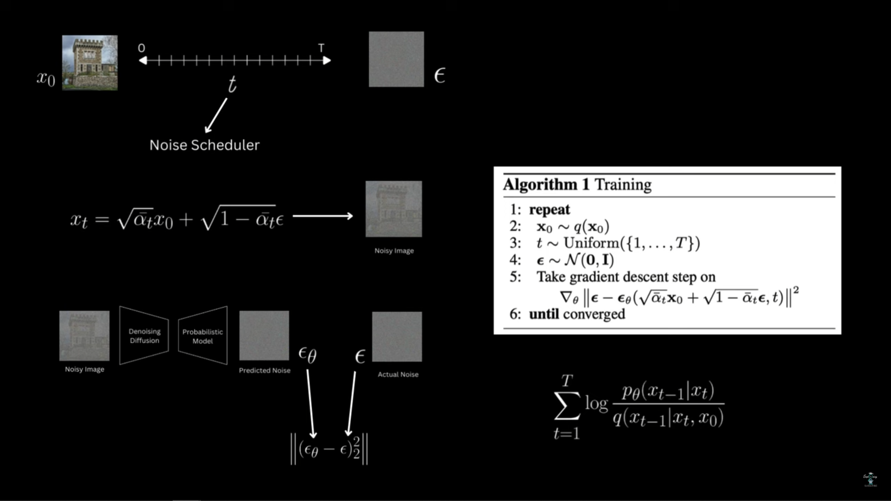
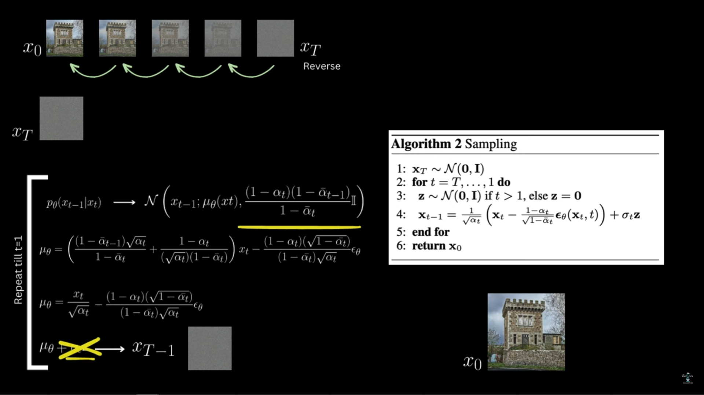

### Soucres:
- [Denoising Diffusion Probabilistic Models | DDPM Explained](http://www.youtube.com/watch?v=H45lF4sUgiE)
- [Denoising Diffusion Probabilistic Models Code | DDPM Pytorch Implementation](https://www.youtube.com/watch?v=vu6eKteJWew&list=PL8VDJoEXIjpo2S7X-1YKZnbHyLGyESDCe&index=2)
- [REPO: Denoising Diffusion Probabilistic Models Implementation in Pytorch](https://github.com/explainingai-code/DDPM-Pytorch)

***

## DDPM (Denoising Diffusion Probabilistic Model)

The DDPM is a generative model that progressively destroys information in an image by adding noise (**Forward Process**) and then learns to reverse this process to generate new images from pure noise.

This approach is conceptually similar to *Variational Autoencoders* (VAEs), which also convert an image to a **latent** Gaussian distribution. However, DDPM models this transformation through a multi-step, physical process known as a **diffusion process**, hoping to achieve better generation results.

### 1. The Forward Diffusion Process ($q$)

The forward process, $q(\mathbf{x}_t | \mathbf{x}_0)$, is a **Stochastic Markov Process** (Stochastic: random, Markov: future state depends on present state) that gradually adds a small amount of **Gaussian noise** ($\mathbf{\epsilon}$) over $T$ time steps until the image $\mathbf{x}_0$ is transformed into a sample from a *simple normal distribution*.

#### **Markov Transition**
Each step $t$ depends only on the previous step $t-1$:
$$q(\mathbf{x}_t | \mathbf{x}_{t-1}) = \mathcal{N}(\mathbf{x}_t; \sqrt{\alpha_t} \mathbf{x}_{t-1}, \beta_t \mathbf{I})$$
Where $\alpha_t = 1 - \beta_t$ and $\beta_t$ is a small, time-dependent variance (often following a linear schedule).

#### **One-Step Sampling**
A key mathematical property allows sampling $\mathbf{x}_t$ from the original image $\mathbf{x}_0$ in a single, **non-iterative** step, which is crucial for training *efficiency*:
$$\mathbf{x}_t = \sqrt{\bar{\alpha}_t} \mathbf{x}_0 + \sqrt{1-\bar{\alpha}_t} \mathbf{\epsilon}$$
where $\mathbf{\epsilon} \sim \mathcal{N}(\mathbf{0}, \mathbf{I})$ and $\bar{\alpha}_t = \prod_{i=1}^t \alpha_i$ (the cumulative product).

***

### 2. The Reverse Diffusion Process (Sampling) ($p_\theta$)

The reverse process, $p_\theta(\mathbf{x}_{t-1} | \mathbf{x}_t)$, is the generative step. It is also a **Markov chain with Gaussian transition probability** which is approximated by a neural network model (the **Noise Predictor** $\mathbf{\epsilon}_\theta$).

The sampling formula describes the iterative process of transforming pure random noise (which is $\mathbf{x}_T$) into the less noisy image $\mathbf{x}_{t-1}$ by subtracting a predicted amount of noise.

The **DDPM** sampling formula estimates the *mean* ($\mu_\theta$) and *variance* ($\Sigma_\theta$) of the reverse transition probability:
$$\mathbf{x}_{t-1} = \mu_\theta(\mathbf{x}_t, t) + \sqrt{\tilde{\beta}_t} \mathbf{z}$$
The mean $\mu_\theta$ is defined as:
$$\mu_\theta(\mathbf{x}_t, t) = \frac{1}{\sqrt{\alpha_t}} \left( \mathbf{x}_t - \frac{1-\alpha_t}{\sqrt{1-\bar{\alpha}_t}} \mathbf{\epsilon}_\theta(\mathbf{x}_t, t) \right)$$
where:
* $\mathbf{x}_{t-1}$ is the image at the next (less noisy) step.
* $\mathbf{x}_t$ is the current noisy image.
* $\mathbf{\epsilon}_\theta(\mathbf{x}_t, t)$ is the **predicted noise** (output of the neural network).
* $\alpha_t$ and $\bar{\alpha}_t$ are constants from the fixed noise schedule.
* $\sqrt{\tilde{\beta}_t} \mathbf{z}$ is the added noise term where $\mathbf{z} \sim \mathcal{N}(\mathbf{0}, \mathbf{I})$ and $\tilde{\beta}_t$ is the fixed variance, which is often set to be the same as the forward process variance.

***

### 3. The Training Objective

Instead of directly training the network to predict the mean $\mu_\theta$ or the less noisy image $\mathbf{x}_{t-1}$, the DDPM model is trained to predict the **noise** $\mathbf{\epsilon}$ that was added in the forward step. The network $\mathbf{\epsilon}_\theta$ is typically a **U-Net architecture**.

The final, simplified training objective is an **L2 loss** between the actual Gaussian noise $\mathbf{\epsilon}$ used to create $\mathbf{x}_t$ and the noise predicted by the model $\mathbf{\epsilon}_\theta$:

1.  **Sample** a data sample $\mathbf{x}_0$ and a time step $t$ (uniformly).
2.  **Sample** noise $\mathbf{\epsilon}$ and compute $\mathbf{x}_t$ using the one-step formula.
3.  **Optimize** the simplified loss function:
$$\min_{\theta} L_t = ||\mathbf{\epsilon} - \mathbf{\epsilon}_\theta(\mathbf{x}_t, t)||^2$$
* This simplified loss effectively optimizes the mean of the reverse process. The time step $t$ is also provided to the model as input (e.g., via positional encoding).