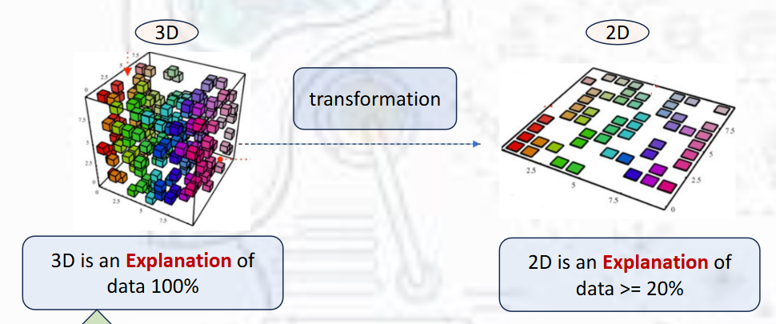

# ITI — Machine Learning (Summer Course)

**Course:** ITI — Machine Learning (summer)
**Scope:** Introductory-to-intermediate coverage of supervised and unsupervised ML with practical Python tooling and common algorithms.

---

## Course overview

This course covers the core concepts, workflow, and commonly used algorithms in supervised and unsupervised machine learning. It emphasizes practical implementation with Python libraries, model evaluation and selection, and hands-on experiments (data cleaning, feature engineering, cross-validation, and hyperparameter tuning).

---

## 0. Python libraries (intro)

Short overview of the essential Python packages used throughout the course:

* **NumPy** — numerical arrays, vectorized operations, linear algebra foundations.
* **Pandas** — tabular data structures (`DataFrame`, `Series`), I/O, data cleaning and manipulation.
* **Matplotlib** — base plotting library for figures, histograms, scatter plots.
* **Seaborn** — higher-level statistical plotting (pairplots, heatmaps) built on top of Matplotlib.
* **scikit-learn** (`sklearn`) — consistent APIs for preprocessing, models (classification/regression/clustering), model selection and evaluation.

Practical tips:

* Use `pandas` for data ingest and initial cleaning; convert to NumPy arrays for heavy numeric work when needed.
* Use scikit-learn pipelines (`Pipeline`) to bundle preprocessing + model to avoid leakage during cross-validation.

---

## 1. Supervised learning

Supervised learning uses labeled data to learn a mapping from features `X` → target `y`. Two main task families:

### Classification (predict discrete labels)

Algorithms covered:

* Logistic Regression
* K-Nearest Neighbors (KNN) (Classifier)
* Decision Tree (Classifier)
* Random Forest
* XGBoost (gradient boosting)
* Support Vector Machine (SVM) — Classification

### Regression (predict continuous targets)

Algorithms covered:

* Linear Regression
* K-Nearest Neighbors (KNN) (Regressor)
* Decision Tree (Regressor)
* Random Forest (Regressor)
* XGBoost (Regressor)
* Support Vector Regression (SVR)

### Common supervised workflow:

1. Exploratory data analysis (EDA) and visualization.
2. Handle missing values, outliers, categorical encoding (one-hot, ordinal), scaling when needed.
3. Split data (train/validation/test) or use cross-validation.
4. Train baseline models → improve with feature engineering and hyperparameter tuning.
5. Evaluate using appropriate metrics, inspect errors, and iterate.

### Common metrics:

* Classification: accuracy, precision, recall, F1, ROC AUC, confusion matrix.
* Regression: MSE / RMSE, MAE, R², residual plots.

### Boosting vs Bagging

**Core idea**

* **Bagging (Bootstrap AGGregatING):** train many independent models on different bootstrap samples of the data, then average (or majority-vote) their predictions.
* **Boosting:** train models *sequentially*; each new model focuses on the mistakes (residuals or misclassified examples) of the previous ensemble members, and combine them into a weighted sum.

**Key practical differences**

* **Training:**
  * Bagging = parallel (independent trees).
  * Boosting = sequential (each learner depends on previous).
  
* **Goal:**
  * Bagging reduces **variance** (stabilizes high-variance learners like deep trees).
  * Boosting reduces **bias** (builds a strong learner by correcting errors).

* **Robustness to noise / outliers:**
  * Bagging is **more robust** to noisy labels.
  * Boosting can **overfit** noisy data if not regularized.
  
* **Typical algorithms / examples:**
  * Bagging → **Random Forest**.
  * Boosting → **AdaBoost**, **Gradient Boosting**, **XGBoost**, **LightGBM**, **CatBoost**.

* **Hyperparameters to watch:**
  * Bagging: number of estimators, tree depth, `max_features`.
  * Boosting: learning rate (shrinkage), number of estimators, tree depth, regularization.

* **When to use which:**
  * Use **bagging/Random Forest** for a strong, low-tuning baseline on tabular data, especially if you worry about noisy labels.
  * Use **boosting** (XGBoost/LightGBM) when you want top predictive performance and are able to tune learning rate / regularization; great for structured data competitions.

**One-line summary:**
* **Bagging =** many independent models → average → lowers variance.
* **Boosting =** many dependent models → sequentially fix errors → lowers bias (but can overfit noise).

---

## 2. Unsupervised learning

Unsupervised learning finds structure in unlabeled data. Topics covered:

* **Clustering**
  * K-means
  * Hierarchical clustering (linkage: ward, complete, average, single)
  * DBSCAN
  * Gaussian Mixture Models (GMM)

* **Dimensionality reduction**
  * PCA (Principal Component Analysis)

### Typical workflow:

1. Preprocess (scaling often required).
2. Choose algorithm and tune hyperparameters (e.g., `k` for K-means, `eps/min_samples` for DBSCAN).
3. Validate clusters with silhouette score, Davies-Bouldin, or domain knowledge.
4. For dimensionality reduction, inspect explained variance and use components for visualization or feature reduction.

---

# Quick cheat-sheet: algorithms & practical notes

> Each mini-cheat contains: what it does, when to use it, key hyperparameters, strengths/weaknesses, common preprocessing.

---

## Libraries (quick)

* `numpy`: arrays; use `np.array`, `np.mean`, `np.linalg`.
* `pandas`: `read_csv`, `df.info()`, `df.describe()`, `df.isna()`.
* `matplotlib` / `seaborn`: `plt.scatter`, `sns.pairplot`, `sns.heatmap`.
* `sklearn`: models in `sklearn.linear_model`, `sklearn.ensemble`, `sklearn.cluster`, evaluation in `sklearn.metrics`.

---

## K-Nearest Neighbors (KNN)

* **What:** Instance-based classifier/regressor using distances to neighbors.
* **When to use:** Small datasets, low dimensionality, simple baseline.
* **Key hyperparams:** `n_neighbors (k)`, distance metric (`p`), weighting (`uniform`/`distance`).
* **Strengths:** Simple, no training cost (lazy), interpretable behavior.
* **Weaknesses:** Prediction cost grows with dataset size, sensitive to irrelevant features and scaling, poor in high dimensions.
* **Preprocessing:** Standardize/normalize features.
* **Quick sklearn:** `KNeighborsClassifier(n_neighbors=5)`

---

## Decision Tree

* **What:** Tree that splits features to make predictions (classification or regression).
* **When to use:** Interpretable model, handles mixed feature types, quick baseline.
* **Key hyperparams:** `max_depth`, `min_samples_split`, `min_samples_leaf`, `criterion` (`gini`/`entropy` or `mse`/`mae`).
* **Strengths:** Interpretable, handles nonlinearity, no need to scale.
* **Weaknesses:** Prone to overfitting if not pruned/tuned; high variance.
* **Preprocessing:** Can handle categorical (if encoded); scaling not required.
* **Quick sklearn:** `DecisionTreeClassifier(max_depth=5)` or `DecisionTreeRegressor()`

---

## Random Forest

* **What:** Ensemble of decision trees using bootstrap aggregation (bagging) and feature subsampling.
* **When to use:** Strong default for tabular data, robust to overfitting relative to single tree.
* **Key hyperparams:** `n_estimators`, `max_depth`, `max_features`, `min_samples_leaf`.
* **Strengths:** Good accuracy, handles nonlinearity, less tuning-sensitive.
* **Weaknesses:** Less interpretable; larger memory/time.
* **Preprocessing:** Usually none required; categorical variables need encoding.
* **Quick sklearn:** `RandomForestClassifier(n_estimators=100)` or `RandomForestRegressor()`

---

## XGBoost (Gradient Boosting)

* **What:** Gradient boosted decision trees (sequential boosting). Powerful for structured data.
* **When to use:** When you need top performance on tabular problems; standard in competitions.
* **Key hyperparams:** `n_estimators`, `learning_rate` (eta), `max_depth`, `subsample`, `colsample_bytree`, `reg_alpha/reg_lambda`.
* **Strengths:** High accuracy, handles missing values, many regularization options.
* **Weaknesses:** More hyperparameters and training time; risk of overfitting without regularization.
* **Preprocessing:** No strict scaling requirement. Encode categoricals (or use libraries that handle them).
* **Notes:** Understand difference: **bagging** (random forest) builds trees independently; **boosting** builds sequentially to correct errors.
* **Quick usage:** `xgboost.XGBClassifier()` or via `xgboost.XGBRegressor()`

---

## Linear Regression

* **What:** Linear model predicting continuous target via weighted sum of features.
* **When to use:** When relationship is approximately linear or as baseline.
* **Key hyperparams:** Regularization parameters when using `Ridge`/`Lasso` (alpha).
* **Strengths:** Interpretable coefficients; fast; works well with sufficient linear signal.
* **Weaknesses:** Poor with nonlinear relationships unless features engineered or polynomial features used. Sensitive to multicollinearity and outliers.
* **Preprocessing:** Standardize features if using regularization. Consider transforming skewed variables.
* **Quick sklearn:** `LinearRegression()` or `Ridge(alpha=1.0)`

---

## Logistic Regression

* **What:** Linear model for binary (or multinomial) classification using the logistic function.
* **When to use:** Baseline classifier, when decision boundary is roughly linear.
* **Key hyperparams:** `C` (inverse regularization), `penalty` (`l1`, `l2`), `solver`.
* **Strengths:** Interpretable, probabilistic outputs, fast.
* **Weaknesses:** Limited to linear boundaries unless features transformed.
* **Preprocessing:** Standardize features; encode categorical variables.
* **Quick sklearn:** `LogisticRegression(C=1.0, penalty='l2')`

---

## Linear vs Logistic regression

- **Linear regression**: predicts a **continuous** target as a linear combination of features and is trained by minimizing squared error, producing real-valued predictions that can lie outside $[0,1]$.
- **Logistic regression**: models the **log-odds** of a binary (or multinomial with softmax) target as a linear function of features, applies a sigmoid/softmax to produce calibrated probabilities, and is trained by maximizing likelihood (cross-entropy), making it suitable for **classification**.

---

## Support Vector Machine (SVM) — Classification

* **What:** Finds the optimal **hyperplane** (multi-dimension) that maximizes the margin between classes; can use **kernels** for nonlinear separation.
* **When to use:** For binary or multiclass classification with clear margin or non-linear boundaries.
* **Key hyperparams:** `C` (regularization), `kernel` (`linear`, `rbf`, `poly`), `gamma` (kernel width), `degree` (for poly).
* **Strengths:** Effective in high-dimensional spaces; robust to overfitting with proper tuning; flexible with kernels.
* **Weaknesses:** Not scalable to very large datasets; sensitive to parameter tuning; less interpretable.
* **Preprocessing:** Requires feature scaling (standardization).
* **Quick sklearn:** `SVC(kernel='rbf', C=1.0, gamma='scale')`

---

## Support Vector Regression (SVR)

* **What:** Extension of SVM for regression that fits a function within a margin of tolerance (`epsilon`) around data points.
* **When to use:** Regression tasks where robustness to outliers and flexibility of kernels is useful.
* **Key hyperparams:** `C` (regularization), `epsilon` (margin tolerance), `kernel`, `gamma`.
* **Strengths:** Can model nonlinear relationships; robust to outliers due to `epsilon`-insensitive loss.
* **Weaknesses:** Computationally expensive on large datasets; requires careful tuning of `C`, `epsilon`, and `gamma`.
* **Preprocessing:** Requires feature scaling.
* **Quick sklearn:** `SVR(kernel='rbf', C=1.0, epsilon=0.1, gamma='scale')`

---

## SVC vs SVR
- **Support Vector Classification (SVC)**: finds a **decision boundary** that maximizes the margin between classes, making it suitable for categorical targets.
- **Support Vector Regression (SVR)**: instead fits a function within a **tolerance band** (epsilon) around the data, making it suitable for continuous targets.

---

## K-means

* **What:** Partition data into `k` clusters by minimizing within-cluster variance (distance between samples and centroids).
* **When to use:** When clusters are spherical-ish and of similar size. Good for large datasets.
* **Key hyperparams:** `n_clusters (k)`, `init` (kmeans++ recommended), `n_init`, `max_iter`.
* **Strengths:** Fast, scalable, simple.
* **Weaknesses:** Assumes spherical clusters, sensitive to initialization and scale, needs `k` chosen.
* **Preprocessing:** Scale features. Use elbow method or silhouette to choose `k`.
* **Quick sklearn:** `KMeans(n_clusters=3, init='k-means++')`

---

## Hierarchical Clustering (Agglomerative)

* **What:** Builds a tree (dendrogram) by iteratively merging points/clusters.
* **When to use:** Exploratory analysis to inspect cluster structure at multiple scales.
* **Linkage options:** `ward` (minimizes variance), `complete`, `average`, `single`.
* **Strengths:** No need to predefine number of clusters (you can cut dendrogram).
* **Weaknesses:** Computationally expensive for large datasets; sensitive to noise and distance metric.
* **Preprocessing:** Scale features. Consider subsampling for large data.
* **Quick sklearn:** `AgglomerativeClustering(n_clusters=3, linkage='ward')`

---

## DBSCAN (Density-based spatial clustering)

* **What:** Clusters **dense** regions and marks sparse points as noise.
* **When to use:** When clusters have irregular shapes or noise/outliers are present.
* **Key hyperparams:** `eps` (neighborhood radius), `min_samples`.
* **Strengths:** Detects arbitrary cluster shapes, noise handling, no need to set `k`.
* **Weaknesses:** Sensitive to scale and `eps` choice; struggles with varying density.
* **Preprocessing:** Standardize features. Use domain knowledge for `eps`.
* **Quick sklearn:** `DBSCAN(eps=0.5, min_samples=5)`

---

## Gaussian Mixture Model (GMM)

* **What:** Probabilistic model that represents data as a mixture of **Gaussian components** (soft clustering).
* **When to use:** When clusters overlap and you want cluster probabilities or to model multimodal distributions.
* **Key hyperparams:** `n_components`, covariance type (`full`, `diag`, `tied`, `spherical`).
* **Strengths:** Provides soft assignments and likelihoods; flexible cluster shapes with full covariance.
* **Weaknesses:** Assumes Gaussian components; can overfit; needs careful initialization.
* **Model selection:** Use BIC/AIC to compare numbers of components.
* **Quick sklearn:** `GaussianMixture(n_components=3, covariance_type='full')`

---

## PCA (Principal Component Analysis)

* **What:** Linear dimensionality reduction that finds orthogonal directions of maximal variance.
* **When to use:** Visualization, noise reduction, preprocessing before modeling (if helpful).
* **Key hyperparams:** `n_components` or explained variance threshold (e.g., 95%).
* **Strengths:** Fast, reduces dimensionality, useful for visualization and removing collinearity.
* **Weaknesses:** Linear method (won't capture nonlinear structure), components can be hard to interpret.
* **Preprocessing:** Always standardize features before PCA unless features already comparable.
* **Quick sklearn:** `PCA(n_components=0.95)` (keep components explaining 95% variance)

---

# Model selection & evaluation (practical tips)

* Use **cross-validation** (k-fold) to estimate generalization performance.
* Use **hold-out test set** for final evaluation.
* Use pipelines (`Pipeline`) to chain preprocessing and model to avoid leakage.
* Use `GridSearchCV` or `RandomizedSearchCV` for hyperparameter tuning.
* For imbalanced classification, prefer metrics like precision/recall, F1, PR AUC over accuracy; consider resampling or class weights.

---