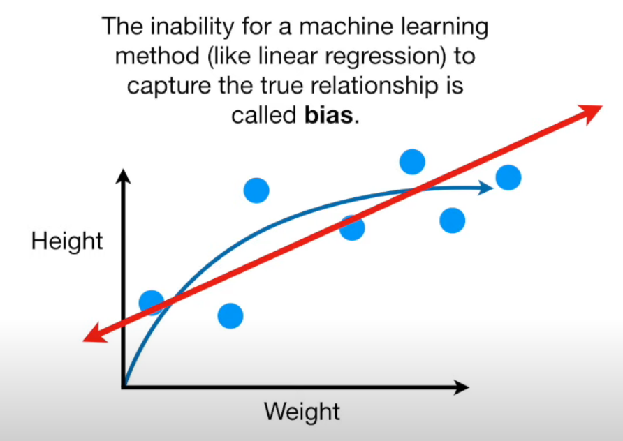
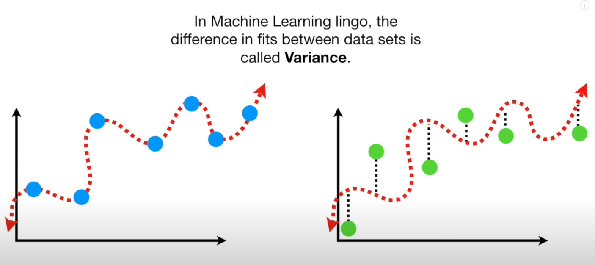
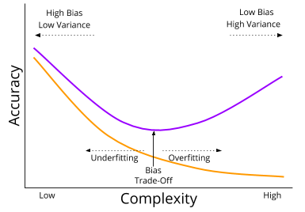

## Sources
- [Machine Learning Fundamentals: Bias and Variance](https://www.youtube.com/watch?v=EuBBz3bI-aA&t=3s)
- [Bias vs Variance](https://kevinbinz.com/2019/05/19/bias-variance/)
## Bias–Variance Tradeoff

### Overview

* The **bias–variance tradeoff** explains how model performance is affected by two types of errors:

  * **Bias** → Error from **incorrect assumptions** in the model.
  * **Variance** → Error from **model sensitivity** to small fluctuations in the training data.
* The goal is to find a balance that minimizes the **total error**.

---

### 1. Bias

* Measures how far the model’s predictions are from the true function.
* High bias → Model is too **simple** (underfitting).
* Example: Linear regression used for a nonlinear relationship.

---

### 2. Variance

* Measures how much the model’s predictions **change** when trained on different datasets.
* High variance → Model is too **complex** (overfitting).
* Example: A deep decision tree that memorizes training data.

---

### 3. Total Error

The expected total error can be decomposed as:

$$
\text{Total Error} = \text{Bias}^2 + \text{Variance} + \text{Irreducible Error}
$$

* **Bias²:** Error due to overly simplistic assumptions.
* **Variance:** Error due to model instability.
* **Irreducible Error:** Noise inherent in the data (cannot be reduced).

---

### 4. Tradeoff Concept

| Model Complexity          | Bias     | Variance | Behavior            |
| ------------------------- | -------- | -------- | ------------------- |
| Low complexity (simple)   | High     | Low      | Underfitting        |
| High complexity (complex) | Low      | High     | Overfitting         |
| Optimal complexity        | Balanced | Balanced | Best generalization |

---

### 5. Visualization (Conceptually)

* **Training error** decreases as model complexity increases.
* **Validation/test error** first decreases (less bias) then increases (more variance).
* The lowest validation error point = **optimal tradeoff**.

---

### 6. How to Control It

* **Reduce bias:** Use more complex models, add features.
* **Reduce variance:**

  * Use more training data.
  * Apply **regularization** (e.g., L1/L2).
  * Use **cross-validation**.
  * Apply **ensemble methods** (e.g., bagging).

---

### 7. Summary Table

| Type          | Cause                 | Symptom      | Fix                  |
| ------------- | --------------------- | ------------ | -------------------- |
| High Bias     | Oversimplified model  | Underfitting | Add complexity       |
| High Variance | Overly flexible model | Overfitting  | Regularize, add data |

---

**Key Idea:**
Good models find the sweet spot between **bias** and **variance**, simple enough to generalize, but complex enough to capture patterns.
