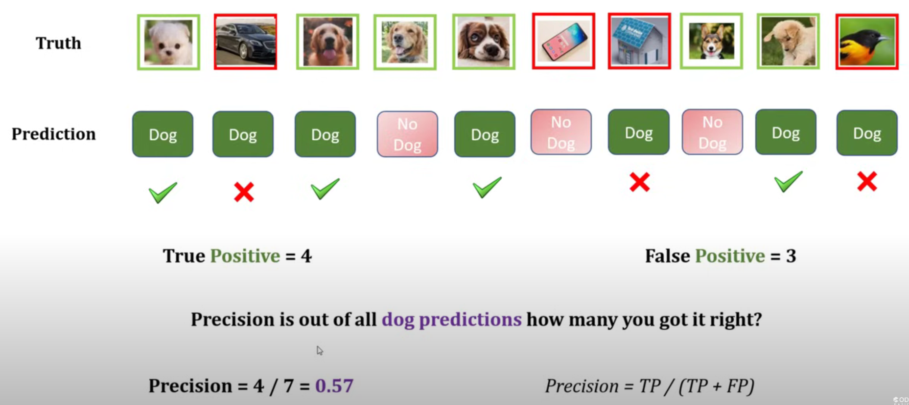

## Sources
- [Precision, Recall, F1 score, True Positive|Deep Learning Tutorial 19](https://www.youtube.com/watch?v=2osIZ-dSPGE)
- [ROC and AUC, Clearly Explained!](https://www.youtube.com/watch?v=4jRBRDbJemM)
## 1. Accuracy, Precision, Recall, F1-Score

### Overview

Used to evaluate **classification models**, especially binary ones.
They are derived from the **confusion matrix**:

|                     | Predicted Positive  | Predicted Negative  |
| ------------------- | ------------------- | ------------------- |
| **Actual Positive** | True Positive (TP)  | False Negative (FN) |
| **Actual Negative** | False Positive (FP) | True Negative (TN)  |

---

### a) Accuracy

Measures **overall correctness** of the model.

$$
\text{Accuracy} = \frac{TP + TN}{TP + TN + FP + FN}
$$

* Easy to understand, but **misleading for imbalanced datasets**.

---

### b) Precision

Measures how many **predicted positives** were actually correct.

$$
\text{Precision} = \frac{TP}{TP + FP}
$$

* High precision → few false positives.
* Useful when **false positives are costly** (e.g., spam detection).

---

### c) Recall (Sensitivity / True Positive Rate)

Measures how many **actual positives** were correctly predicted.

$$
\text{Recall} = \frac{TP}{TP + FN}
$$

* High recall → few false negatives.
* Useful when **missing a positive is costly** (e.g., disease detection).

---

### d) F1-Score

Harmonic **mean** of precision and recall, balances the two.

$$
F_1 = 2 \times \frac{\text{Precision} \times \text{Recall}}{\text{Precision} + \text{Recall}}
$$

* Good for **imbalanced datasets** where accuracy alone isn’t reliable.

---

## Quick Summary

| Metric    | Focus                    | Good For                 | Formula                               |
| --------- | ------------------------ | ------------------------ | ------------------------------------- |
| Accuracy  | Overall correctness      | Balanced datasets        | $\frac{TP + TN}{TP + TN + FP + FN}$ |
| Precision | Correctness of positives | Reducing false positives | $\frac{TP}{TP + FP}$                |
| Recall    | Finding all positives    | Reducing false negatives | $\frac{TP}{TP + FN}$                |
| F1-Score  | Balance of P & R         | Imbalanced data          | $2 \times \frac{PR}{P + R}$         |

---

## 2. ROC and AUC

### a) ROC (Receiver Operating Characteristic Curve)

* A **graphical plot** showing the tradeoff between:

  * **True Positive Rate (TPR)** (Sensitivity) = Recall = $\frac{TP}{TP + FN}$
  * **False Positive Rate (FPR)** (1-Specificity) = $\frac{FP}{FP + TN}$

* The curve is created by varying the **classification threshold** (e.g., 0.1 to 0.9).

#### Special case (class imbalance):
- When one class is much rarer than the other (e.g., fraud detection, disease diagnosis), **accuracy** and even **recall** may give a *misleading* picture of performance.  
- In such cases, **precision** can be a better metric to focus on, as it reflects how many of the predicted positives are actually correct, reducing false alarms.

#### Ideal model:

* High TPR and low FPR → curve near **top-left** corner.

---

### b) AUC (Area Under the Curve)

* The **area under the ROC curve**.
* Represents the model’s overall ability to distinguish between classes.

$$
\text{AUC} = \int_0^1 \text{TPR(FPR)} , d(\text{FPR})
$$

#### Interpretation:

| AUC Value | Meaning         |
| --------- | --------------- |
| 1.0       | Perfect model   |
| 0.9 – 1.0 | Excellent       |
| 0.8 – 0.9 | Good            |
| 0.7 – 0.8 | Fair            |
| 0.5       | Random guessing |

---

## Use Cases

* **Accuracy / F1:** General classification tasks.
* **Precision / Recall:** Imbalanced datasets.
* **ROC–AUC:** Comparing classifiers independent of threshold (e.g., logistic regression, random forests).

---

**Key Idea:**
Accuracy alone can be misleading, use **precision, recall, F1, and AUC** together to get a full picture of your model’s performance.
