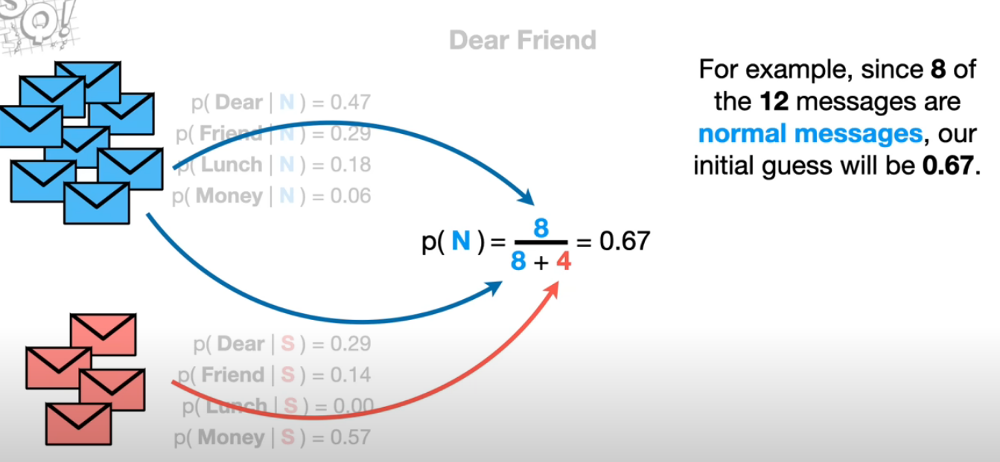
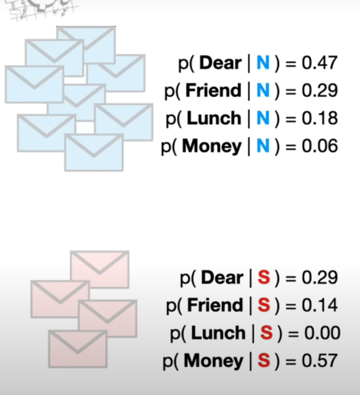
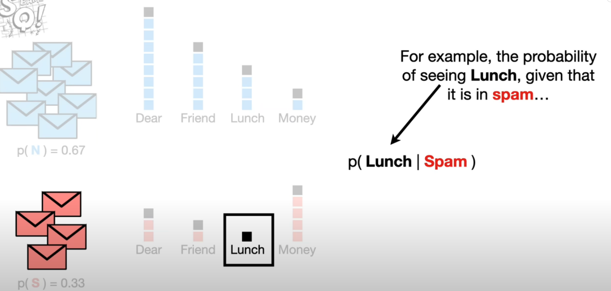
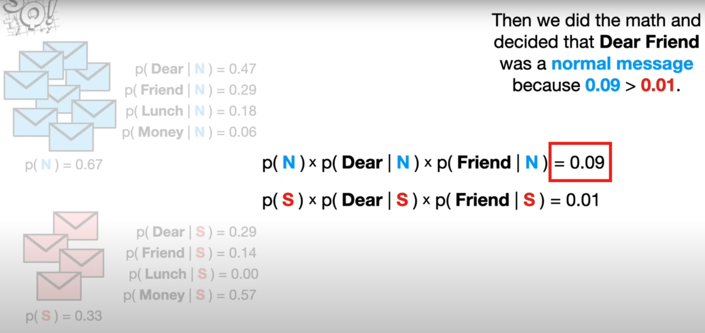
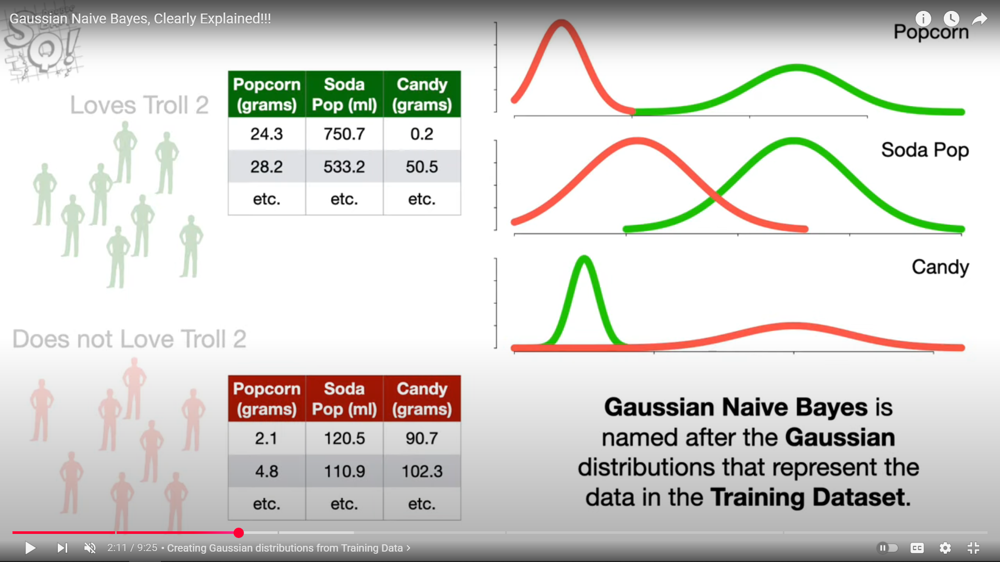
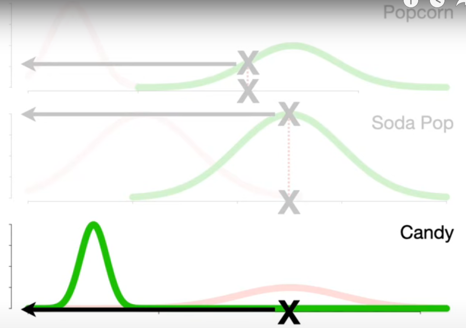
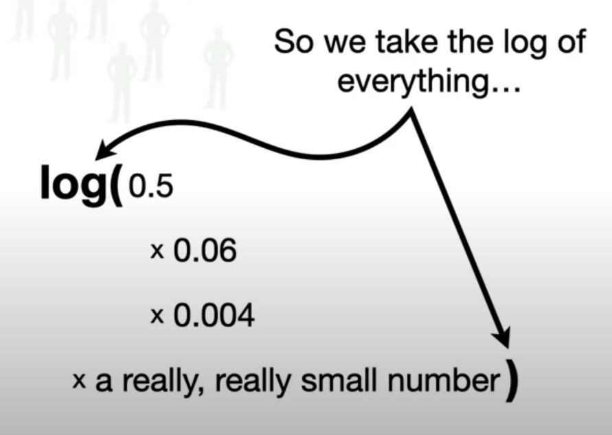

## Sources
- [Naive Bayes, Clearly Explained!!!](https://www.youtube.com/watch?v=O2L2Uv9pdDA)
- [Gaussian Naive Bayes, Clearly Explained!!!](https://www.youtube.com/watch?v=H3EjCKtlVog)
## 1. Multinomial Naive Bayes

### Overview

* A **probabilistic classification algorithm** based on **Bayes’ theorem**.
* Assumes all features are **independent** (e.g, it treats every word independently of its context in a sentence) given the class label (the "naive" assumption).
* Works best for **discrete or count-based features**, such as **word counts** in text.

$$
P(C|X) = \frac{P(X|C) , P(C)}{P(X)}
$$

Since features are assumed independent:

$$
P(X|C) = \prod_{i=1}^{n} P(x_i | C)
$$

---

### Steps

1. **Calculate Prior Probability**

   $$
   P(C) = \frac{\text{Number of samples in class } C}{\text{Total number of samples}}
   $$

2. **Calculate Likelihood for Each Feature**

   For word-count features (using Laplace smoothing '+1' to prevent zero possibilites):
   $$
   P(x_i|C) = \frac{\text{count}(x_i, C) + 1}{\sum_j \text{count}(x_j, C) + V}
   $$
   where (V) is the vocabulary size.

3. **Compute Posterior Probability**

   $$
   P(C|X) \propto P(C) \prod_i P(x_i | C)
   $$

5. **Predict the Class**
   Choose the class with the highest posterior probability.

---

### Pros

* Very efficient and simple to train.
* Excellent for **text data**, especially with **bag-of-words** or **TF-IDF** features.

### Cons

* Assumes features are independent (not always true).
* Performs poorly when feature counts don’t represent the data meaningfully.

### Typical Use Cases

* Spam filtering
* Sentiment analysis
* Document classification

---

## 2. Gaussian Naive Bayes

### Overview

* Used when features are **continuous** rather than counts.
* Assumes each feature follows a **normal (Gaussian) distribution** for each class.

$$
P(x_i|C) = \frac{1}{\sqrt{2\pi\sigma_C^2}} , \exp\left( -\frac{(x_i - \mu_C)^2}{2\sigma_C^2} \right)
$$

---

### Steps

1. **Compute Mean and Standard Deviation**

   For each feature and class:
   $$
   \mu_C = \text{mean of feature values in class } C
   $$
   $$
   \sigma_C = \text{standard deviation of feature values in class } C
   $$

3. **Calculate Prior Probability**
   $$
   P(C) = \frac{\text{Number of samples in class } C}{\text{Total number of samples}}
   $$

4. **Compute Likelihood for Each Feature**
 
   Use the Gaussian formula above for every feature.

5. **Compute Posterior Probability** (use log to prevent underflow)

   $$
   P(C|X) \propto P(C) \prod_i P(x_i | C)
   $$

6. **Predict the Class**
   Select the class with the highest posterior probability.

---

### Pros

* Works well for **continuous, real-valued data**.
* Handles **normally distributed data** effectively.
* Fast and simple to implement.

### Cons

* Assumes **Gaussian distribution** of features.
* Still assumes **feature independence**.

### Typical Use Cases

* Medical diagnosis
* Sensor-based classification
* Real-time prediction systems
