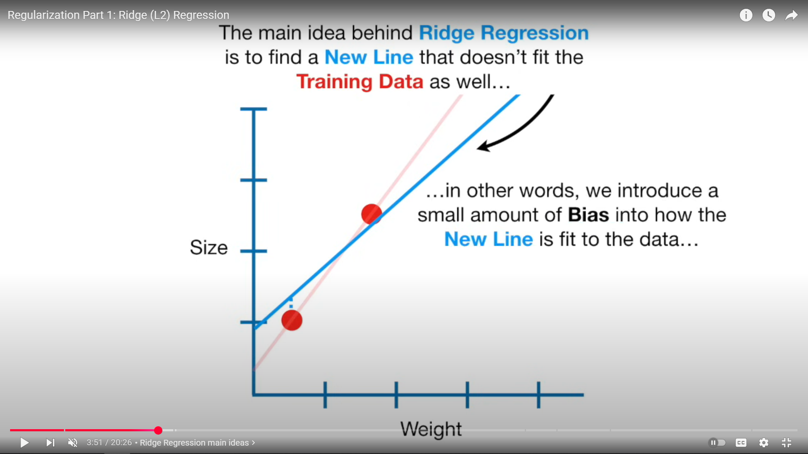
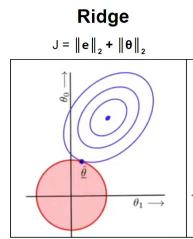
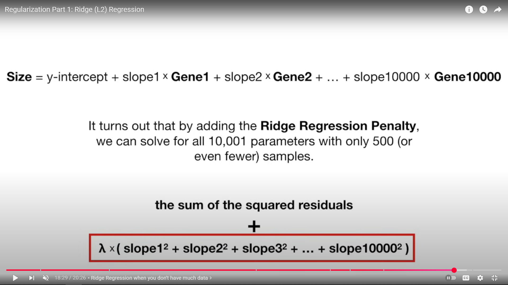
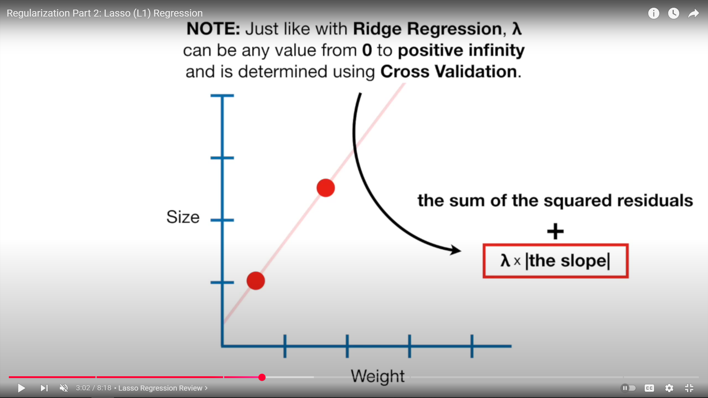
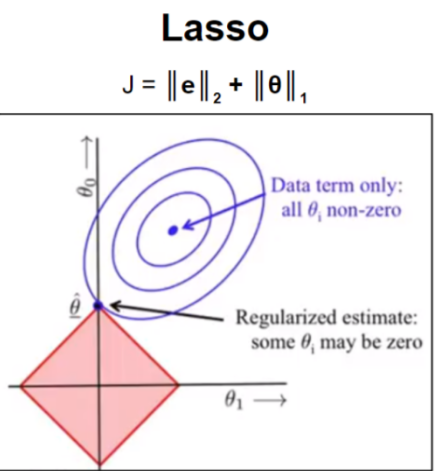
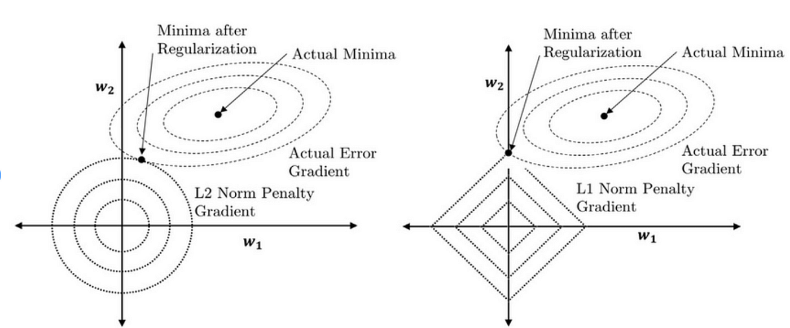

## Sources
- [Regularization Part 1: Ridge (L2) Regression](https://www.youtube.com/watch?v=Q81RR3yKn30)
- [Regularization Part 2: Lasso (L1) Regression](https://www.youtube.com/watch?v=NGf0voTMlcs)
- [Intro to Regularization](https://kevinbinz.com/2019/06/09/regularization/)
## 1. Ridge Regression (L2 Regularization)

### Overview

* Regularization is used to **prevent overfitting** by **penalizing large weights** in the model.
* Ridge regression adds an **L2 penalty** (squared magnitude of coefficients) to the loss function.
* This discourages the model from assigning excessively large weights to any one feature.

---

### Mathematical Form

For linear regression:

$$
J(\theta) = \text{MSE} + \lambda \sum_{j=1}^{n} \theta_j^2
$$

where

* $J(\theta)$: regularized loss function
* $\lambda$: regularization strength (**controls penalty size**)
* $\theta_j$: model parameters (weights) (everything other than the y-intercept)

If $\lambda = 0$: no regularization (ordinary least squares)
If $\lambda$ is large: stronger penalty, smaller weights.

---

### Effect

* Reduces **variance** by shrinking coefficients toward zero.
* Keeps **all features** in the model but makes their influence *smaller*.
* Best when most features are **useful** but need **stabilization**.

---

### Geometric View

* The penalty forms a **circular constraint** (L2 norm) that restricts how large weights can get.
* Solutions lie inside this circular region, smooth shrinkage of weights.

---

### Use Cases

* When you expect **many correlated features**.
* Helps models **generalize** better by smoothing coefficients.
* Common in:
	- Ridge regression
	- L2-regularized logistic regression
	- Neural networks (weight decay)

---

### Pros

* Prevents **overfitting** effectively.
* Keeps **all** features (no feature elimination).
* Helps handle multicollinearity.
* Allows using more parameters even with limited data, since the penalty prevents overfitting.
- Improves generalization performance.

### Cons

* Doesn’t perform feature selection (all features remain).

---

## 2. Lasso Regression (L1 Regularization)

### Overview

* Adds an **L1 penalty** (absolute value of coefficients) to the loss function.
* Encourages some weights to become **exactly zero**, effectively **removing** less important features.

---

### Mathematical Form

For linear regression:

$$
J(\theta) = \text{MSE} + \lambda \sum_{j=1}^{n} |\theta_j|
$$

where

* $\lambda$: controls the amount of shrinkage.
* Larger $\lambda$ → more coefficients shrink to zero.

---

### Effect

* Performs **feature selection** automatically. ⭐
* Useful when you believe only a few features are important.
* Increases **bias** slightly but can reduce **variance** significantly.

---

### Geometric View

* The penalty forms a **diamond-shaped constraint** (L1 norm).
* Corners of the diamond tend to land on coordinate axes → some weights become exactly zero.

---

### Use Cases

* When you want **sparse models** (few active features).
* Works well in **high-dimensional** datasets (e.g., text or genetics).

---

### Pros

* Automatically selects relevant features.
* Can improve interpretability.

### Cons

* Unstable when features are highly correlated.
* May ignore useful but correlated predictors.

---

## Comparison Summary

| Aspect                    | **Ridge (L2)**              | **Lasso (L1)**           |
| ------------------------- | --------------------------- | ------------------------ |
| Penalty                   | $\sum \theta_j^2$           | $\sum \theta_j$          |
| Effect                    | Shrinks weights smoothly    | Forces some weights to 0 |
| Feature selection         | No                          | Yes                      |
| Handles multicollinearity | Yes                         | Poorly                   |
| Use case                  | Many small/related features | Few important features   |
| Geometry                  | Circular constraint         | Diamond constraint       |

---

## 3. Elastic Net Regularization

**Overview:**

* Combines **L1 (Lasso)** and **L2 (Ridge)** penalties to get the benefits of both.
* Encourages **sparse models** like *Lasso* while maintaining **stability** like *Ridge*.

**Mathematical Form:**
$$
J(\theta) = \text{MSE} + \lambda_1 \sum_{j=1}^{n} |\theta_j| + \lambda_2 \sum_{j=1}^{n} \theta_j^2
$$

**Key Points:**

* Uses two parameters:

  * $\lambda_1$: controls sparsity (L1 strength)
  * $\lambda_2$: controls weight shrinkage (L2 strength)
* Works well when features are **correlated** and **some feature selection** is desired.
- **Sparsity** refers to having **many zero-valued parameters (weights)** in the model.

**Use Cases:**

* Text or genomic data with many correlated predictors.
* When neither pure Lasso nor pure Ridge alone performs well.
