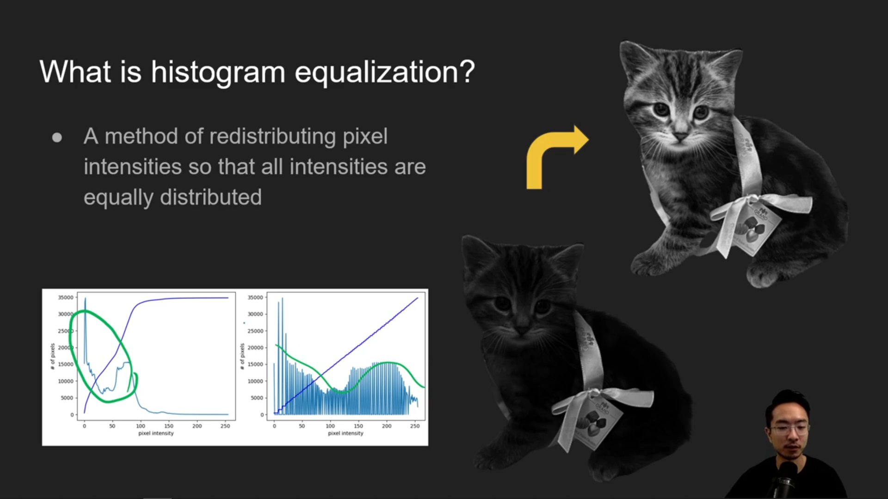
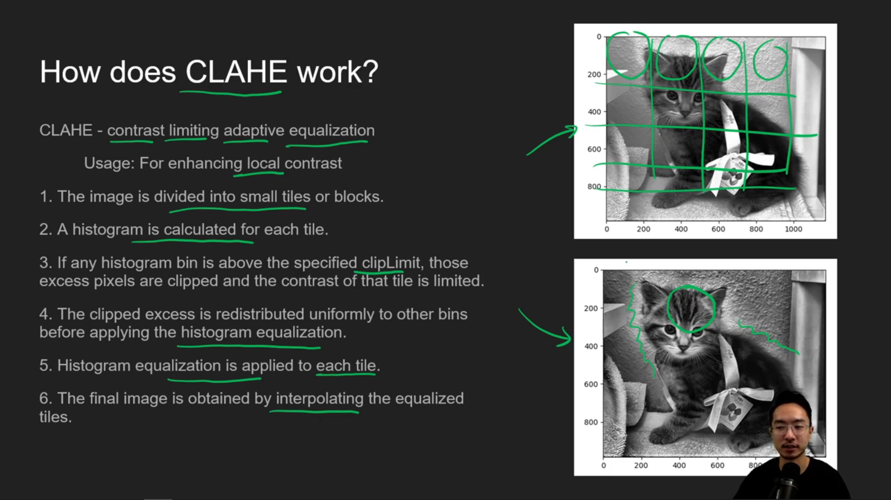

# 1. PyTorch (`transforms`) Data Augmentation Cheat Sheet

---

## 1. **Geometric Transformations**

- Affect the **spatial structure** of the image, useful for improving **invariance to viewpoint and object orientation**.
- Used to make models robust to **position, rotation, and scale variations**.

| Transformation                    | PyTorch Function                                                                        | Description                                 | Common Use Cases                                                |
| --------------------------------- | --------------------------------------------------------------------------------------- | ------------------------------------------- | --------------------------------------------------------------- |
| **Horizontal Flip**               | `transforms.RandomHorizontalFlip(p=0.5)`                                                | Flips image left–right randomly.            | Object classification, self-driving, face detection (mirroring) |
| **Vertical Flip**                 | `transforms.RandomVerticalFlip(p=0.5)`                                                  | Flips image up–down randomly.               | Satellite imagery, aerial views, microscopy                     |
| **Rotation**                      | `transforms.RandomRotation(degrees=30)`                                                 | Rotates within ±30°.                        | Document OCR, medical scans, aerial photography                 |
| **Translation / Shift**           | `transforms.RandomAffine(degrees=0, translate=(0.1, 0.1))`                              | Moves image horizontally/vertically.        | Robotics vision, gesture recognition                            |
| **Scaling / Zoom**                | `transforms.RandomResizedCrop(size=224, scale=(0.8, 1.2))`                              | Random zoom in/out.                         | Object detection, data imbalance handling                       |
| **Shear**                         | `transforms.RandomAffine(degrees=0, shear=15)`                                          | Tilts image along x/y axes.                 | Handwriting, text images                                        |
| **Perspective Transform**         | `transforms.RandomPerspective(distortion_scale=0.5, p=0.5)`                             | Simulates viewpoint changes.                | Document OCR, AR/VR, autonomous driving                         |
| **Crop + Pad**                    | `transforms.RandomCrop(224)` / `transforms.Pad(10)`                                     | Randomly crops or pads image.               | Focus on partial regions, context simulation                    |
| **Affine Transform (all-in-one)** | `transforms.RandomAffine(degrees=15, translate=(0.1, 0.1), scale=(0.8, 1.2), shear=10)` | Combines rotation, shift, scale, and shear. | General robustness to geometric distortions                     |

---

## 2. **Photometric / Lighting Transformations**

Used to handle **brightness, contrast, lighting, exposure, and color variation**.

| Transformation            | PyTorch Function                                     | Description                                             | Common Use Cases                               |
| ------------------------- | ---------------------------------------------------- | ------------------------------------------------------- | ---------------------------------------------- |
| **Brightness Adjustment** | `transforms.ColorJitter(brightness=0.4)`             | Randomly lightens or darkens the image.                 | Indoor/outdoor scenes, illumination changes    |
| **Contrast Adjustment**   | `transforms.ColorJitter(contrast=0.4)`               | Changes difference between dark and light regions.      | Low-light photos, surveillance                 |
| **Saturation Adjustment** | `transforms.ColorJitter(saturation=0.4)`             | Alters color vividness.                                 | Weather robustness, artistic datasets          |
| **Hue Adjustment**        | `transforms.ColorJitter(hue=0.1)`                    | Shifts colors slightly.                                 | Domain adaptation (e.g., RGB camera variation) |
| **Combined ColorJitter**  | `transforms.ColorJitter(0.4, 0.4, 0.4, 0.1)`         | Adjusts brightness, contrast, saturation, hue together. | General image classification                   |
| **Grayscale Conversion**  | `transforms.RandomGrayscale(p=0.2)`                  | Converts some images to grayscale.                      | Shape-based recognition (digits, sketches)     |
| **Gamma Correction**      | `transforms.functional.adjust_gamma(img, gamma=1.5)` | Adjusts luminance non-linearly.                         | Underexposed images, medical imaging           |
| **Equalization**          | `transforms.RandomEqualize(p=0.3)`                   | Equalizes image histogram.                              | Low-light or uneven lighting correction        |
| **Solarization**          | `transforms.RandomSolarize(threshold=128, p=0.3)`    | Inverts bright pixels.                                  | Artistic or domain randomization tasks         |

---

## 3. **Noise and Blur Transformations**

Used to simulate **focus issues**, **sensor imperfections**, **motion blur**, and **environmental noise**.

| Transformation                       | PyTorch Function / Equivalent                               | Description                      | Common Use Cases                  |
| ------------------------------------ | ----------------------------------------------------------- | -------------------------------- | --------------------------------- |
| **Gaussian Blur**                    | `transforms.GaussianBlur(kernel_size=3, sigma=(0.1, 2.0))`  | Smooths image by blurring edges. | Simulate motion blur, low focus   |
| **Random Noise (Custom)**            | `transforms.Lambda(lambda x: x + torch.randn_like(x)*0.05)` | Adds random pixel noise.         | Low-quality camera simulation     |
| **JPEG Compression (Custom)**        | `transforms.functional.adjust_jpeg_quality(img, quality)`   | Simulates compression artifacts. | Real-world photo compression      |
| **Motion Blur (via Albumentations)** | `A.MotionBlur(p=0.5)`                                       | Mimics moving camera.            | Surveillance, automotive datasets |

---

## 4. **Occlusion & Cutout-Based Augmentations**

Used to make models **robust to missing or occluded objects**.

| Transformation              | PyTorch Function                                     | Description                                    | Common Use Cases                        |
| --------------------------- | ---------------------------------------------------- | ---------------------------------------------- | --------------------------------------- |
| **Random Erasing (Cutout)** | `transforms.RandomErasing(p=0.5, scale=(0.02, 0.2))` | Masks random rectangular patches.              | Object classification, face recognition |
| **Mixup**                   | Implemented in training loop                         | Blends two images linearly (λ-weighted).       | Classification, regularization          |
| **CutMix**                  | Implemented in training loop                         | Replaces a region from one image with another. | Robustness against occlusion            |
| **Random Masking (custom)** | `transforms.Lambda(custom_mask_func)`                | Applies synthetic occlusion masks.             | Self-supervised learning (MAE-style)    |

---

## 5. **Color and Style Transformations**

Used for **domain generalization**, **cross-camera adaptation**, and **data diversification**, by varying the visual appearance of objects.

| Transformation               | PyTorch Function                                          | Description                            | Common Use Cases              |
| ---------------------------- | --------------------------------------------------------- | -------------------------------------- | ----------------------------- |
| **Color Jitter (full)**      | `transforms.ColorJitter(0.4, 0.4, 0.4, 0.1)`              | Varies lighting, tone, and saturation. | General visual tasks          |
| **Equalize**                 | `transforms.RandomEqualize(p=0.5)`                        | Equalizes histogram across image.      | Uneven lighting               |
| **Posterize**                | `transforms.RandomPosterize(bits=4, p=0.3)`               | Reduces color bits.                    | Stylized training, robustness |
| **Invert**                   | `transforms.RandomInvert(p=0.2)`                          | Inverts pixel values.                  | Handwriting, sketch data      |
| **Channel Shuffle (custom)** | `transforms.Lambda(lambda x: x[torch.randperm(3), :, :])` | Randomizes RGB channel order.          | Domain randomization          |
| **Solarize**                 | `transforms.RandomSolarize(threshold=128, p=0.3)`         | Inverts high-intensity pixels.         | Domain shift augmentation     |

---

## 6. **Domain-Specific Augmentations**

For **specialized tasks**, you can combine multiple augmentations to simulate realistic scenarios.

| Domain                              | Common Transformations                                                                  | Use Cases                                |
| ----------------------------------- | --------------------------------------------------------------------------------------- | ---------------------------------------- |
| **Medical Imaging**                 | Rotation, Flip, Elastic deformation (custom), Gamma correction, Intensity normalization | MRI, CT, X-ray augmentation              |
| **Aerial / Satellite**              | Rotation (90° steps), RandomCrop, Brightness/Contrast jitter, Gaussian noise            | Land classification, object localization |
| **Document OCR / Handwriting**      | Perspective transform, Motion blur, Solarization, Rotation                              | OCR, handwriting recognition             |
| **Sketch / Spiral / Line Drawings** | Gaussian noise, Invert, Elastic deformation, RandomErasing                              | Parkinson’s detection, drawing analysis  |
| **Autonomous Driving**              | Brightness, Motion blur, Cutout, RandomCrop                                             | Lane detection, object detection         |
| **Industrial / Manufacturing**      | Noise, Contrast, Gamma, Cropping                                                        | Defect detection under varying lighting  |

---

## 7. **Automated / Policy-Based Augmentations**

Automatically apply multiple transformations using **policy search or stochastic mixing**.

| Transformation     | PyTorch Function                                            | Description                                               | Common Use Cases                   |
| ------------------ | ----------------------------------------------------------- | --------------------------------------------------------- | ---------------------------------- |
| **AutoAugment**    | `transforms.AutoAugment(policy=AutoAugmentPolicy.IMAGENET)` | Learned augmentation policy from ImageNet/CIFAR/SVHN.     | Classification, fine-tuning        |
| **RandAugment**    | `transforms.RandAugment(num_ops=2, magnitude=9)`            | Randomly applies N augmentations with set strength.       | Lightweight policy search          |
| **TrivialAugment** | `transforms.TrivialAugmentWide()`                           | Applies one random augmentation per image.                | Quick general-purpose augmentation |
| **AugMix**         | `transforms.AugMix()`                                       | Combines multiple augmentations with stochastic blending. | Robustness, uncertainty estimation |

---

## 8. **Normalization and Preprocessing**

Used **after augmentations** to standardize input before feeding into the model.

| Transformation | PyTorch Function                  | Description                       | Common Use Cases                   |
| -------------- | --------------------------------- | --------------------------------- | ---------------------------------- |
| **Resize**     | `transforms.Resize((224, 224))`   | Scales image to fixed input size. | Required for pretrained CNNs       |
| **CenterCrop** | `transforms.CenterCrop(224)`      | Extracts central region.          | Validation/testing                 |
| **ToTensor**   | `transforms.ToTensor()`           | Converts to tensor in [0,1].      | Always needed before model input   |
| **Normalize**  | `transforms.Normalize(mean, std)` | Standardizes channel values.      | Pretrained models, stable training |

---
# 2. Albumentation Data Augmentation Cheat Sheet

Albumentations offers a **faster**, **richer**, and more **flexible** image augmentation library than PyTorch’s `transforms`, especially for **segmentation and detection** tasks.

## Source:
- [OpenCV Python Histogram Equalization and CLAHE (VI!!)](https://www.youtube.com/watch?v=tn2kmbUVK50)

---

## 1. **Geometric Transformations**

Affect spatial layout; used to improve robustness to **position, rotation, and scale**.

| Transformation             | Albumentations Function                                                         | Description                                       | Common Use Cases                  |
| -------------------------- | ------------------------------------------------------------------------------- | ------------------------------------------------- | --------------------------------- |
| **Horizontal Flip**        | `A.HorizontalFlip(p=0.5)`                                                       | Flip left–right randomly.                         | Natural images, self-driving      |
| **Vertical Flip**          | `A.VerticalFlip(p=0.5)`                                                         | Flip up–down randomly.                            | Aerial, medical imaging           |
| **Rotation**               | `A.Rotate(limit=30, p=0.5)`                                                     | Rotate by ±angle.                                 | MRI, aerial, OCR                  |
| **Shift / Scale / Rotate** | `A.ShiftScaleRotate(shift_limit=0.05, scale_limit=0.1, rotate_limit=15, p=0.5)` | Combined transform for full geometric robustness. | General-purpose robustness        |
| **Affine Transform**       | `A.Affine(scale=1.1, rotate=15, shear=10, p=0.5)`                               | Similar to `RandomAffine` in PyTorch.             | Shape & geometric variability     |
| **Elastic Transform**      | `A.ElasticTransform(alpha=120, sigma=6, alpha_affine=3, p=0.5)`                 | Non-linear local distortion.                      | Handwriting, medical segmentation |
| **Grid Distortion**        | `A.GridDistortion(num_steps=5, distort_limit=0.3, p=0.5)`                       | Warps image using a grid.                         | MRI deformation simulation        |
| **Optical Distortion**     | `A.OpticalDistortion(distort_limit=0.2, shift_limit=0.1, p=0.5)`                | Simulate camera lens distortion.                  | Robotics, object detection        |
| **Perspective Transform**  | `A.Perspective(scale=(0.05, 0.1), p=0.5)`                                       | Simulate viewpoint change.                        | Document OCR, AR/VR               |

---

## 2. **Photometric / Color Transformations**

Affect intensity, color, and lighting, useful for color-robustness and illumination variation.

| Transformation               | Albumentations Function                                                       | Description                      | Common Use Cases            |
| ---------------------------- | ----------------------------------------------------------------------------- | -------------------------------- | --------------------------- |
| **Brightness / Contrast**    | `A.RandomBrightnessContrast(p=0.5)`                                           | Adjust image lighting.           | Outdoor vs indoor variation |
| **Gamma Correction**         | `A.RandomGamma(gamma_limit=(80, 120), p=0.5)`                                 | Correct exposure issues.         | Medical or low-light images |
| **Hue / Saturation / Value** | `A.HueSaturationValue(p=0.5)`                                                 | Randomly modify color tones.     | Natural image datasets      |
| **Color Jitter**             | `A.ColorJitter(brightness=0.2, contrast=0.2, saturation=0.2, hue=0.2, p=0.5)` | Combined lighting adjustment.    | Classification models       |
| **CLAHE (Histogram Eq.)**    | `A.CLAHE(p=0.5)`                                                              | Equalize image contrast locally. | Medical & low-contrast data |
| **RGB Shift**                | `A.RGBShift(r_shift_limit=20, g_shift_limit=20, b_shift_limit=20, p=0.5)`     | Shift RGB channels separately.   | Domain randomization        |
| **Channel Shuffle**          | `A.ChannelShuffle(p=0.1)`                                                     | Randomly reorder color channels. | Domain generalization       |
| **To Grayscale**             | `A.ToGray(p=1.0)`                                                             | Convert image to grayscale.      | MRI, CT, X-ray              |
| **Invert Image**             | `A.InvertImg(p=0.3)`                                                          | Invert pixel intensity values.   | Sketch / binary data        |
| **Equalize**                 | `A.Equalize(p=0.5)`                                                           | Histogram equalization.          | Medical scans, OCR          |

---

## 3. **Noise and Blur Transformations**

Simulate real-world imperfections (camera blur, sensor noise, motion, etc.).

| Transformation     | Albumentations Function                    | Description                        | Common Use Cases              |
| ------------------ | ------------------------------------------ | ---------------------------------- | ----------------------------- |
| **Gaussian Noise** | `A.GaussNoise(var_limit=(10, 50), p=0.5)`  | Add pixel-level random noise.      | Low-light cameras             |
| **ISO Noise**      | `A.ISONoise(p=0.5)`                        | Simulate real camera sensor noise. | Real-world photo augmentation |
| **Motion Blur**    | `A.MotionBlur(blur_limit=5, p=0.5)`        | Blur caused by camera motion.      | Surveillance, automotive      |
| **Gaussian Blur**  | `A.GaussianBlur(blur_limit=(3, 5), p=0.5)` | Smooth out image edges.            | Defocus simulation            |
| **Median Blur**    | `A.MedianBlur(blur_limit=3, p=0.5)`        | Reduces salt-and-pepper noise.     | Medical, industrial data      |

---

## 4. **Occlusion & Cutout Augmentations**

Improve robustness to occluded or missing regions.

| Transformation               | Albumentations Function                                            | Description                                 | Common Use Cases           |
| ---------------------------- | ------------------------------------------------------------------ | ------------------------------------------- | -------------------------- |
| **Coarse Dropout (Cutout)**  | `A.CoarseDropout(max_holes=8, max_height=32, max_width=32, p=0.5)` | Randomly masks rectangular areas.           | Object classification      |
| **Random Snow / Rain / Fog** | `A.RandomFog(p=0.5)`, `A.RandomRain(p=0.5)`                        | Simulate weather occlusion.                 | Outdoor/Autonomous driving |
| **Random Shadow**            | `A.RandomShadow(p=0.5)`                                            | Adds shadows to simulate lighting variance. | Autonomous driving         |

---

## 5. **Domain-Specific / Style Augmentations**

Used for domain adaptation and cross-environment generalization.

| Transformation  | Albumentations Function          | Description                            | Common Use Cases                 |
| --------------- | -------------------------------- | -------------------------------------- | -------------------------------- |
| **Sharpen**     | `A.Sharpen(p=0.5)`               | Increases edge contrast.               | Text, industrial data            |
| **Emboss**      | `A.Emboss(p=0.5)`                | Adds relief-like texture.              | Artistic, defect detection       |
| **Superpixels** | `A.Superpixels(p=0.5)`           | Convert image into superpixel patches. | Domain generalization            |
| **Solarize**    | `A.Solarize(p=0.3)`              | Inverts bright pixel values.           | Artistic, adversarial robustness |
| **Posterize**   | `A.Posterize(num_bits=4, p=0.3)` | Reduces color bit depth.               | Domain randomization             |

---

## 6. **Normalization & Conversion**

Used for preprocessing before model input.

| Transformation          | Albumentations Function                                              | Description                        | Common Use Cases           |
| ----------------------- | -------------------------------------------------------------------- | ---------------------------------- | -------------------------- |
| **Resize**              | `A.Resize(512, 512)`                                                 | Resize to fixed input size.        | CNNs, UNet, etc.           |
| **Normalize**           | `A.Normalize(mean=[0.485, 0.456, 0.406], std=[0.229, 0.224, 0.225])` | Standardize pixel values.          | Pretrained ImageNet models |
| **Grayscale Normalize** | `A.Normalize(mean=[0.5], std=[0.5])`                                 | For grayscale inputs.              | MRI, CT, X-ray             |
| **ToTensorV2**          | `A.ToTensorV2()`                                                     | Convert to PyTorch tensor (C,H,W). | Final step for model input |

---

## 7. **Composition & Pipelines**

Albumentations chains transformations using `A.Compose`.

```python
transform = A.Compose([
    A.Resize(512, 512),
    A.ToGray(p=1.0),
    A.RandomBrightnessContrast(p=0.5),
    A.ShiftScaleRotate(p=0.5),
    A.Normalize(mean=[0.5], std=[0.5]),
    ToTensorV2()
])
```

---

## 8. **Special Notes for Segmentation Tasks**

| Tip                                                     | Why                                 |
| ------------------------------------------------------- | ----------------------------------- |
| Always apply `transform(image=image, mask=mask)`        | Keeps mask aligned with image.      |
| Use `interpolation=cv2.INTER_NEAREST` for mask resizing | Preserves class labels.             |
| Avoid color transforms on grayscale data (e.g., MRI)    | No RGB channels exist.              |
| Use `A.ToGray(p=1.0)` inside the pipeline for MRI       | Ensures correct grayscale handling. |

---
