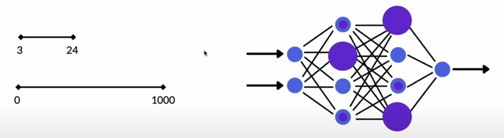
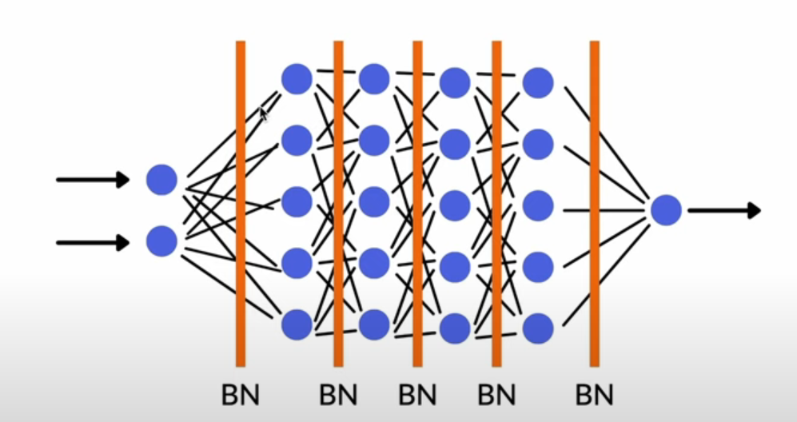
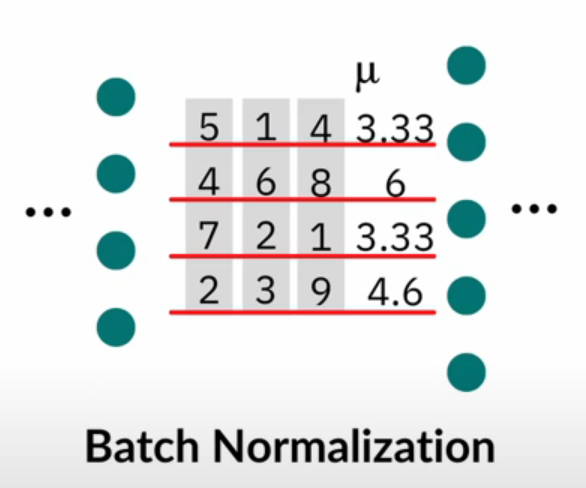
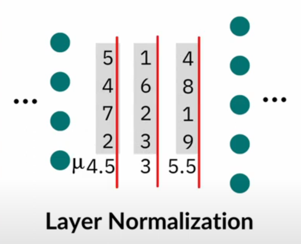

## Sources
- [Batch normalization | What it is and how to implement it](https://www.youtube.com/watch?v=yXOMHOpbon8)
- [ What is Layer Normalization? | Deep Learning Fundamentals](https://www.youtube.com/watch?v=2V3Uduw1zwQ)

---
## **1. Dropout**

* **What it does:** Randomly “turns off” (sets to 0) some neurons during training.
* **Why:** Prevents the network from relying too much on specific neurons → reduces **overfitting**.
* **When:** Used **only during training**, turned off during inference.
* **Example:** If dropout = 0.5 → half of the neurons are dropped each forward pass.

> **Think of it as:** “Forcing the model to not depend on any single neuron → improves generalization.”

---
## Before we start 
### 1. What unnormalized NN looks like
- Having a big difference in the **range of inputs** will make it **very hard** for the network to learn and the weight values of the neurons will be very different from each other.

## **2. Batch Normalization (BatchNorm)**


* **What it does:** Normalizes the activations of the *previous* layer **across the batch** (the outputs of a layer **before the activation function**) (mean = 0, variance = 1), then scales and shifts them.
* **Why:** Helps stabilize and speed up training by keeping activations in a consistent range.
* **When:** Typically used in CNNs and dense networks, **between linear/conv and activation**.
* **Extra:** During inference, it uses stored running averages (mean and variance) instead of batch statistics.
- **Cons:**  Hard to use with 
	- *sequence data* 
	- *small batch sizes*
	- *parallelization*

> **Think of it as:** “Keeps the layer outputs balanced during training → helps the model learn faster and more stably.”
> You don’t need to *standardize* the input data before feeding it into the network, since Batch Normalization already does that during training.

---

## **3. Layer Normalization (LayerNorm)**
 

* **What it does:** Normalizes activations **across all features of each individual sample** (not across batch).
* **Why:** Makes training more stable, especially in **RNNs and Transformers**, where batch sizes can vary or dependencies are across time/sequence.
* **When:** Used often in Transformer blocks, before or after self-attention/MLP.

> **Think of it as:** “Normalizes each sample independently → good for sequence models and small batches.”

---

## **Summary Table**

| Technique     | Normalizes Across              | Main Goal                                  | Common Use         | Placement                                                      |
| ------------- | ------------------------------ | ------------------------------------------ | ------------------ | -------------------------------------------------------------- |
| **Dropout**   | —                              | Prevent overfitting                        | CNNs, MLPs         | After activation layer                                         |
| **BatchNorm** | Batch dimension                | Stabilize + speed up training              | CNNs, MLPs         | Between linear/conv and activation                             |
| **LayerNorm** | Feature dimension (per sample) | Stable training for variable-length inputs | RNNs, Transformers | Before (or after) attention/MLP block, usually before (Pre-LN) |

---

## What does “normalizes the activations of each layer” mean?

### 1. **What are “activations”?**

* In a neural network, each neuron takes an input, applies weights and bias, and then passes the result through an **activation function** (like ReLU, Sigmoid, etc.).
* The **output values** that come **after** applying the activation function are called the **activations** of that layer.

Example (simple flow):

```
Input → Linear layer (weights + bias) → Activation function (ReLU, Sigmoid...) → Output
```

The numbers that come **out of the activation function** are the **activations**.

---

### 2. **So what does “normalize the activations” mean?**

* During training, activations can get **too large or too small** (this is called *internal covariate shift*).
* **BatchNorm** or **LayerNorm** fix this by **scaling those activation values** so that their mean is around 0 and their variance is around 1.
  This keeps the learning stable and helps the network converge faster.

In math terms (for BatchNorm):
$$
\hat{x} = \frac{x - \mu_{\text{batch}}}{\sqrt{\sigma_{\text{batch}}^2 + \epsilon}}
$$
Then it optionally rescales and shifts it with learned parameters:
$$
y = \gamma \hat{x} + \beta
$$

---

## Putting it all together (example)

Typical layer block in a neural net:

```
Linear/Conv → BatchNorm → ReLU → Dropout
```

* **Linear/Conv:** computes weighted sum
* **BatchNorm:** normalizes activations (keeps them stable)
* **ReLU:** activation layer adds non-linearity
* **Dropout:** randomly disables neurons to prevent overfitting

