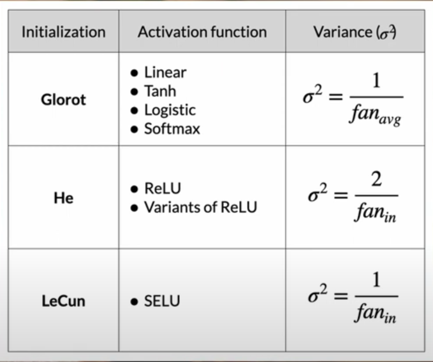

## Source
- [Weight Initialization for Deep Feedforward Neural Networks](https://www.youtube.com/watch?v=tYFO434Lpm0&t=30s)
## Weight Initialization (Xavier, Kaiming, LeCun)

Proper weight initialization helps prevent **vanishing or exploding gradients**, ensuring that signals flow well through the network during forward and backward passes.

---

### **1. Glorot (Xavier) Initialization**

* **Used with:** Linear, Tanh, Logistic (Sigmoid), Softmax
* **Formula:**
  $$
  \sigma^2 = \frac{1}{fan_{avg}} = \frac{2}{fan_{in} + fan_{out}}
  $$
* **Idea:** Keeps the **variance of activations** and **gradients** roughly the same across layers.
* **When to use:** When activations are **symmetric** (like Tanh or Sigmoid).
* **In PyTorch:**
  `torch.nn.init.xavier_uniform_()` or `xavier_normal_()`

> Think of it as: “Balances input and output flow → stable for smooth activations.”

---

### **2. He (Kaiming) Initialization**

* **Used with:** ReLU and its variants (LeakyReLU, ELU, etc.)
* **Formula:**
  $$
  \sigma^2 = \frac{2}{fan_{in}}
  $$
* **Idea:** Accounts for the fact that ReLU **zeros out half of its inputs**, so it **doubles the variance** to compensate.
* **When to use:** For **ReLU-based networks** (most modern CNNs).
* **In PyTorch:**
  `torch.nn.init.kaiming_uniform_()` or `kaiming_normal_()`

> Think of it as: “Adds extra variance to survive ReLU’s zeroing effect.”

---

### **3. LeCun Initialization**

* **Used with:** SELU (Scaled Exponential Linear Unit)
* **Formula:**
  $$
  \sigma^2 = \frac{1}{fan_{in}}
  $$
* **Idea:** Designed for **self-normalizing networks**, keeps activations near zero mean and unit variance automatically.
* **When to use:** With **SELU activation** in **self-normalizing networks**.
* **In PyTorch:**
  `torch.nn.init.lecun_normal_()` or `lecun_uniform_()`

> Think of it as: “Built to keep activations self-normalized, pairs with SELU.”

---

### **Quick Comparison Table**

| Initialization      | Best for Activation                      | Variance Formula ($\sigma ^2$) | When to Use                     |
| ------------------- | ---------------------------------------- | ------------------------------ | ------------------------------- |
| **Glorot (Xavier)** | Tanh, Sigmoid, Softmax, Linear, Logistic | $$\frac{1}{fan_{avg}}$$        | Balanced activations (non-ReLU) |
| **He (Kaiming)**    | ReLU, LeakyReLU                          | $$\frac{2}{fan_{in}}$$         | Deep CNNs / ReLU networks       |
| **LeCun**           | SELU                                     | $$\frac{1}{fan_{in}}$$         | Self-normalizing networks       |

