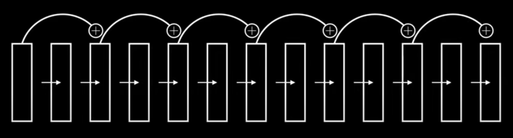

## Sources
- [ResNet (actually) explained in under 10 minutes](https://www.youtube.com/watch?v=o_3mboe1jYI)

## **CNN Architecture Comparison**

| Model             | Year | Key Idea                                               | Depth                        | Parameters       | Main Innovations                                             | Typical Use Cases                                                 |
| ----------------- | ---- | ------------------------------------------------------ | ---------------------------- | ---------------- | ------------------------------------------------------------ | ----------------------------------------------------------------- |
| **LeNet-5**       | 1998 | Early CNN for digit recognition                        | 5–7 layers                   | ~60K             | Introduced convolution + pooling + FC combo                  | Handwritten digit recognition (MNIST), basic CNN teaching         |
| **AlexNet**       | 2012 | Deep CNN with ReLU and dropout                         | 8 layers                     | ~60M             | ReLU activation, dropout, data augmentation, trained on GPUs | General image classification, foundation for deep CNN research    |
| **VGG16 / VGG19** | 2014 | Deep CNN with small (3×3) filters stacked sequentially | 16–19 layers                 | ~138M            | Simplicity + uniform architecture (3×3 conv + 2×2 pool)      | Transfer learning, feature extraction, object detection backbones |
| **ResNet**        | 2015 | Introduced **skip connections (residual blocks)**      | 18–152 layers                | ~25M (ResNet-50) | Solves vanishing gradients → enables _very_ deep networks    | Most modern tasks: classification, detection, segmentation        |
| **EfficientNet**  | 2019 | Scales **depth, width, and resolution** systematically | up to 480 layers (EffNet-B7) | ~66M (B7)        | Compound scaling, optimized for accuracy & efficiency        | Real-time and mobile applications, efficient training/deployment  |

---

## **Key Insights**

|Concept|Introduced By|Purpose|
|---|---|---|
|**ReLU Activation**|AlexNet|Avoid vanishing gradients in deep CNNs|
|**Small stacked convs (3×3)**|VGG|Capture more complex features efficiently|
|**Residual Connections**|ResNet|Enable extremely deep networks (100+ layers)|
|**Compound Scaling**|EfficientNet|Balanced scaling of all network dimensions|

---

## **Practical Use Cases**

|Scenario|Best Choice|Why|
|---|---|---|
|**Simple dataset (e.g., MNIST, digits)**|LeNet|Lightweight and fast|
|**Basic image classification (learning CNNs)**|AlexNet|Historical and educational|
|**Feature extraction / transfer learning**|VGG|Easy to fine-tune, stable features|
|**High-performance classification / detection**|ResNet|Deep, general-purpose backbone|
|**Mobile / real-time inference**|EfficientNet|Accuracy–efficiency tradeoff is excellent|

---

## **Skip Connections / Residual Blocks (ResNet)**

#### **The Problem:**

When CNNs became *very deep* (e.g., 30+ layers), training got harder.

* Gradients became **very small** as they backpropagated → **vanishing gradients**.
* Deeper networks sometimes performed *worse* than shallower ones.

---

#### **The Solution: Residual (Skip) Connections**

Instead of just passing data *layer by layer* like:
$$
x \rightarrow f(x)
$$

ResNet adds a **shortcut (skip connection)** that lets the input **skip over** some layers:

$$
\text{Output} = f(x) + x
$$

Here:

* ( f(x) ) = transformation done by a few conv, BN, ReLU layers
* ( x ) = the original input (added directly to the output)

---

#### **Why It Helps**

* The network can learn a **residual mapping** ( f(x) = H(x) - x ), which is easier to optimize.
* Gradients can **flow directly** through the skip path → no vanishing.
* Allows training **hundreds or thousands** of layers effectively.

---

#### **Visual Intuition**


- Viewing the network as a **series of residual blocks** instead of series of **independent layers**.

```
      Input (x)
         │
         ├───────────────┐
         │               │
      [Conv → BN → ReLU] │
      [Conv → BN]        │
         │               │
         └──── + x  <────┘  ← Skip connection adds input back (be aware of dimension mismatch)
              │
           [ReLU] ← This is arbitrary (but gives best results)
```
> Note: adding a final *activation function* after the skip connection is arbitrary, but the authors of the original paper found this to give **the best results**.

---
#### **Dimension Mismatch Problems**

In ResNet, the **output of a convolutional block** (the part that goes through several conv layers) often has **different dimensions** (spatial size or number of channels) compared to the input ( x ).

This happens because convolutional layers **reduce spatial dimensions** (for feature compression) or **increases** channel depth, which is common in **image classification**.

So, after that path, the **output of the conv block** typically has **more channels** (and possibly smaller spatial width/height) than the **input skip connection x**.

As you go **deeper** into the network:
- **Spatial dimensions (H×W)** → **decrease**
- **Number of channels (depth)** → **increase**

> x (the skip input) usually has _fewer channels_ than the output of the convolutional block.
> **In short:** As the network goes deeper, it trades _spatial detail_ for _feature richness_.

To properly add ( f(x) + x ), both tensors must have **the same shape**.
If not, we must fix the mismatch.

##### **Two common solutions:**

1. **Zero Padding (no extra parameters)**

   * Increase the number of *channels* in ( x ) by padding with zeros.
   * ✅ No extra parameters.
   * ❌ Inefficient, extra zero channels add useless computation and memory.

2. **1×1 Convolution (projection shortcut)**

   * Pass ( x ) through a **1×1 convolution** to match the output *dimensions*.
   * ✅ Efficient and learnable , adjusts both spatial and channel dimensions.
   * ❌ Adds a small number of extra parameters.
   * Example: if ( x ) has 3 channels and we need 6, use **six 1×1 filters** to double the output channels.

> **In short:** When input and output dimensions differ, ResNet uses either **zero-padding** (cheap but inefficient) or a **1×1 conv projection** (adds params but precise).


---

#### **In Summary**

| Term                | Meaning                                          | Benefit                                        |
| ------------------- | ------------------------------------------------ | ---------------------------------------------- |
| **Skip Connection** | Directly adds the input to the output of a block | Prevents **vanishing** gradients               |
| **Residual Block**  | Block that uses a skip connection                | Allows deeper, easier-to-train networks        |
| **ResNet**          | Network made of many residual blocks             | Enables *ultra-deep* CNNs with stable training |

---

> **Think of it as:** “If deeper layers don’t help, at least they can learn to *do nothing* and let information pass through unchanged.”

---

