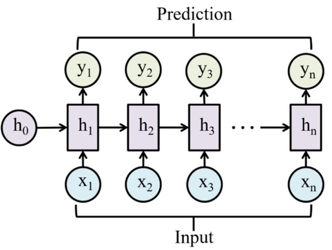
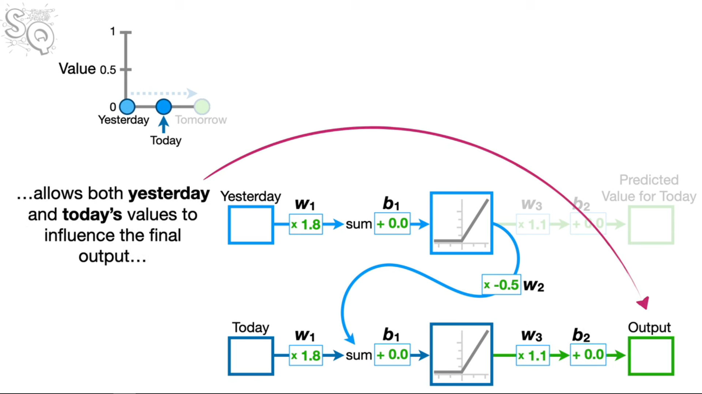
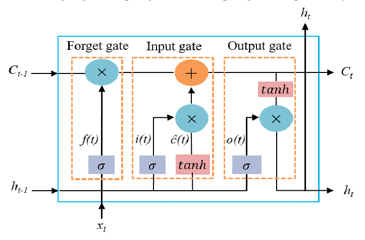
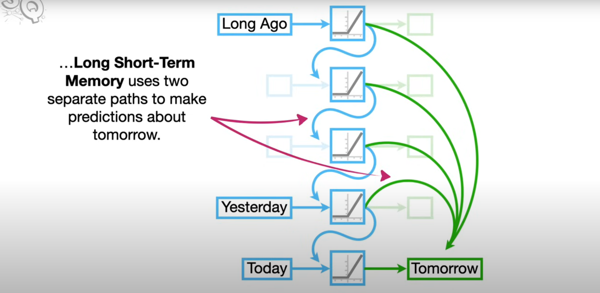
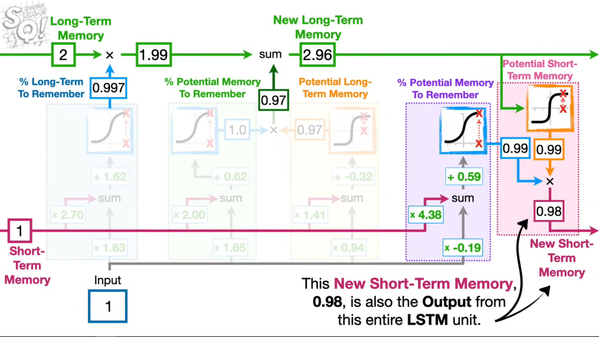
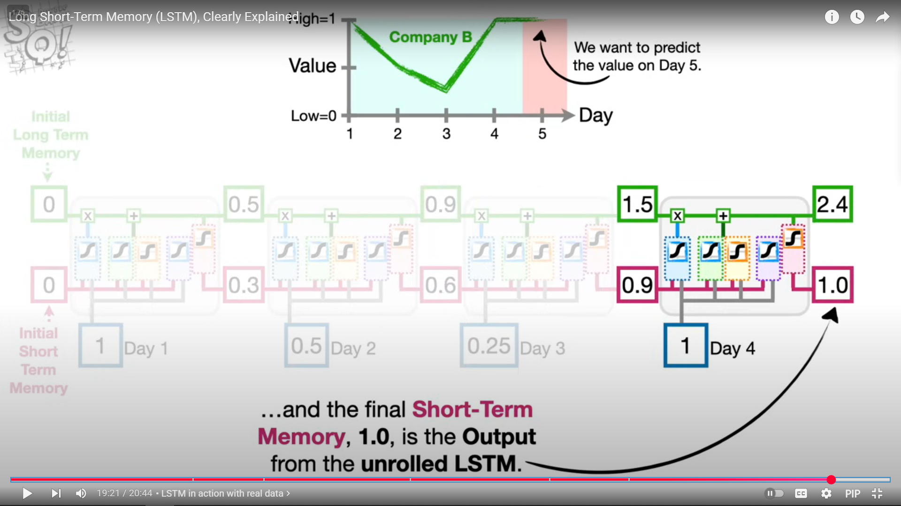
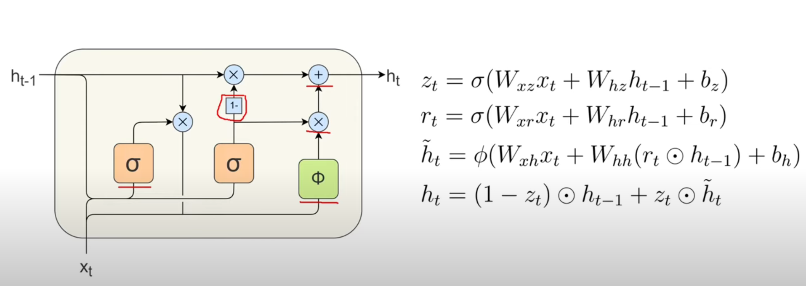
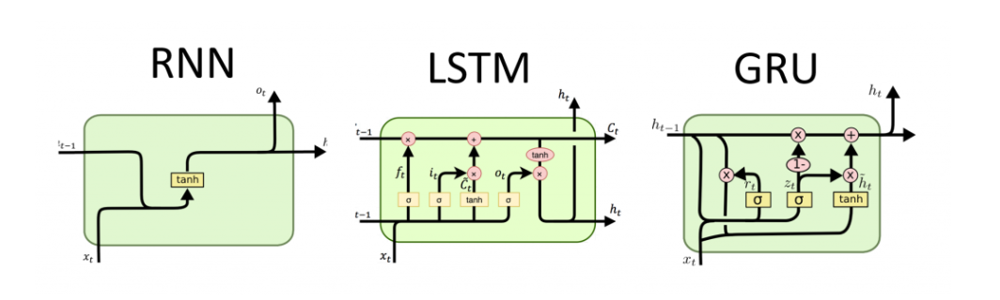

## Sources
- [Recurrent Neural Networks (RNNs), Clearly Explained!!!](https://www.youtube.com/watch?v=AsNTP8Kwu80)
- [Long Short-Term Memory (LSTM), Clearly Explained](https://www.youtube.com/watch?v=YCzL96nL7j0)
- [Gated Recurrent Unit (GRU) Equations Explained](https://www.youtube.com/watch?v=hkJNjxlEO-s)
- [LSTMs and GRUs](https://www.youtube.com/watch?v=E4c_bom0_6Y)
- [Mastering GRU: A Deep Dive into Gated Recurrent Units](https://www.youtube.com/watch?v=LMFFp5_iPh4)

---
## **Recurrent Neural Networks (RNNs)**

RNNs are neural networks designed for **sequential data**, where the output at each time step depends on **previous inputs**.
They use **hidden states** that carry information forward through time, allowing the model to capture **temporal dependencies**.
However, standard RNNs struggle with **long-term dependencies** due to **vanishing/exploding gradients** during backpropagation through time (BPTT).

> **Note:** regardless of how many times we unroll an RNN (add layers for each input), the **weights** and **biases** are *shared across every input*, so the total number of weights and biases that  have to train **never increases**. (notice how  w1, 3 and b1,2 are the same for both layers)

**Key idea:**
$$h_t = f(W_h\times h_{t-1} + W_x\times x_t + b)$$
**Where:**
- $h_t$: *hidden* state at time t
- $h_{t-1}$: hidden state at time t-1
- $x_t$: input at time t
- $W_h$: recurrent weight matrix (hidden→hidden)
- $W_x$: input weight matrix (input→hidden)
- $b$: bias vector
- $f$: activation function (e.g., ReLU)

**Pros:**
- Simple and lightweight, few parameters and easy to implement.
- Effective for **short-term** dependencies and simple sequential patterns.
- Fast inference and training on short sequences.

**Cons:**
- Struggles with long-term dependencies due to vanishing/exploding gradients.
- Often unstable to train on long sequences.
- Poor performance on tasks requiring long context or complex temporal patterns.

---
## **Long Short-Term Memory (LSTM)**

LSTMs are a special type of RNN designed to **overcome vanishing and exploding gradients** by introducing **gates** that regulate information flow.
They can **remember information over long time spans** by maintaining a **cell state** that flows through time with minimal modification.

**Core components:**

* **Forget gate:** Decides what information to *discard* (% of **long-term memory** to remember).
* **Input gate:** Decides what new information to *store* (% of potential memory to remember x potential **long-term** memory).
* **Output gate:** Decides what information to *output* (% of potential memory to remember x potential **short-term** memory).

**Key equations:**
$$
\begin{align*}
f_t &= \sigma(W_f [h_{t-1}, x_t] + b_f) \\
i_t &= \sigma(W_i [h_{t-1}, x_t] + b_i) \\
\tilde{C}*t &= \tanh(W_C [h*{t-1}, x_t] + b_C) \\
C_t &= f_t * C_{t-1} + i_t * \tilde{C}*t \\
o_t &= \sigma(W_o [h*{t-1}, x_t] + b_o) \\
H_t &= o_t * \tanh(C_t) \\
\end{align*}
$$

**Where:**
- $f_t$: *forget* gate vector (values in [0,1])
- $i_t$: *input* gate vector (values in [0,1])
- $\tilde{C}_t$: candidate cell state (proposed new content)
- $C_t$: cell state (*long-term* memory) at time t
- $o_t$: *output* gate vector (values in [0,1])
- $H_t$ (or $h_t$): hidden state (*short-term* output) at time t
- $W_f$, $W_i$, $W_C$, $W_o$: weight matrices for respective gates
- $b_f$, $b_i$, $b_C$, $b_o$: bias vectors for respective gates
- $\sigma$: *sigmoid* activation function
- $\tanh$: hyperbolic tangent activation
- $[h_{t-1}, x_t]$: concatenation of previous hidden state and current input
- $*$ : element-wise multiplication

**Pros:**
- Designed to mitigate vanishing gradient problems, good at long-term dependencies.
- Strong performance on many sequence tasks (language modeling, translation).
- Gates allow selective memory retention and forgetting.

**Cons:**
- More parameters and higher computational cost than simple RNNs.
- Slower to train and may require more memory.
- More complex architecture to tune and understand.

---

## **Gated Recurrent Unit (GRU)**

GRUs simplify the LSTM by **combining the forget and input gates** into a single **update gate** and **removing the separate cell state**.
They achieve similar performance but with **fewer parameters** and **faster training**.

**Core components:**
* **Reset gate:** Controls how much of the past information to *forget* when computing the new hidden state (helps capture **short-term** memory).
* **Update gate:** Controls how much of the past information to *keep* (helps capture **long-term** memory).

**Key equations:**
$$
\begin{align*}
z_t &= \sigma(W_z [h_{t-1}, x_t]) \\
r_t &= \sigma(W_r [h_{t-1}, x_t]) \\
\tilde{h}*t &= \tanh(W_h [r_t * h*{t-1}, x_t]) \\
H_t &= (1 - z_t) * h_{t-1} + z_t * \tilde{h}_t \\
\end{align*}
$$

**Where:**
- $z_t$: *update* gate (controls interpolation between previous and candidate hidden state)
- $r_t$: *reset* gate (controls how much past to forget for candidate)
- $\tilde{h}_t$: candidate hidden state
- $H_t$ (or $h_t$): new *hidden state* at time t
- $W_z$, $W_r$, $W_h$: weight matrices for update, reset, and candidate computations
- $\sigma$: *sigmoid* activation function
- $\tanh$: hyperbolic tangent activation
- $[h_{t-1}, x_t]$: concatenation of previous hidden state and current input
- $*$ : element-wise multiplication

**Pros:**
- Simpler and more efficient than LSTM (fewer gates, fewer parameters).
- Often trains faster and can match LSTM performance on many tasks.
- Good compromise between capacity and speed.

**Cons:**
- May be slightly less expressive than LSTM for some very long-context tasks.
- Performance differences vs LSTM depend on task and dataset; not universally better.
- Still subject to some training difficulties on very long sequences.

---
## Summary

| Feature                           | **RNN**                                                | **LSTM**                                                 | **GRU**                                                     |
| :-------------------------------- | :----------------------------------------------------- | :------------------------------------------------------- | :---------------------------------------------------------- |
| **Purpose**                       | Models sequential data with *short-term* memory        | Handles *long-term* dependencies with gated memory cells | Simplified version of LSTM, faster and efficient            |
| **Memory Mechanism**              | Hidden state only $h(t)$                               | Hidden state + cell state $c(t)$                         | Hidden state only                                           |
| **Gates**                         | None                                                   | Input, Forget, Output                                    | Update, Reset                                               |
| **Gradient Issues**               | Suffers from vanishing/exploding gradients             | Mitigates vanishing gradients                            | Mitigates vanishing gradients                               |
| **Parameter Count**               | Fewest                                                 | Most                                                     | Fewer than LSTM                                             |
| **Training Speed**                | Fastest                                                | Slowest                                                  | Faster than LSTM, slower than RNN                           |
| **Performance on Long Sequences** | Poor                                                   | Excellent                                                | Good, slightly less than LSTM                               |
| **Common Use Cases**              | Simple sequential tasks (e.g., time-series prediction) | Complex sequences (e.g., language modeling, translation) | When efficiency and speed matter (e.g., speech recognition) |

