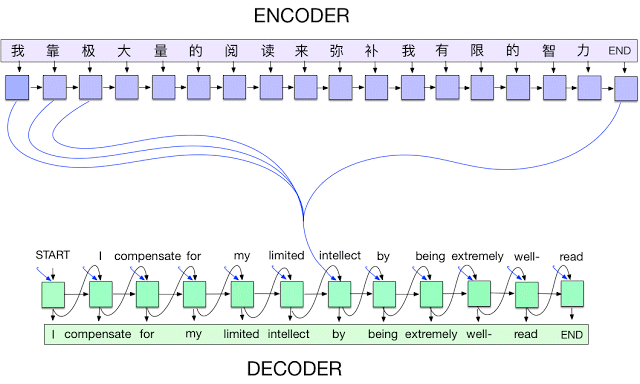

## **Sequence-to-Sequence (Seq2Seq) Models**

Seq2Seq models are used for tasks where **input and output are both sequences**, but of possibly **different lengths** (e.g., machine translation).

They consist of two main parts:
* **Encoder:** Reads and compresses the input sequence into a **context vector** (fixed-length representation).
* **Decoder:** Uses that context vector to generate the **output sequence** step by step.

The original Seq2Seq models used **RNNs (or LSTMs/GRUs)** for both encoder and decoder.
Later versions incorporate **attention mechanisms** to let the decoder focus on relevant parts of the input at each step, solving the fixed-size bottleneck problem.

**Pros:**
- Handles variable-length input and output sequences naturally.
- Flexible architecture (encoder/decoder) suitable for many tasks (translation, summarization).
- Can be enhanced with attention to focus on relevant input parts.

**Cons:**
- Vanilla Seq2Seq with a fixed context vector can **bottleneck** information (especially for long inputs).
- Can be computationally expensive and data-hungry.
- Training and tuning can be more complex (teacher forcing, alignment, etc.).
