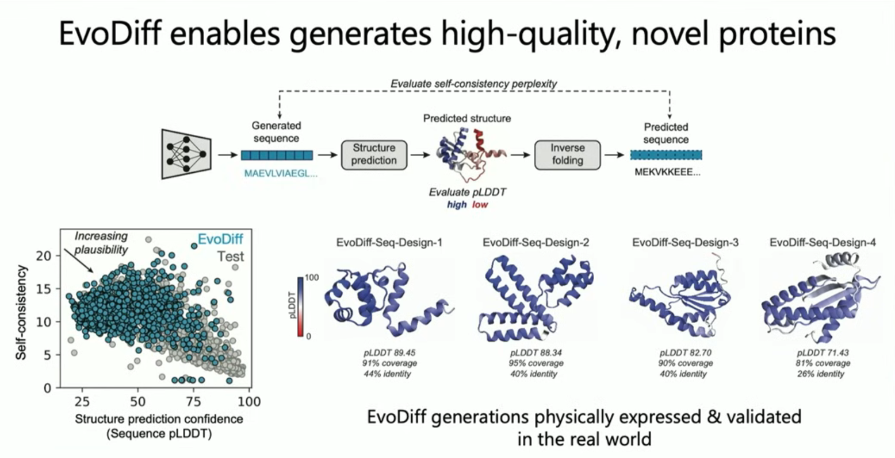

# Lecture 10: AI for Biology 

### [Video Link](https://www.youtube.com/watch?v=SSzSOeGP87I&ab_channel=AlexanderAmini)
## Introduction

- This lecture presents the idea of how to **link** generative AI and deep neural networks to biology, to be able to create new things like a new protein.
- To represent these biological languages into something the NN can understand we can do something like the following:

- What they are trying to do is to build a generative model that can understand these **protein sequence data**, to be able to generate new proteins, and prompt what they want this new protein's functions to be.
---
## EvoDiff:

**EvoDiff** is a generative **AI model for protein design** developed by researchers at Salesforce Research. It stands for **Evolutionary Diffusion**, and it applies **diffusion models** (commonly used in image generation) to the **sequence and structure of proteins**.

### Key Points:

- **Purpose**: EvoDiff is designed to generate **novel protein sequences** that are **structurally and functionally realistic**, even if they *do not exist* in nature.
- **How it works**: It uses a **diffusion process** to gradually denoise random inputs into meaningful protein representations — similar to how models like DALL·E or Stable Diffusion create images from noise.
- **Representation**: Unlike traditional methods that rely solely on amino acid sequences, EvoDiff can operate in **3D or 2D structural space**, enabling **structure-aware generation**.
- **Advantages**:
    - Works without relying on natural sequence databases (no multiple sequence alignment needed).
    - Can **generate proteins from scratch** based on desired structural or functional constraints.

### Applications:

- Drug design
- Enzyme engineering
- Synthetic biology
- Understanding protein evolution

---
## Discrete Diffusion

**Discrete diffusion** is used for data made of **tokens** (like words or amino acids). In this process, noise is added by **randomly replacing tokens** with others from the vocabulary or with a special placeholder like `[MASK]`. Over time, the sequence becomes more corrupted. During training, the model learns to **reverse** this corruption by predicting the original tokens step by step.

- Works on **categorical data** (e.g., protein sequences: `A, R, K...`, or text).
- Noise = replacing tokens with random ones.
- Reverse process = predicting the correct token from a corrupted input.

---
### Different **Discrete Diffusion** approaches

#### Next-Token Autoregressive (Left):

- Generates tokens **one-by-one** from left to right (e.g., GPT).
    
- Each token depends on the ones before it.
    
- **Only one decoding order** (fixed left-to-right).
    
#### Masked Language Modeling (Right):

- Predicts a few **randomly masked tokens** at once (e.g., BERT).
    
- No fixed order; it's **one-step prediction**.
    
- Doesn't generate sequences, just fills in blanks.
    
#### Discrete Diffusion (Middle):

- **Generalizes both**:
    
    - Predicts all tokens but over **multiple steps** (not just one like BERT).
        
    - Works in **any decoding order** (not just left-to-right like GPT).
        
- Gradually refines a noisy version of the full sequence, making it more accurate each step.
    

So, discrete diffusion combines the **flexibility of BERT** (any position) with the **generation capability of GPT**, but adds **step-wise denoising** to control the learning process better.

---

---
## Biological "Prompting" in EvoDiff

In **EvoDiff**, _biological prompting_ refers to the idea of giving the model **biologically relevant context** (or “prompts”) to guide protein generation—similar to how language models are prompted with text.

### What kind of prompts?

- **Partial sequences** (e.g., known functional motifs (**Short, conserved sequences** in proteins that are linked to **specific biological functions**.)).
    
- **Desired 3D structures** or structural constraints.
    
- **Functional regions** (like binding sites or catalytic residues).
    
- **Specific secondary structure elements** (e.g., alpha helices at certain positions).
    

### Why is this useful?

- It allows **controlled protein generation** instead of random sequences.
    
- Helps design proteins with **desired functions, shapes, or properties**.
    
- Mimics how natural proteins evolve under structural/functional constraints.
    

So, biological prompting helps EvoDiff generate proteins **on demand**, based on user-defined biological goals, much like giving a language model a sentence start and asking it to complete it.