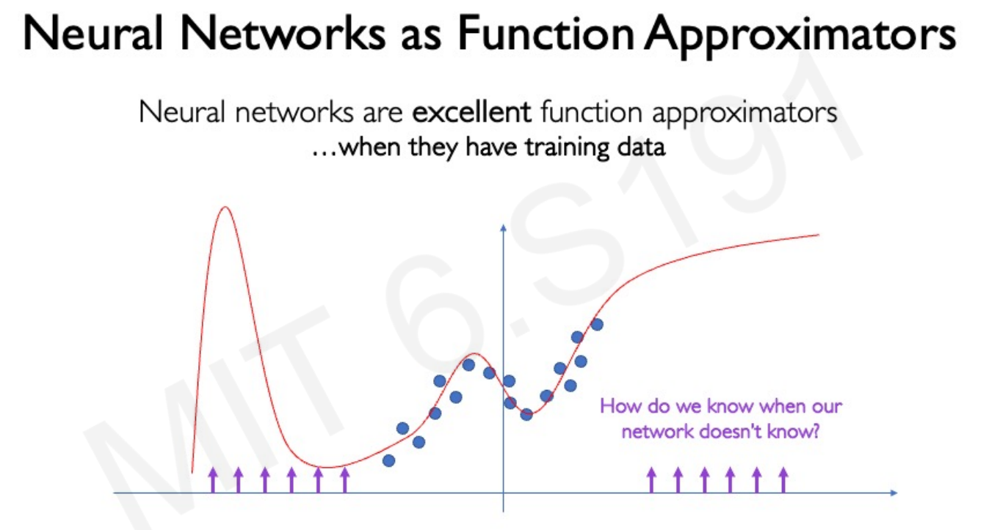

# Lecture 6: New Frontiers
### [Video Link](https://www.youtube.com/watch?v=HLKo4fJx_7k&list=PLtBw6njQRU-rwp5__7C0oIVt26ZgjG9NI&index=7&ab_channel=AlexanderAmini)
### [Slides Link](https://introtodeeplearning.com/slides/6S191_MIT_DeepLearning_L6.pdf)

## 1. Power of Neural Networks

Neural networks are powerful because they can **learn complex patterns and functions** from data. With enough layers and neurons, they can represent **almost any function**, whether it’s for classification, regression, control, or generation.

### **Universal Approximation Theorem**

The **Universal Approximation Theorem** states:

> A feedforward neural network with **at least one hidden layer** and a **non-linear activation function** (like ReLU or sigmoid) can approximate **any continuous function** on a compact input space **to any desired accuracy**, given **enough neurons**.

---
## 2. Rethinking generalization

- **Rethinking generalization** in deep learning means questioning traditional ideas about how and why neural networks generalize well to new data, even when they have far more parameters than training samples. 
- Classic machine learning says models should overfit in such cases, but deep networks often don’t, they perform well despite being over-parameterized. This has led to new theories like the role of implicit regularization, optimization dynamics (like SGD), and the structure of data in helping deep models generalize, even when classical theory can’t fully explain it.

---

## 3. Neural Networks as function approximators

Neural networks can be seen as **universal function approximators**, they learn to map inputs to outputs by adjusting weights to approximate an unknown function. Given enough neurons and layers, a neural network can model highly complex, non-linear relationships between variables, making them ideal for tasks like regression, classification, and reinforcement learning where the true underlying function (like Q(s, a) or π(a|s)) is unknown and must be learned from data.

---
## 4. Neural networks failure modes

- Neural networks have several **failure modes**, one major example being their sensitivity to small **perturbations** in input data. Even tiny, imperceptible changes (called **adversarial examples**) can cause a network to misclassify with high confidence. 
- This shows that despite *high accuracy*, networks may rely on fragile or non-robust features. Other failure modes include **memorizing noise** (overfitting), **poor generalization** to out-of-distribution inputs, and instability in **training dynamics**, especially in reinforcement learning where feedback loops can amplify small mistakes.
- **Adversarial attacks** exploit the fact that neural networks often rely on brittle, non-robust patterns in data by introducing **carefully crafted small changes** to inputs that cause the model to make incorrect predictions with high confidence. 
- These attacks can be white-box (knowing the model’s architecture and weights) or black-box (only observing outputs), and are especially dangerous in safety-critical systems like facial recognition or autonomous driving. Common methods include **FGSM (Fast Gradient Sign Method)** and **PGD (Projected Gradient Descent)**, which use gradients to find input perturbations that *maximize loss*. Their existence raises concerns about model reliability and has led to research in adversarial training and robust optimization.
 

---

## 5.Neural Networks Limitations

---
## 6. Diffusion models

- Diffusion models are a class of generative models that learn to create data (like images or audio) by **reversing a gradual noise process**. 
- During training, they learn how to **add noise step-by-step** to real data (the forward process), and then they learn how to **denoise** that data step-by-step to recover the original (the reverse process). 
- At inference time, they start from **pure noise** and gradually **denoise** it to generate realistic samples. 
- Unlike GANs, diffusion models are *more stable* to train and can produce high-quality outputs, which is why they are used in tools like **DALL·E 2** and **Stable Diffusion**.

---
## 7. Large Language Models

- **Large Language Models** (LLMs) are deep neural networks trained on vast amounts of *text data* to understand and generate human language. 
	- They use architectures like the **Transformer**, and models like **GPT**, **BERT**, and **LLaMA** fall into this category. 
	- LLMs learn **statistical patterns** in text and can perform a wide range of tasks, from writing code to answering questions, without task-specific training. 
	- Their power comes from scale: billions of parameters trained on diverse datasets, enabling them to generalize well, but they also raise challenges around bias, hallucination, and efficiency.
- **Next token prediction** is the core training objective for models like GPT, where the model learns to predict the **next word or token** in a sequence given all the previous ones. 
	- During training, the model is fed large text datasets and learns to assign **high probability** to the correct next token using a language modeling loss (usually cross-entropy).
	- This setup allows the model to learn grammar, facts, reasoning patterns, and even coding logic, and it forms the foundation for generating coherent text, answering questions, or continuing prompts at inference time.
	

---

## 8. Emergent abilities
- **Emergent abilities** refer to surprising skills that large language models develop **only after reaching a certain scale** in model size or data, abilities that smaller models simply don’t show. Examples include basic arithmetic, in-context learning, code generation, or following complex instructions. These abilities aren’t directly programmed or seen during training, but they **“emerge”** once the model passes a threshold in capacity, suggesting that **scale unlocks new generalization behavior** that can't be predicted just by studying smaller models.

