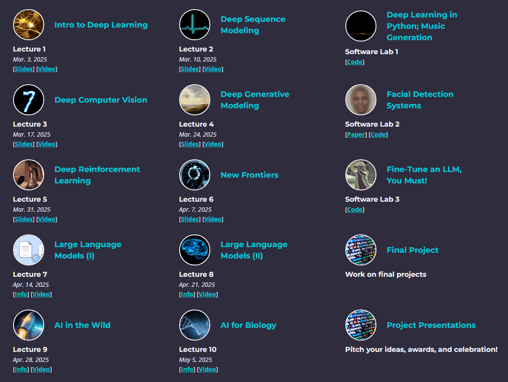

# MIT 6.S191: Introduction to Deep Learning

This repository contains my personal notes, implementations, and assignments from the [MIT 6.S191: Introduction to Deep Learning](https://introtodeeplearning.com/). The course provides a comprehensive introduction to deep learning methods and applications, including computer vision, natural language processing, generative models, and more.

## Resources

- **Institution:** Massachusetts Institute of Technology (MIT)
- **Course Website:** [Course Homepage](https://introtodeeplearning.com/) 
- **Lectures Playlist:** [YouTube Lectures](https://www.youtube.com/playlist?list=PLtBw6njQRU-rwp5__7C0oIVt26ZgjG9NI) 

## Progress
### Lectures
- [x] Lecture 1: Intro to Deep Learning
- [x] Lecture 2: Deep Sequence Modeling 
- [x] Lecture 3: Deep Computer Vision 
- [x] Lecture 4: Deep Generative Modeling 
- [x] Lecture 5: Deep Reinforcement Learning 
- [x] Lecture 6: New Frontiers 
- [x] Lecture 7: Large Language Models (I) 
- [x] Lecture 8: Large Language Models (II) 
- [x] Lecture 9: AI in the Wild 
- [x] Lecture 10: AI for Biology 
### Software Labs
- [x] Software Lab 1: Deep Learning in Python; Music Generation  
- [x] Software Lab 2: Facial Detection Systems  
- [x] Software Lab 3: Fine-Tune an LLM, You Must!  

## Topics Covered

