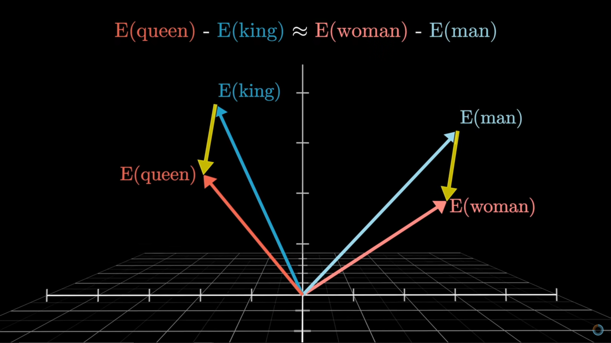
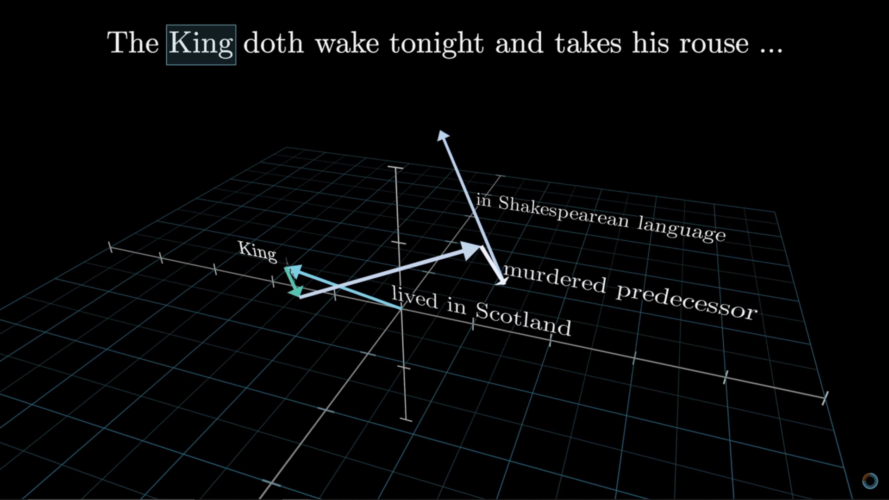

# Transformers, LLMs, PyTorch examples

## [Transformers, the tech behind LLMs | Deep Learning Chapter 5](https://www.youtube.com/watch?v=wjZofJX0v4M&t=442s&ab_channel=3Blue1Brown)
- [0:00](https://www.youtube.com/watch?v=wjZofJX0v4M) - Predict, sample, repeat
- [3:03](https://www.youtube.com/watch?v=wjZofJX0v4M&t=183s) - Inside a transformer
- [6:36](https://www.youtube.com/watch?v=wjZofJX0v4M&t=396s) - Chapter layout
- [7:20](https://www.youtube.com/watch?v=wjZofJX0v4M&t=440s) - The premise of Deep Learning
- [12:27](https://www.youtube.com/watch?v=wjZofJX0v4M&t=747s) - Word embeddings 
- [18:25](https://www.youtube.com/watch?v=wjZofJX0v4M&t=1105s) - Embeddings beyond words 
- [20:22](https://www.youtube.com/watch?v=wjZofJX0v4M&t=1222s) - Unembedding 
- [22:22](https://www.youtube.com/watch?v=wjZofJX0v4M&t=1342s) - Softmax with temperature 
- [26:03](https://www.youtube.com/watch?v=wjZofJX0v4M&t=1563s) - Up next
## [Attention in transformers, step-by-step | Deep Learning Chapter 6](https://www.youtube.com/watch?v=eMlx5fFNoYc&ab_channel=3Blue1Brown)
- [0:00](https://www.youtube.com/watch?v=eMlx5fFNoYc) - Recap on embeddings
- [1:39](https://www.youtube.com/watch?v=eMlx5fFNoYc&t=99s) - Motivating examples 
- [4:29](https://www.youtube.com/watch?v=eMlx5fFNoYc&t=269s) - The attention pattern 
- [11:08](https://www.youtube.com/watch?v=eMlx5fFNoYc&t=668s) - Masking
- [12:42](https://www.youtube.com/watch?v=eMlx5fFNoYc&t=762s) - Context size 
- [13:10](https://www.youtube.com/watch?v=eMlx5fFNoYc&t=790s) - Values 
- [15:44](https://www.youtube.com/watch?v=eMlx5fFNoYc&t=944s) - Counting parameters 
- [18:21](https://www.youtube.com/watch?v=eMlx5fFNoYc&t=1101s) - Cross-attention 
- [19:19](https://www.youtube.com/watch?v=eMlx5fFNoYc&t=1159s) - Multiple heads
- [22:16](https://www.youtube.com/watch?v=eMlx5fFNoYc&t=1336s) - The output matrix
- [23:19](https://www.youtube.com/watch?v=eMlx5fFNoYc&t=1399s) - Going deeper
- [24:54](https://www.youtube.com/watch?v=eMlx5fFNoYc&t=1494s) - Ending
## [How might LLMs store facts | Deep Learning Chapter 7](https://www.youtube.com/watch?v=9-Jl0dxWQs8&ab_channel=3Blue1Brown)
- [0:00](https://www.youtube.com/watch?v=9-Jl0dxWQs8) - Where facts in LLMs live
- [2:15](https://www.youtube.com/watch?v=9-Jl0dxWQs8&t=135s) - Quick refresher on transformers
- [4:39](https://www.youtube.com/watch?v=9-Jl0dxWQs8&t=279s) - Assumptions for our toy example
- [6:07](https://www.youtube.com/watch?v=9-Jl0dxWQs8&t=367s) - Inside a multilayer perceptron
- [15:38](https://www.youtube.com/watch?v=9-Jl0dxWQs8&t=938s) - Counting parameters
- [17:04](https://www.youtube.com/watch?v=9-Jl0dxWQs8&t=1024s) - Superposition (In high-dimensional spaces, random vectors tend to be nearly orthogonal (i.e., have angles close to 90 degrees) due to the geometry of high-dimensional spaces. This property is useful in transformers because it allows different pieces of information (e.g., token representations, attention heads, or features) to be stored in overlapping or "superposed" ways with minimal interference. The **higher** the dimensionality, the **more independent directions** you can encode, making it easier to **separate** and later recover information.)
- [21:37](https://www.youtube.com/watch?v=9-Jl0dxWQs8&t=1297s) - Up next

## Simple LLM Transfer Learning with GPT-2 (PyTorch)

```python
# Import the essential libraries
import torch
from transformers import GPT2Tokenizer, GPT2LMHeadModel, Trainer, TrainingArguments, TextDataset, DataCollatorForLanguageModeling

# 1. Load a pretrained tokenizer (to tokenize text the same way GPT-2 was trained)
tokenizer = GPT2Tokenizer.from_pretrained("gpt2")

# GPT-2 doesn't have a padding token by default, so we add one for batching
tokenizer.pad_token = tokenizer.eos_token

# 2. Load a pretrained GPT-2 model with a language modeling head
model = GPT2LMHeadModel.from_pretrained("gpt2")

# Match the padding token in the model to tokenizer
model.resize_token_embeddings(len(tokenizer))

# 3. Prepare a very small sample dataset
with open("train.txt", "w") as f:
    f.write("The sky is blue.\nThe grass is green.\nCats sit on mats.\n")

# 4. Load and tokenize the dataset
def load_dataset(file_path):
    return TextDataset(
        tokenizer=tokenizer,
        file_path=file_path,
        block_size=64  # max sequence length per sample
    )

train_dataset = load_dataset("train.txt")

# 5. Prepare a data collator that dynamically pads sequences for batch training
data_collator = DataCollatorForLanguageModeling(
    tokenizer=tokenizer,
    mlm=False  # GPT-2 is a causal language model, not masked
)

# 6. Define training arguments
training_args = TrainingArguments(
    output_dir="./output",          # where to save the model
    overwrite_output_dir=True,
    per_device_train_batch_size=2,  # batch size
    num_train_epochs=3,             # number of training epochs
    save_steps=10_000,
    save_total_limit=2,
    logging_steps=10,
    logging_dir='./logs'
)

# 7. Initialize the Trainer
trainer = Trainer(
    model=model,
    args=training_args,
    train_dataset=train_dataset,
    data_collator=data_collator
)

# 8. Start training
trainer.train()

# 9. Save the final model
model.save_pretrained("./fine_tuned_gpt2")
tokenizer.save_pretrained("./fine_tuned_gpt2")

```

|Step|Explanation|
|---|---|
|1–2|Loads GPT-2 and sets up tokenizer so the input matches the original pretraining.|
|3|Creates a small toy dataset (for demo; in practice you'd use a larger one).|
|4|Tokenizes the data and splits it into blocks of 64 tokens for training.|
|5|Defines how to collate (batch and pad) data during training.|
|6|Sets up training configurations such as batch size, logging, and number of epochs.|
|7–8|Uses Hugging Face's `Trainer` class to handle training loops and optimization.|
|9|Saves the fine-tuned model for later use or deployment.|

---





