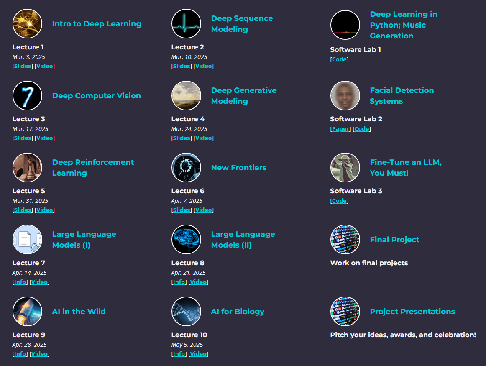

# MIT 6.S191: Introduction to Deep Learning

This repository contains my personal notes, implementations, and assignments from the [MIT 6.S191: Introduction to Deep Learning](https://introtodeeplearning.com/). The course provides a comprehensive introduction to deep learning methods and applications, including computer vision, natural language processing, generative models, and more.

## Resources

- **Institution:** Massachusetts Institute of Technology (MIT)
- **Course Website:** [Course Homepage](https://introtodeeplearning.com/) 
- **Lectures Playlist:** [YouTube Lectures (from 51 to 61)](https://www.youtube.com/playlist?list=PLtBw6njQRU-rwp5__7C0oIVt26ZgjG9NI) 

## Topics Covered

