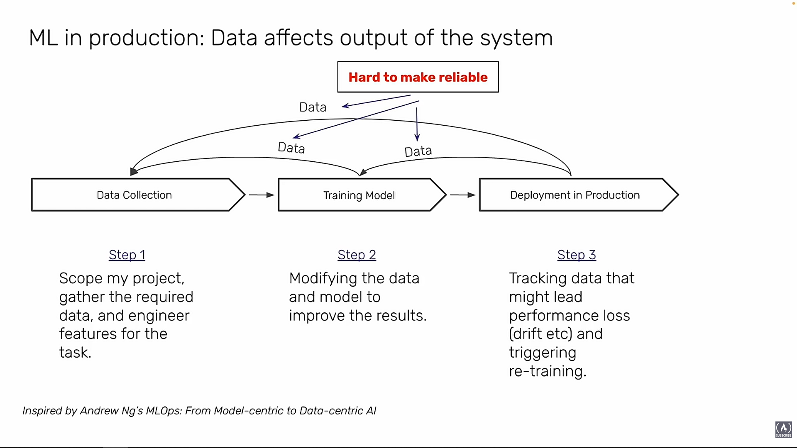
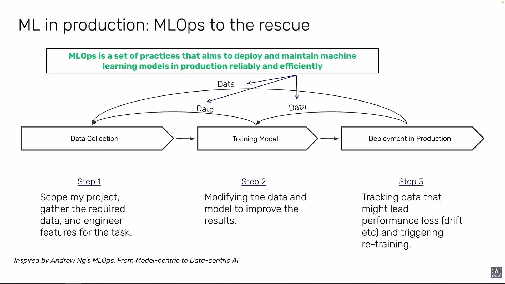
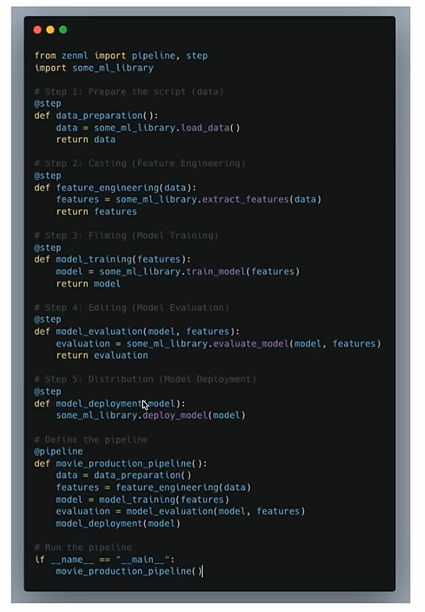

- 
- 
- MLOps is extension of DevOps
- Post-deployment:
    - woes: Accounting for latency (53% of visits are abanded if a mobile site takes longer than 3 seconds to load)
    - Maintinag Fairness
    - Lack of explainability and auditability
    - very slow (most data scients' time is spent deploying ML models)
- Model-centric vs Data-centric
- Example using `zenml`:
  - 