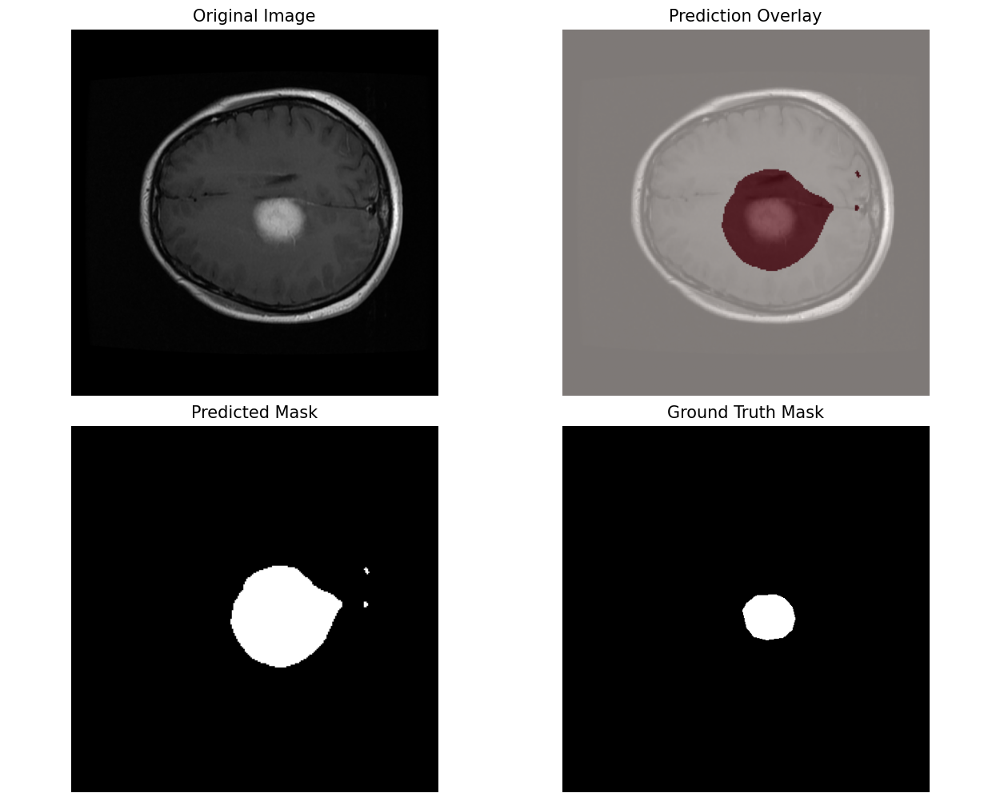

# Brain Tumor Segmentation

This project focuses on developing a **deep learning model** for semantic segmentation of brain tumors from MRI scans. The aim is to experiment with state-of-the-art segmentation architectures and refine them to achieve high accuracy in identifying tumor regions.

> Project's progress is currently on hold for a while.

### Sample Output

## Objective

The primary goal is to train a model that can **accurately detect and segment tumor subregions** from multi-modal MRI data. This involves:

* Exploring and understanding the **BraTS 2021** dataset and similar datasets.
* Implementing segmentation architectures such as **U-Net** and **MONAI-based models**.
* Optimizing model performance through experimentation with loss functions, learning rates, and data augmentation techniques.

## Dataset

This project uses the [Brain Tumor Segmentation Dataset](https://www.kaggle.com/datasets/nikhilroxtomar/brain-tumor-segmentation?select=images), which contains **3064 MRI brain image–mask pairs**.

* **Images**: 2D MRI slices.
* **Masks**: Binary masks where white pixels indicate tumor regions.

## Workflow

The entire workflow is documented in the [`Brain_tumor_seg.ipynb`](./Brain_tumor_seg.ipynb) notebook, which includes:

1. **Data loading & preprocessing** – Reading, resizing, and normalizing MRI images.
2. **Model definition** – Building a U-Net / MONAI-based architecture.
3. **Training** – Using a combination of Dice Loss and cross-entropy to optimize segmentation performance.
4. **Evaluation** – Measuring accuracy, Dice coefficient, and visualizing predictions.

## Results

After training for 20 epochs, the model achieved:

* **Final Validation Accuracy**: **90.81%**
* **Best Dice Coefficient**: **0.89**

Sample segmentation results show that the model can effectively capture tumor boundaries in most cases.

## Project Status & Future Work

**Status: On Hold**

This project has successfully demonstrated a baseline U-Net model for brain tumor segmentation. While the project is not currently under active development, the following areas were identified as the next steps for optimization and fine-tuning:

* **Improve Boundary Precision**: The current model correctly identifies tumor locations but tends to over-segment the area. Future work would focus on refining the loss function (e.g., adding a boundary loss) or model architecture to produce tighter, more accurate segmentation masks.
* **Experiment with Pretrained Models**: Evaluate and fine-tune other established segmentation models to benchmark performance against the current U-Net baseline:
  * [DeepLabV3](https://docs.pytorch.org/vision/main/models/deeplabv3.html): Leverages atrous convolutions to capture multi-scale context.
  * [FCN (Fully Convolutional Network)](https://docs.pytorch.org/vision/main/models/fcn.html): A foundational architecture for semantic segmentation.
  * [LR-ASPP (Lite R-ASPP)](https://docs.pytorch.org/vision/main/models/lraspp.html): A lightweight and efficient model designed for speed.
* **Experiment with Advanced Architectures**: Explore deeper or more complex models like **Swin-UNet** or **Attention U-Net**.
* **Transition to 3D Data**: Apply the 2D model approach to **sliced 3D volumetric datasets** (like the full BraTS dataset) for improved training data diversity and context.
* **Cross-Dataset Validation**: Conduct validation on different datasets to assess and improve the model's generalization capabilities.

---
