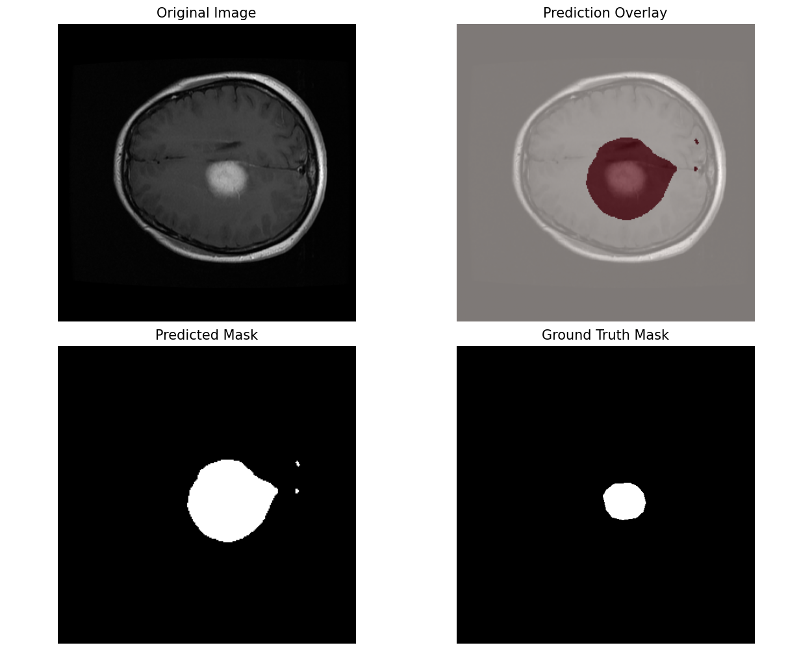
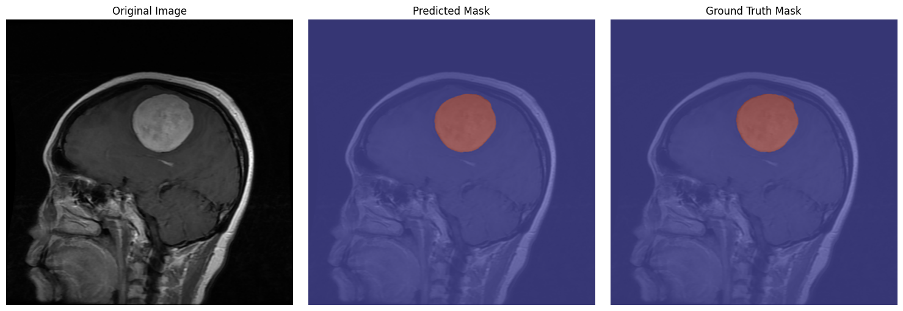
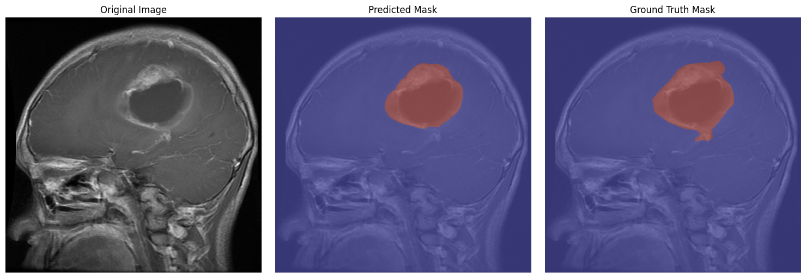

# Brain Tumor Segmentation

This project focuses on developing a **deep learning model** for semantic segmentation of brain tumors from MRI scans. The aim is to experiment with state-of-the-art segmentation architectures and refine them to achieve high accuracy in identifying tumor regions.

### Announcement — Version 3 (v3)
This repository now ships Version 3 (v3) of the segmentation pipeline. v3 focuses on state-of-the-art architecture improvements, deeper supervision, and a stronger loss/augmentation strategy to improve tumor overlap (Dice) and boundary accuracy.

Highlights in v3:
- Switched to UNet++ with a pretrained EfficientNet-B4 encoder and deep supervision.
- Advanced combined loss (Dice+CE, Focal, Tversky) designed for class imbalance and boundary focus.
- Rich augmentation pipeline (elastic, grid distortions, CLAHE) and robust validation preprocessing.
- Modern training utilities: AdamW + OneCycleLR, AMP, and detailed metrics (Dice + Hausdorff).
- Modular training/validation loops with checkpointing and inference visualization tools.

> **Note on Training Duration:** For optimal performance, this model architecture benefits from extensive training (e.g., 75+ epochs), which is computationally expensive. The current results are based on a 5-epoch training run to demonstrate the model's potential and validate the pipeline. The provided checkpoints and outputs should be considered a proof-of-concept rather than a fully benchmarked result.

History — previous versions (click to expand)

#### Announcement — Version 2 (v2)
This repository includes a second version (v2) of the segmentation pipeline. v2 focused on transfer-learning with DeepLabV3 (ResNet-50) and pipeline improvements. Work continues iteratively; training metrics for v2 are kept here for reference.

> The output is still not satisfying, but experiments continue.

##### What's new in v2 (high level)
- Switched to `torchvision's DeepLabV3` (ResNet-50) with pretrained weights for transfer learning.
- Adapted the model to single-channel (grayscale) MRI slices by replacing the first convolutional layer.
- Replaced classifier and auxiliary heads to produce two output channels (background vs tumor).
- Backbone parameters were frozen initially to speed up convergence and reduce overfitting risk.
- Introduced a concise, reproducible transform pipeline for grayscale images.
- Implemented a custom PyTorch Dataset that aligns image/mask pairs and binarizes masks.
- Integrated MONAI's DiceLoss and DiceMetric for segmentation-specific training and evaluation.
- Enabled Automatic Mixed Precision (AMP) and a ReduceLROnPlateau scheduler.
- Training/validation loops are managed via a modular `going_modular.engine` for cleaner code and checkpointing.
- Corrected the Dice score implementation to ensure it is properly calculated and bounded between 0 and 1.

## Sample Output
### Version one

### Version three

> Notice how much greater the model is now after 3 updates.

## Objective

The primary goal is to train a model that can **accurately detect and segment tumor subregions** from MRI slices. This involves:

* Exploring and understanding relevant brain tumor datasets (e.g., BraTS).
* Implementing and comparing segmentation architectures such as U-Net and DeepLabV3.
* Optimizing model performance through experiments with loss functions, learning rates, and data augmentation techniques.

## Dataset

This project uses the [Brain Tumor Segmentation Dataset](https://www.kaggle.com/datasets/nikhilroxtomar/brain-tumor-segmentation?select=images), which contains MRI brain image–mask pairs.

* **Images**: 2D MRI slices.
* **Masks**: Binary masks where white pixels indicate tumor regions.

## Workflow

The workflow is documented in the notebooks:
- `Brain_tumor_seg.ipynb` — original baseline experiments (v1).
- `Brain_tumor_seg_V2.ipynb` — transfer-learning experiments and updated pipeline (v2).
- `Brain_tumor_seg_V3.ipynb` — current state-of-the-art experiments (v3) using UNet++, EfficientNet encoder, deep supervision, and advanced losses/augmentations.

Main steps (v3-focused):
1. Data loading & preprocessing — discover aligned image/mask pairs, resize, convert to required channels, and binarize masks.
2. Augmentation — extensive albumentations pipeline (elastic, grid distortion, CLAHE, noise) for robust training.
3. Model definition — UNet++ with pretrained EfficientNet-B4 encoder and deep supervision heads.
4. Loss & optimization — CombinedLoss (Dice+CE, Focal, Tversky), AdamW, OneCycleLR, AMP.
5. Training — modular training/validation loops with checkpointing and metric tracking (Dice, Hausdorff).
6. Evaluation & visualization — thresholded predictions, visual overlays, and per-case metric reporting.

## Results (placeholders for v3)
~~Training for v3 is in progress. Final metrics will be populated here once experiments complete.~~
This version has only been trained on **5 epochs**, but it has the best outcomes compared to the other versions.

- Final Train Loss: 0.2161
- Final Val Loss: 0.0974
- Final Dice Score: 0.7914
- Final Hausdorff Distance: 21.0548
- Notes: v3 focuses on improving Dice overlap and boundary accuracy (Hausdorff).

## Results from v2 (historical)
- Final Validation Accuracy: 93.67%
- Best Dice Coefficient: 0.2617

> NOTE: In medical imaging, the feature of interest (the tumor) is often a very small percentage of the total image. A model that learns to predict everything as "background" can achieve very high pixel-wise accuracy (e.g., 98%) while completely failing at the actual task. This is why the Dice score is so important—it specifically measures the overlap of the predicted tumor with the real one.

## Results from v1 (historical)
- **Final Validation Accuracy:** 90.81%
- **Best Dice Coefficient:** Not reported due to a calculation error in the v1 implementation. This issue is resolved in the v2 pipeline.
- **Summary:** The v1 experiments successfully established a U-Net baseline and a functional data pipeline. Detailed logs are available in the original `Brain_tumor_seg.ipynb` notebook for reference.

## Project Status & Future Work

This project has demonstrated baseline segmentation approaches. Next steps and ideas:

- [x] Improve boundary precision (e.g., boundary loss, architectural tweaks).
- [ ] Deploy the model on Hugging Face or another hosting service.
- [x] Experiment with other pretrained segmentation models for comparison:
  * DeepLabV3, FCN, LR-ASPP
- [ ] Explore advanced architectures like Swin-UNet or Attention U-Net.

- [ ] Cross-dataset validation to evaluate generalization.
  
- [ ] ~~Extend to 3D volumetric data (full BraTS 3D volumes)~~.

---
