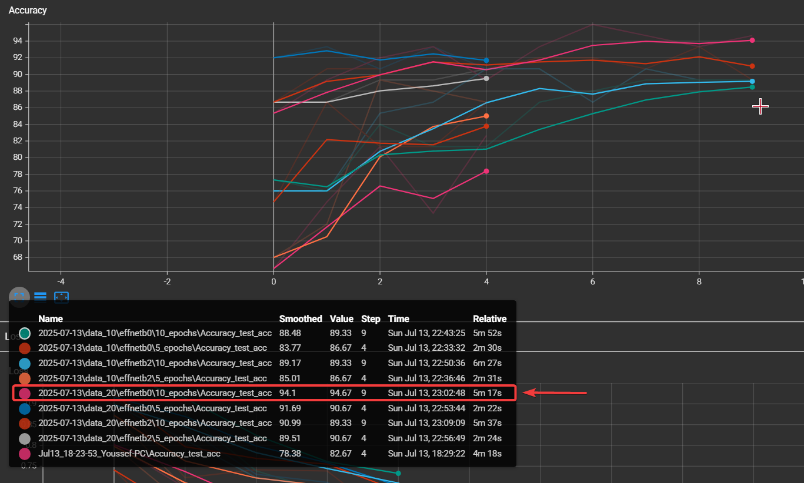
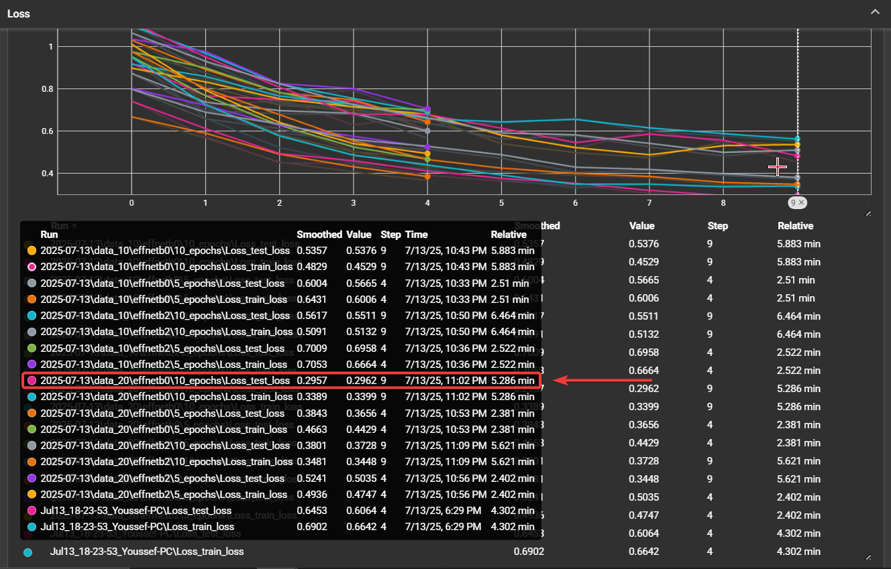

# FoodMini 🍽️

## Overview

**FoodMini** is the final product of a deep learning experiment conducted as part of the *PyTorch Course — Chapter 7 notebook*. The full workflow—including model creation, training, evaluation, and experiment tracking—was developed within that notebook. This standalone project provides the trained model and testing script for food image classification using subsets of the [Food-101 dataset](https://data.vision.ee.ethz.ch/cvl/datasets_extra/food-101/), focusing on three classes: pizza, steak, and sushi. The goal was to compare various training setups (e.g., different models, data proportions, and epoch counts) to find an optimal solution under limited resources. The best-performing configuration—EfficientNetB0 trained on 20% of the dataset for 10 epochs—achieved over **94% accuracy** on the test set.

## Results Summary




## Project Structure

```
FoodMini/
│
├── going_modular/                      # Modular codebase for model architecture, training, and utility functions
├── TEST_IMGS/                          # Folder containing test images for model evaluation
├── 07_effnetb0_data_20_10_epochs.pth   # Saved model weights (EfficientNetB0, 20% Food101, 10 epochs)
├── Food_MINI.py                        # Script to run inference on images in test_imgs using the trained model
├── README.md                           # Project overview and documentation
```

## Models and Experiments

Eight experiments were conducted varying the following parameters:

| Model           | Dataset Portion | Epochs | Identifier          |
| --------------- | --------------- | ------ | ------------------- |
| EfficientNet B0 | 10%             | 5      | `b0_10p_5e`         |
| EfficientNet B0 | 10%             | 10     | `b0_10p_10e`        |
| EfficientNet B0 | 20%             | 5      | `b0_20p_5e`         |
| EfficientNet B0 | 20%             | 10     | `b0_20p_10e` ✅ Best |
| EfficientNet B2 | 10%             | 5      | `b2_10p_5e`         |
| EfficientNet B2 | 10%             | 10     | `b2_10p_10e`        |
| EfficientNet B2 | 20%             | 5      | `b2_20p_5e`         |
| EfficientNet B2 | 20%             | 10     | `b2_20p_10e`        |

## Experiment Tracking

All training runs were tracked using **TensorBoard**, including:

* Training and validation accuracy/loss
* Confusion matrix visualization
* Sample predictions
* Model checkpoints and best weights

## Best Model

After comparing all setups, the **EfficientNet B0 trained on 20% of the data for 10 epochs** (`b0_20p_10e`) consistently achieved the best accuracy and generalization performance. It strikes a strong balance between:

* Model size
* Inference speed
* Accuracy
* Losses
