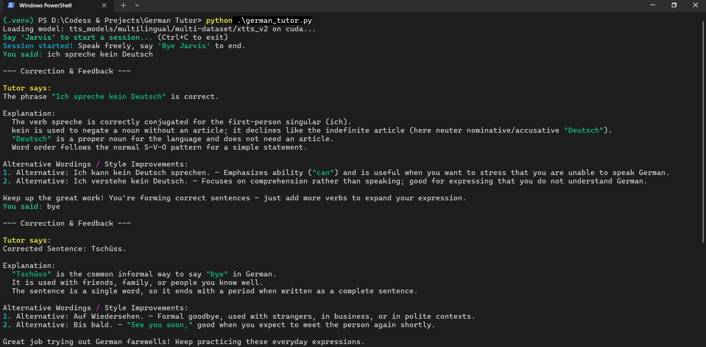
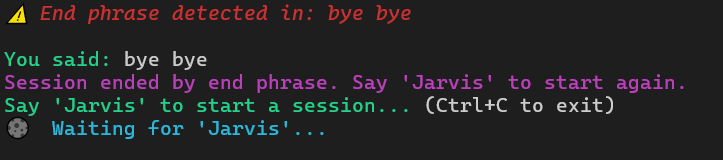
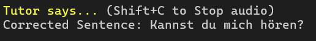

# 🇩🇪 German Tutor 🇩🇪

**German Tutor** is an AI-powered German language learning assistant that helps users improve their spoken German and grammar. It uses speech recognition, large language models (LLMs), and text-to-speech (TTS) to provide corrections and advice.  
*Note: This project was created by a college student and is not 100% professional or perfect. There may be some delay between speaking and receiving feedback.*

> Example on End Phrases:

---
## **Major Update – `german_tutor_V2.py` Performance Boost** 

We’ve supercharged the German Tutor app with a **response time improvement of up to 90%** thanks to several key upgrades:

* **Faster Text-to-Speech** → Switched to the new `my_TTS_2.py` engine for **quicker audio generation** and **improved pronunciation accuracy**.
* **Smarter Speech-to-Text** → Replaced the old STT with `SST_2.py`, delivering **more stable sessions** and preventing accuracy drop-offs during long conversations.
* **Cleaner Console Output** → Improved spacing and formatting for **better readability** during interactions. 
* **Instant Speech Interrupt** → Added a **Shift + C** shortcut to immediately stop the tutor from speaking mid-response. 
* **Imporved responses** → Added more voice responses from Jarvis and wrote a better prompt for a better experince and more human like answers.
  
  

These changes mean you get **faster feedback**, **clearer speech**, and a **more fluid tutoring experience**.

---

## Features

- **Wake Word Activation:** Start sessions by saying "Jarvis" (Porcupine hotword detection).
- **Speech-to-Text (STT):** Transcribes spoken German using Google Speech Recognition.
- **AI Corrections:** Uses the latest OpenAI model `gpt-oss-120b` api for grammar corrections, explanations, and alternative phrasings.
- **Text-to-Speech (TTS):** Reads feedback aloud in German using XTTS v2.
- **Session Flow:** After feedback is spoken, the assistant listens again automatically until an end phrase is detected.
- **End Phrase Detection:** Recognizes session-ending phrases (e.g., "bye jarvis", "tschüss jarvis").
- **Terminal UI:** Uses `rich` for status messages and feedback.
- **Modular Design:** STT, LLM, and TTS are separated for easier maintenance.
- **Error Handling:** Handles audio/network errors and supports safe shutdown with Ctrl+C.

---

## Project Architecture

- **Input:** Speak German into your microphone.
- **Wake Word Detection:** Porcupine listens for "Jarvis" to start a session.
- **Speech Recognition:** Captures and transcribes your utterance.
- **LLM Correction:** Sends transcript to the LLM for grammar correction, explanation, and style tips.
- **Text-to-Speech:** Synthesizes and plays back the feedback in German.
- **Session Loop:** Repeats until you say an end phrase; then waits for "Jarvis" to restart.

---

## Highlights

- **Interactive Learning:** Get feedback and corrections as you speak.
- **Simple Guidance:** LLM provides explanations and alternative wordings.
- **Hands-Free Flow:** No manual restarts—just speak, listen, and learn.
- **Multi-Voice Support:** Switch speaker voices for varied practice.
- **Extensible:** Modular Python codebase for future improvements.

---

## Limitations

- ~~There is some delay between speaking and hearing feedback.~~
- The project is not fully professional and may have rough edges.

---

## Implemented Functionality

- [x] Wake word detection ("Jarvis") to start sessions.
- [x] Speech-to-text conversion with error handling.
- [x] LLM-based grammar correction, explanation, and style advice.
- [x] TTS playback (XTTS v2).
- [x] Session management and end phrase detection.
- [x] Terminal feedback and status indicators.
- [x] Modular code structure.

---

## File Structure

- `german_tutor.py` — Main entry point and session loop.
- `legos/STT.py` — Wake word and speech recognition logic.
- `legos/LLM.py` — LLM integration and feedback formatting.
- `legos/my_TTS.py` — Text-to-speech synthesis and playback.
- `README.md` — Project documentation.

---

## How It Works

1. **Say “Jarvis”** to start a session.
2. **Speak a German sentence**—the system transcribes and sends it to the LLM.
3. **LLM returns feedback**: corrections, explanations, and alternatives.
4. **TTS reads feedback aloud** (playback blocks until finished).
5. **Assistant listens again** automatically—no need to repeat "Jarvis".
6. **Say an end phrase** (e.g., “bye jarvis”, “tschüss jarvis”) to close the session.
7. **Repeat** as desired for continuous practice.

---

## Why German Tutor Stands Out

- **Hands-Free Experience:** Speak and listen—no typing or manual resets.
- **AI Guidance:** Combines speech, language, and voice technologies.
- **Encouraging Feedback:** Polite, supportive, and beginner-friendly.
- **Open Source:** Easy to customize and extend.

---

## Getting Started

1. **Install dependencies:**  
   `pip install -r requirements.txt`
2. **Set your HuggingFace/OpenAI token:**  
   `export HF_TOKEN="your_token_here"` (Linux/Mac)  
   `$Env:HF_TOKEN = "your_token_here"` (Windows PowerShell)
3. **Run the tutor:**  
   `python german_tutor.py`
4. **Start speaking German!**

---

## Future Updates / To Do

- [x] Reduce delay between speaking and feedback.
- [ ] Add accent recognition to better support different German accents.
- [x] Improve UI and error messages.
- [ ] Add support for more languages and voices.

---

## License

MIT License.  
See [LICENSE](LICENSE) for details.

---

**German Tutor — Speak, Learn, Improve.**