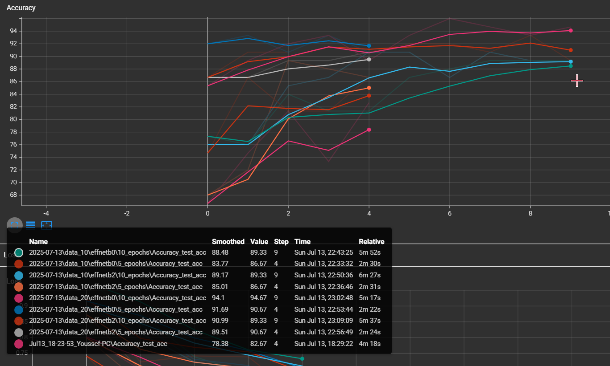
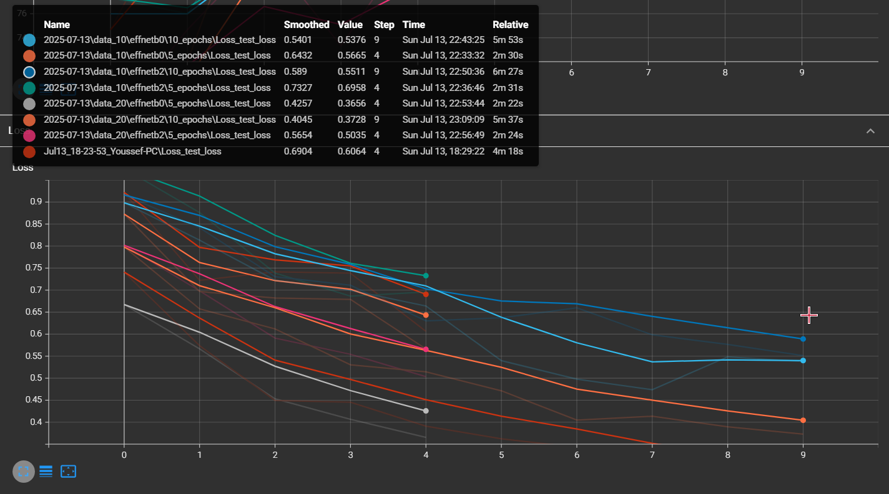
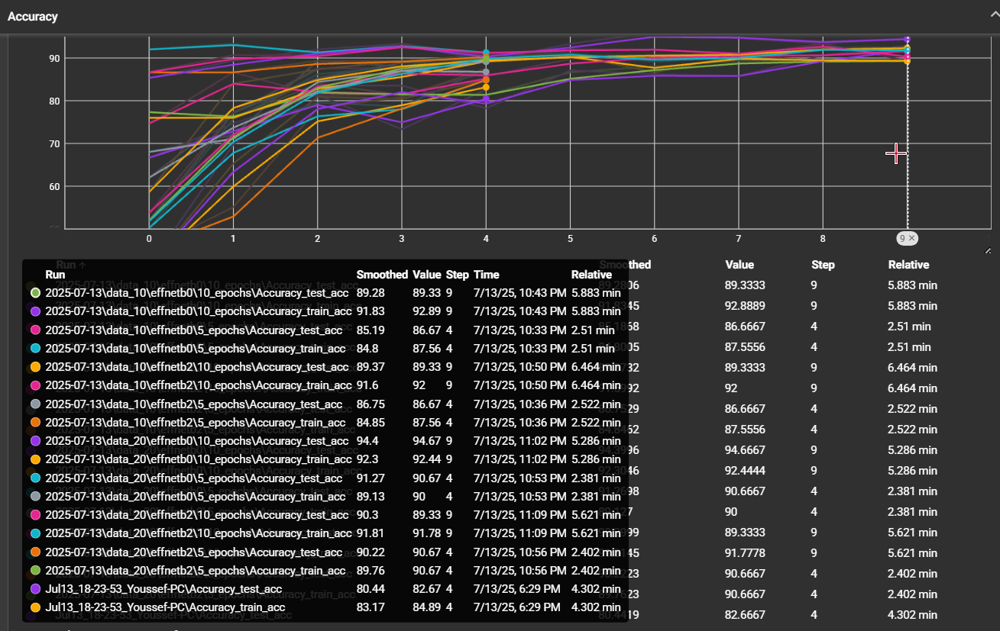
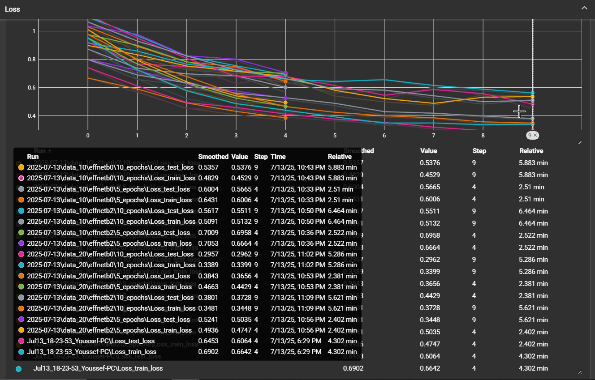

# Chapter 7 notes:

## [**SLIDES**](https://github.com/mrdbourke/pytorch-deep-learning/blob/main/slides/07_pytorch_experiment_tracking.pdf)
## [**Book link**](https://www.learnpytorch.io/07_pytorch_experiment_tracking/)
## [**Collab link**](https://colab.research.google.com/github/mrdbourke/pytorch-deep-learning/blob/main/07_pytorch_experiment_tracking.ipynb)

## >The rest of the models have been added to .gitignore because of push size.

