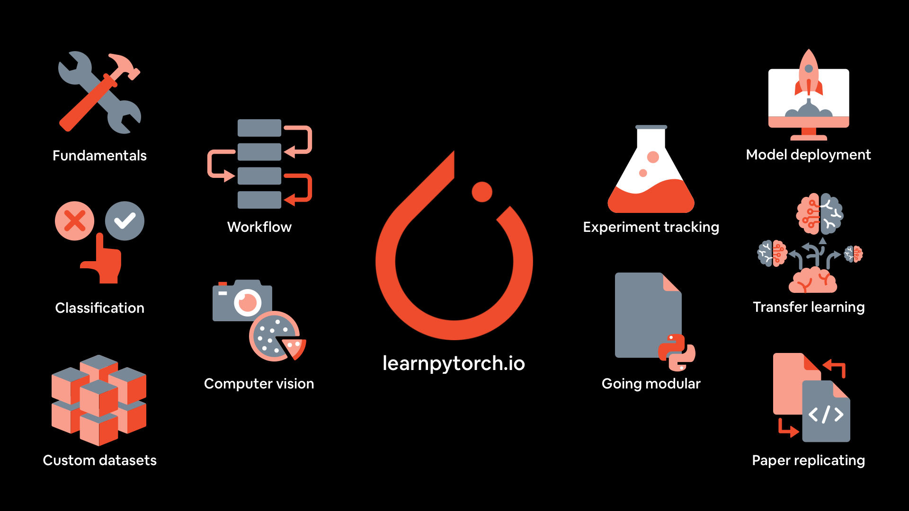

#  Zero to Mastery Learn PyTorch for Deep Learning Course

## [**REPO Link**](https://github.com/mrdbourke/pytorch-deep-learning/)
## [**Book Link**](https://www.learnpytorch.io/)

## 📚 Topics Covered (To-Do List)

- [x] 00. PyTorch Fundamentals
- [x] 01. PyTorch Workflow Fundamentals
- [x] 02. PyTorch Neural Network Classification
- [x] 03. PyTorch Computer Vision
- [x] 04. PyTorch Custom Datasets
- [x] 05. PyTorch Going Modular
- [x] 06. PyTorch Transfer Learning
- [x] 07. PyTorch Experiment Tracking
- [x] 08. PyTorch Paper Replicating
- [ ] 09. PyTorch Model Deployment

---

