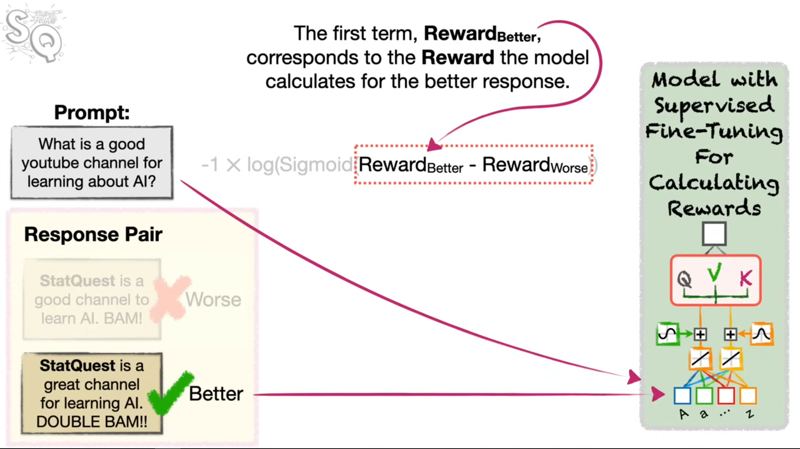

### Materials
- [Reinforcement Learning: Essential Concepts](https://www.youtube.com/watch?v=Z-T0iJEXiwM)
- [Reinforcement Learning with Neural Networks: Essential Concepts](https://www.youtube.com/watch?v=9hbQieQh7-o)
- [Reinforcement Learning with Neural Networks: Mathematical Details](https://www.youtube.com/watch?v=DVGmsnxB2UQ)
- [Reinforcement Learning with Human Feedback (RLHF), Clearly Explained!!!](https://www.youtube.com/watch?v=qPN_XZcJf_s)
## 1. Core Reinforcement Learning (RL) Concepts

Reinforcement Learning is a methodology that allows an entity (the **Agent**) to learn and adapt based on experience within an external environment, with the ultimate goal of maximizing a cumulative **Reward**.

| **Term**          | **Definition**                                                                                                  | **Context**                                                                                                                                                              |
| ----------------- | --------------------------------------------------------------------------------------------------------------- | ------------------------------------------------------------------------------------------------------------------------------------------------------------------------ |
| **Agent**         | The entity that explores and interacts with the environment.                                                    | The LLM being trained to generate responses.                                                                                                                             |
| **Environment**   | The external system or scenario the agent interacts with.                                                       | In LLM training, this includes the prompt and the mechanism that evaluates the response (e.g., the Reward Model).                                                        |
| **Policy**        | The set of rules or probabilities the agent uses to decide how to act.                                          | In RL with Neural Networks, the Policy is the **neural network itself**, which determines the probability of taking certain actions (e.g., outputting a specific token). |
| **Reward**        | The feedback (score) used to update the policy.                                                                 | The goal is to maximize this score. In simple RL, it's a direct score; in RLHF, it comes from a separate model.                                                          |
| **Learning Rate** | A hyperparameter that controls the magnitude of change made to the policy (weights/biases) in each update step. | A value between 0 and 1; a smaller value prevents changing the probability too much too soon.                                                                            |

---

## 2. Policy Gradients with Neural Networks

The **Policy Gradients** algorithm is an approach used in RL to train a neural network policy when there are no known "ideal" output values in advance, which is the key distinction from standard Supervised Learning.

### The Core Mechanism: Guessing and Correction

1. **Action Selection (Guess):** The neural network (Policy) calculates probabilities for possible actions (outputs). The agent selects one action. It is then initially **guessed** that the selected action was the correct thing to do.
    
2. **Initial Derivative Calculation:** Based on this _guess_ (e.g., setting the ideal output probability for the taken action to 1.0), the **gradient** (derivative) of the **Cross Entropy Loss** with respect to the network parameters is calculated.
    
3. **Reward Observation:** The agent observes the actual **Reward** received from the environment for the action taken.
    
4. **Gradient Correction:** The initial derivative is multiplied by the observed **Reward** to get the **updated derivative**.
    - If the reward is **positive** (correct guess), the updated derivative points in the intended direction.
    - If the reward is **negative** (incorrect guess), the negative sign flips the direction of the derivative, thus correcting the mistake and shifting the parameter in the opposite direction.
        
5. **Parameter Update:** The updated derivative is plugged into **Gradient Descent** to adjust the neural network parameters (weights and biases), optimizing the policy to favor high-reward actions.
    

### Mathematical Details

In the context of the example (where $P_{\text{Norm}}$ is the output probability and $C_{\text{Squatch}}$ is the Cross Entropy loss for selecting Squatch's, and $\text{Bias}$ is the parameter being optimized):

- **Loss Function:** The difference between the actual output and the _guessed_ ideal output is quantified using **Cross Entropy**.
    - For the selected action (e.g., Squatch's), the Cross Entropy loss is: $C_{\text{Squatch}} = - \log(P_{\text{Squatch}}) = - \log(1 - P_{\text{Norm}})$.
        
- Chain Rule: The derivative is calculated using the chain rule, linking the loss back to the parameter:
    $$\frac{\partial C_{\text{Squatch}}}{\partial \text{Bias}} = \frac{\partial C_{\text{Squatch}}}{\partial P_{\text{Norm}}} \times \frac{\partial P_{\text{Norm}}}{\partial X} \times \frac{\partial X}{\partial \text{Bias}}$$
    
- **Key Derivatives:**
    - The derivative of the sigmoid activation function (which yields $P_{\text{Norm}}$) with respect to its input $X$ is:
        
        $$\frac{\partial P_{\text{Norm}}}{\partial X} = P_{\text{Norm}} \times (1 - P_{\text{Norm}})$$
        
- Policy Update Step (Gradient Descent): The step size is calculated by incorporating the reward:
$$\text{Step Size} = \text{Learning Rate} \times \left( \frac{\partial \text{Loss}}{\partial \text{Bias}} \right)_{\text{guess}} \times \text{Reward}$$
    

---

## 3. Reinforcement Learning with Human Feedback (RLHF)

RLHF is a technique used to **align** large language models (LLMs) to human preferences (e.g., being polite, helpful, and truthful) without requiring a massive, costly supervised fine-tuning dataset.

### RLHF Architecture The process involves three main stages:

1. **Supervised Fine-Tuning (SFT) & Alignment:**
    - The LLM is initially **Pre-trained** (to predict the next token) and then given a small amount of **SFT** using prompt/response pairs created by humans.
    - SFT helps the model generate appropriate responses to _specific_ prompts but often leads to **overfitting** and poor generalization to new prompts.
        
2. **Reward Model (RM) Training (The Human Feedback Step):*
    - This step is performed to substitute the *huge cost* of creating a large, generalized **supervised fine-tuning dataset**.
    - **Data Collection:** The SFT model generates multiple possible responses to a prompt, and human reviewers compare and rank pairs of responses (human feedback/preferences).
    - **RM Architecture:** A copy of the LLM is created, and the *embedding layer* is **removed**, leaving a single output layer. This model, the **Reward Model**, takes both the **prompt and the response** as input and generates a single scalar output, the **reward** for that response.
    - **RM Loss Function (Pairwise Ranking Loss):** The RM is trained using a loss function to ensure that the reward it calculates for the human-preferred response ($R_{\text{better}}$) is higher than the reward for the worse response ($R_{\text{worse}}$).
        - The function is the negative log-sigmoid loss:
        $$\text{Loss} = -1 \times \log(\sigma(R_{\text{better}} - R_{\text{worse}}))$$

        - **Ideal Rewards:** The goal is for the difference $R_{\text{better}} - R_{\text{worse}}$ to be a **large positive number**, which results in a value close to 1 after the sigmoid function $\sigma(\cdot)$, thus minimizing the negative log-loss.
            
3. **Policy Optimization with RL:**
    - The original SFT LLM (now the **Policy**) is treated as **the agent** and trained using a Policy Gradients algorithm (like PPO).
    - The **Reward Model** now acts as the *environment*, giving the LLM a **Reward** score for its generated responses to new prompts.
    - This allows the LLM to learn how to generate polite and helpful responses to prompts it has never seen before, leveraging the human preferences learned by the RM.

