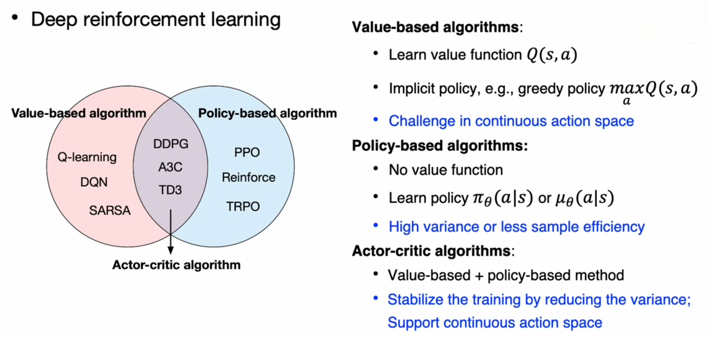
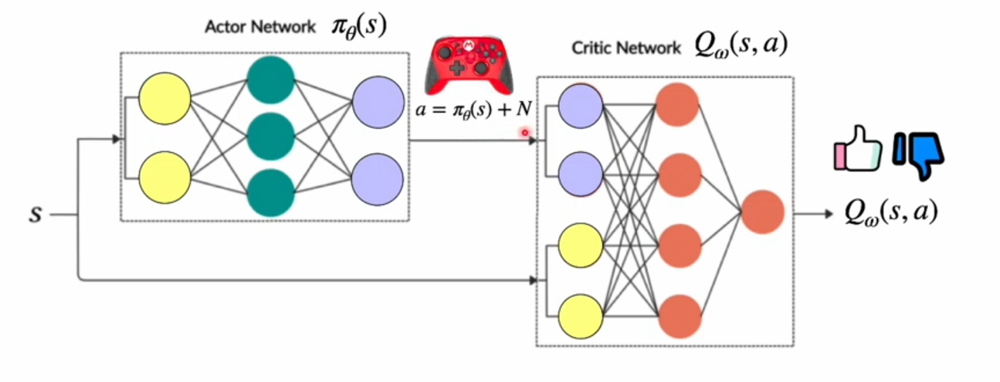

### Sources:
- [Actor Critic Algorithms](https://www.youtube.com/watch?v=w_3mmm0P0j8)
- [What is Actor-Critic?](https://www.youtube.com/watch?v=oDdPcEanLwY)
# Actor-Critic Architecture (AC, A2C)

The Actor-Critic (AC) framework is a highly influential architecture in Reinforcement Learning that combines the strengths of both **Value-Based** (like Q-learning/DQN) and **Policy-Based** (like REINFORCE) methods. It addresses key limitations of both pure approaches.

Actor-Critic algorithms involve **two distinct neural networks** that work together in harmony: the **Actor** and the **Critic**. They train concurrently and cooperatively.

### The Critic: The Value Estimator

The **Critic** is a **Value-Based** network whose job is to estimate the value of the current state.

* **Role:** The Critic learns a state-value function, $V_\phi(s)$, which estimates the **expected return** if the agent starts from state $s$ and follows the current policy $\pi_\theta$.
* **Parameters ($\phi$):** The weights of the Critic network.
* **Training:** The Critic is trained using an **iterative update rule** similar to temporal difference (TD) learning (like in Q-learning), aiming to *minimize* the difference between its **prediction** $V_\phi(s)$ and a more accurate, observed **TD target**.

> **Summary:** The **Critic** is a **Value Network** ($V_\phi(s)$) that assesses **how good** the current state is. It is trained using TD learning to accurately predict the expected future reward from that state.

### The Actor: The Policy Maker

The **Actor** is a **Policy-Based** network whose job is to determine the **agent's behavior**.

* **Role:** The Actor learns the policy function, $\pi_\theta(a|s)$, which dictates the *probability distribution* over **actions** given a state $s$.
* **Parameters ($\theta$):** The weights of the Actor network.
* **Training:** The Actor is trained using the **Policy Gradient** approach, similar to REINFORCE, but with a crucial difference: it **does not use** the full return ($G_t$) to scale its update. Instead, it uses the **signal provided by the Critic**.

> **Summary:** The **Actor** is a **Policy Network** ($\pi_\theta(a|s)$) that selects the actions. It is trained to **increase the probability** of actions that the **Critic deems favorable** (i.e., actions that lead to a higher-than-expected return).

---

## The Advantage Function and The Update

The core innovation of Actor-Critic is how the two networks are linked in the update process.

### The Temporal Difference (TD) Error as the Advantage

In pure REINFORCE, the action probability is scaled by the entire **Return ($G_t$)** observed from that moment, which leads to **high variance** because the reward might be due to a lucky sequence of actions that happened much later.

In Actor-Critic, the Critic's prediction is used to define the **Advantage Function** ($A(s, a)$), which is a much **lower-variance** estimate of how good a specific action was. The simplest and most common approximation uses the **TD Error**:

$$\delta_t = \text{TD Error} = R_{t+1} + \gamma V_\phi(s') - V_\phi(s)$$

This TD Error $\delta_t$ estimates the **advantage** of taking action $a$ in state $s$:
* **$R_{t+1} + \gamma V_\phi(s')$:** This is the **TD Target**, the improved, observed estimate of the value of the starting state.
* **$V_\phi(s)$:** This is the Critic's **old prediction** of the state's value.

If $\delta_t$ is **positive**, the action $a$ was *better* than the Critic predicted, and the Actor's weights $\theta$ should be adjusted to **increase the probability** of $a$.
If $\delta_t$ is **negative**, the action $a$ was *worse* than predicted, and the Actor should adjust to **decrease the probability** of $a$.

---

### The Advantage Function $A(s, a)$ (in simpler terms)

The **Advantage Function**, denoted $A(s, a)$, quantifies **how much better a specific action ($a$) is compared to the expected outcome of the current state ($s$)**.

#### 1. Mathematical Definition

The Advantage Function is formally defined as the difference between the **Action-Value Function** ($Q^\pi(s, a)$) and the **State-Value Function** ($V^\pi(s)$):

$$A^\pi(s, a) = Q^\pi(s, a) - V^\pi(s)$$

* **$Q^\pi(s, a)$ (Action-Value):** The expected total return starting from state $s$, taking a specific action $a$, and then following policy $\pi$ thereafter. (This is what Q-learning tries to estimate.) -> **actor**.
* **$V^\pi(s)$ (State-Value):** The expected total return starting from state $s$ and then following policy $\pi$ thereafter. (This is what the Critic tries to estimate.) -> **critic**.

#### 2. The Intuition

Imagine the Critic tells you that the expected value of your current state $s$ is $V(s) = 100$.

* If you take action $a_1$, and the resulting $Q(s, a_1)$ is $\mathbf{110}$:
    $$\text{Advantage}(s, a_1) = 110 - 100 = +\mathbf{10}$$
    Action $a_1$ is **better** than average. The Actor should **increase its probability**.

* If you take action $a_2$, and the resulting $Q(s, a_2)$ is $\mathbf{90}$:
    $$\text{Advantage}(s, a_2) = 90 - 100 = -\mathbf{10}$$
    Action $a_2$ is **worse** than average. The Actor should **decrease its probability**.

* If you take action $a_3$, and the resulting $Q(s, a_3)$ is $\mathbf{100}$:
    $$\text{Advantage}(s, a_3) = 100 - 100 = \mathbf{0}$$
    Action $a_3$ is **exactly average**. The Actor should not change its probability.

The Advantage Function acts as a **baseline** that automatically handles whether the state itself is generally good or bad, focusing the policy update only on the *relative quality* of the action taken.

> **Summary:** The **Advantage Function** ($A(s, a)$) measures the **relative superiority** of taking a specific action $a$ over the average expected value of the starting state $s$. It acts as a zero-centered baseline for the policy update.

---

### The Advantage in A2C: The TD Error

In A2C, we **do not** explicitly train a separate $Q$-network to calculate $Q(s, a)$. Instead, we rely on the **Critic** ($V_\phi$) to provide an **estimate** of the advantage.

The **TD Error ($\delta_t$)** is used as an estimate for the Advantage Function:

$$\text{Advantage}(s, a) \approx \delta_t = \underbrace{\left(R_{t+1} + \gamma V_\phi(s')\right)}_{\text{TD Target } \approx Q(s, a)} - \underbrace{V_\phi(s)}_{\text{Baseline}}$$

Here is why $\delta_t$ is a good proxy for $A(s, a)$:

| Term | Role in TD Error ($\delta_t$) | Corresponds to |
| :--- | :--- | :--- |
| $R_{t+1} + \gamma V_\phi(s')$ | The **TD Target** (Observed Value) | A single-step sample of the **Action-Value $Q(s, a)$**. |
| $- V_\phi(s)$ | The **Baseline** (Predicted Value) | The **State-Value $V(s)$**. |

Since the policy update relies on the difference between $Q$ and $V$, using the TD error $\delta_t$ is the simplest and most efficient way to estimate the advantage using only the Critic's output.

> **Summary:** In A2C, the **Temporal Difference (TD) Error** $\delta_t$ is used to *estimate* the Advantage Function. This is efficient because it requires only the *Critic* ($V_\phi$) and the *immediate reward*, **without needing to learn a separate Q-function**.

---

### Why the Advantage Function is Better than $G_t$

The introduction of the Advantage Function is what makes Actor-Critic superior to pure Monte Carlo Policy Gradient methods like REINFORCE.

#### 1. Reduced Variance (The Main Benefit)

* **REINFORCE (using $G_t$):** The total return $G_t$ is highly variable (high variance) because it depends on every single stochastic action taken for the rest of the episode. Even if an action $a$ was good, the return $G_t$ could be very small if the agent failed later on. The signal is noisy.
* **A2C (using $A(s, a) \approx \delta_t$):** The Advantage $\delta_t$ is a **low-variance** signal because it only relies on the *immediate reward* ($R_{t+1}$) and the *Critic's local, learned value estimates* ($V_\phi(s')$ and $V_\phi(s)$). It immediately captures the unexpected change in value from one state to the next.

#### 2. Fair Credit Assignment

$G_t$ assigns credit to an action based on the absolute goodness of the entire path.

* If you are in a **very bad state** ($V(s) = 5$), and you take an action that results in a huge reward, say $G_t = 100$. This huge return will massively increase the probability of that action, even though **every action** might lead to a good result from that state.
* The **Advantage Function** handles this: $\text{Advantage} = 100 - 5 = 95$. It still rewards the action heavily, but if $V(s)$ was accurate, the learning is more focused. Crucially, if you are in a **very good state** ($V(s) = 500$), and you get a return of $G_t = 505$, the advantage is only $+5$, meaning the action was only slightly better than average.

By centering the update around $V(s)$, the Advantage Function ensures the Actor learns only what it needs to: **how to improve upon the current, expected value.** 
### The AC Update Rules

1.  **Critic Update (Value Update):** The Critic's parameters $\phi$ are updated using gradient descent to minimize the **squared TD Error**. This is a standard supervised learning update.
    $$\text{Loss}_\text{Critic} = \delta_t^2$$
    $$\phi \leftarrow \phi - \alpha_\phi \nabla_\phi \text{Loss}_\text{Critic}$$

2.  **Actor Update (Policy Update):** The Actor's parameters $\theta$ are updated using the TD Error $\delta_t$ as the scaling factor (or advantage) for the Policy Gradient.
    $$\text{Objective}_\text{Actor} = \delta_t \cdot \log \pi_\theta(a|s)$$
    $$\theta \leftarrow \theta + \alpha_\theta \nabla_\theta \text{Objective}_\text{Actor}$$

*(Note: $\alpha_\phi$ and $\alpha_\theta$ are the learning rates for the Critic and Actor, respectively.)*

> **Summary:** The Critic's **TD Error ($\delta_t$)** is used as the **Advantage signal** to update the Actor. A positive $\delta_t$ reinforces the action taken, while a negative $\delta_t$ punishes it. This direct, immediate feedback from the Critic dramatically **reduces the variance** of the policy gradient update compared to REINFORCE.

---

## Addressing RL Problems

Actor-Critic is a powerful hybrid that overcomes the major limitations of its pure counterparts:

| Problem | Pure Method | Actor-Critic Solution |
| :---: | :---: | :---: |
| **High Variance** | **Policy-Based (REINFORCE)** relies on the full, noisy Return ($G_t$). | The **Critic** replaces the noisy $G_t$ with the low-variance **TD Error ($\delta_t$)**, which stabilizes the Actor's updates. |
| **Continuous Actions** | **Value-Based (DQN/Q-learning)** requires discretizing or optimizing over the Q-table/Q-Network output, which is impractical for continuous actions. | The **Actor** can output the **mean and standard deviation** of a continuous probability distribution (like a Gaussian), allowing it to sample continuous actions directly. |

The result is an algorithm (like A2C, or its asynchronous variant, A3C) that is generally more **stable, sample-efficient,** and **faster to train** than REINFORCE, while being applicable to a wider range of problems than DQN.

---
## AC v A2C v A3C

The primary difference is that **Actor-Critic (AC)** refers to the *general architecture* and *mathematical foundation*, while **A2C (Advantage Actor-Critic)** or **A3C (Asynchronous Advantage Actor-Critic)** are a *specific, practical implementation* of that architecture.

The key difference A3C introduces is the concept of **parallelization** and **asynchronous updates**, which was a major breakthrough in making policy gradient methods practical and fast.

Here is the updated table comparing the three concepts:
### Comparison of Actor-Critic Architectures

| Feature              | AC (Actor-Critic) - General Concept                        | A2C (Advantage Actor-Critic) - Synchronous                                                                                                                                                                | A3C (Asynchronous Advantage Actor-Critic)                                                                                                                                                                                   |
| :------------------- | :--------------------------------------------------------- | :-------------------------------------------------------------------------------------------------------------------------------------------------------------------------------------------------------- | :-------------------------------------------------------------------------------------------------------------------------------------------------------------------------------------------------------------------------- |
| **Scope**            | Broad architectural framework (Actor + Critic).            | Specific, stable implementation of the AC framework.                                                                                                                                                      | Groundbreaking parallel implementation of the AC framework.                                                                                                                                                                 |
| **Advantage Signal** | General $\text{Advantage}(s, a)$ (e.g., $Q(s, a) - V(s)$). | **TD Error ($\delta_t$)**: $R_{t+1} + \gamma V(s') - V(s)$.                                                                                                                                               | **TD Error ($\delta_t$)**: $R_{t+1} + \gamma V(s') - V(s)$.                                                                                                                                                                 |
| **Learning Mode**    | On-Policy or Off-Policy.                                   | **On-Policy**.                                                                                                                                                                                            | **On-Policy**.                                                                                                                                                                                                              |
| **Parallelism**      | Not inherently parallel.                                   | **Synchronous Parallelism:** Multiple agents (rollout workers) collect experience in parallel, but they all **wait for each other to finish** before the central network performs a single, large update. | **Asynchronous Parallelism:** Multiple independent agent threads (Actor-Learners) run in **parallel**, update a global shared network, and then synchronize their local parameters, all **without waiting for each other**. |
| **Hardware Use**     | General implementation.                                    | **Efficient with GPUs** due to large batch sizes formed by synchronizing the parallel rollouts.                                                                                                           | **Efficient with many CPUs** (or multiple CPU cores) due to lock-free, asynchronous updates.                                                                                                                                |
| **Stability**        | Depends on implementation.                                 | **High Stability** (synchronous averaging of gradients is stable).                                                                                                                                        | Lower stability than A2C (due to agents updating with slightly stale parameters), but effective for exploration.                                                                                                            |
| **Key Benefit**      | Variance reduction.                                        | **Efficient computation** and high stability.                                                                                                                                                             | **Fast wall-clock training time** and effective exploration.                                                                                                                                                                |

### Summary of Differences

1.  **AC is the Theory:** It is the conceptual split between the policy (Actor) and the value function (Critic) to reduce the high variance of pure policy gradient methods (like REINFORCE).
2.  **A3C is the Parallel Pioneer:** It was the original implementation that demonstrated huge performance gains by using **asynchronous, lock-free threads** (multiple agents) to explore the environment in parallel and independently push updates to a central model. This was revolutionary for its speed.
3.  **A2C is the Synchronous Simplification:** Researchers found that synchronizing the A3C process, making all agents collect data and then waiting to apply a single, **batched update**, was simpler, often more stable, and more effective at utilizing modern **GPU acceleration**. In current practice, A2C is often the preferred, more modern algorithm over the original A3C for single-machine setups.
---
## Numerical Example: Actor and Critic Collaboration

Imagine an agent in state $s$ takes action $a$.

* **Parameters:** $\gamma = 0.9$

### Scenario Data

| State | Action | Reward ($R_{t+1}$) | Next State ($s'$) |
| :---: | :---: | :---: | :---: |
| $S_A$ | $A_{UP}$ | 5 | $S_B$ |

### Network Predictions (Current State)

* **Critic Prediction (Old Value):** $V_\phi(S_A) = \mathbf{10.0}$
* **Actor Log-Probability:** $\log \pi_\theta(A_{UP} | S_A) = \mathbf{-1.5}$

### Step 1: Critic Prediction of Next State

The Critic predicts the value of the next state:
$$V_\phi(S_B) = \mathbf{18.0}$$

### Step 2: Calculate the TD Target

The TD Target is the *observed* value of the starting state, incorporating the immediate reward and the Critic's prediction of the future:
$$\text{TD Target} = R_{t+1} + \gamma V_\phi(s')$$
$$\text{TD Target} = 5 + 0.9 \times 18.0$$
$$\text{TD Target} = 5 + 16.2 = \mathbf{21.2}$$

### Step 3: Calculate the TD Error (Advantage)

This is the signal used to update *both* networks.
$$\delta_t = \text{TD Target} - V_\phi(s)$$
$$\delta_t = 21.2 - 10.0 = \mathbf{11.2}$$

The action $A_{UP}$ was **11.2 units better** than the Critic expected for state $S_A$.

### Step 4: Network Updates

1.  **Critic Update:** The Critic minimizes the squared error:
    $$\text{Loss}_\text{Critic} = \delta_t^2 = 11.2^2 = \mathbf{125.44}$$
    The Critic's parameters $\phi$ are adjusted via backpropagation to move $V_\phi(S_A)$ towards the observed target of 21.2 (and improve the prediction $V_\phi(S_B)$).

2.  **Actor Update:** The Actor's update is scaled by the TD Error:
    $$\text{Objective}_\text{Actor} = \delta_t \cdot \log \pi_\theta(a|s)$$
    $$\text{Objective}_\text{Actor} = 11.2 \times (-1.5) = \mathbf{-16.8}$$

    Since the objective is negative, minimizing the loss (i.e., maximizing the objective) will drive the policy to **increase the probability** of taking action $A_{UP}$ in state $S_A$. The magnitude of this update is much larger than if the TD error had been near zero, confirming the action was highly successful.