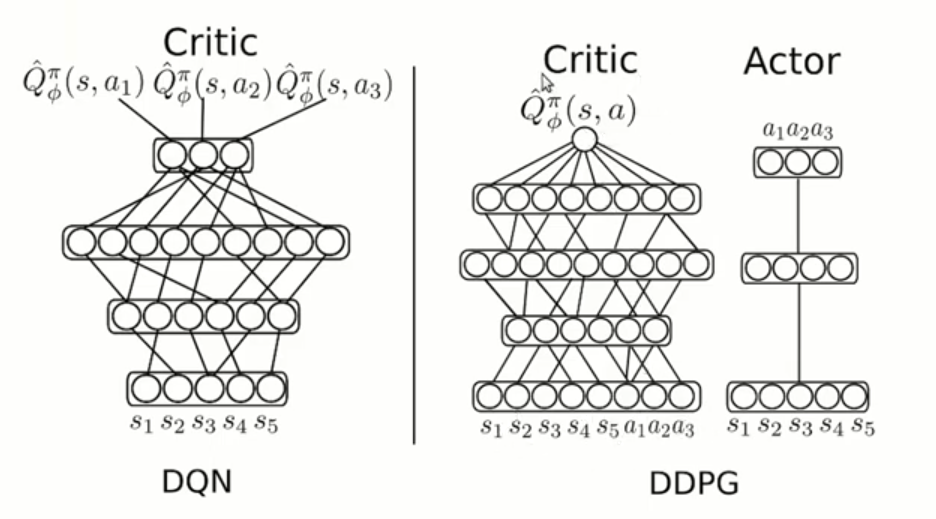
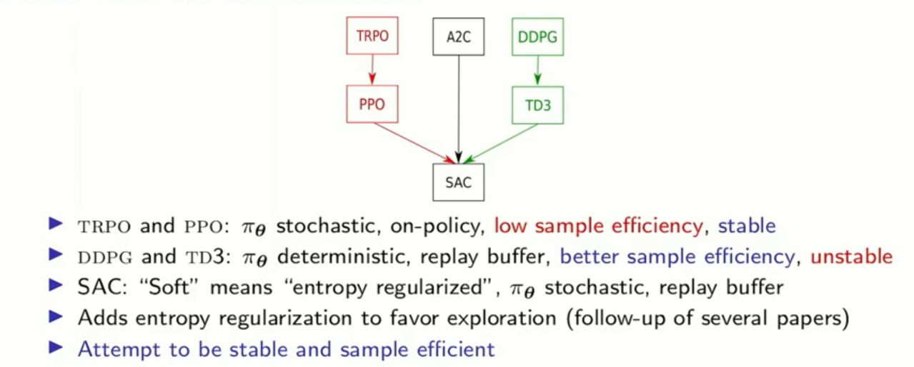
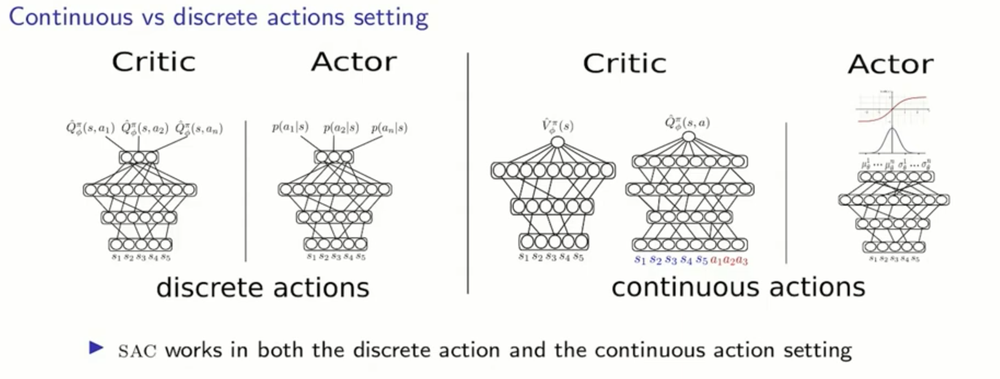

### Sources:
- [DDPG | Deep Deterministic Policy Gradient (DDPG) architecture | DDPG Explained](https://www.youtube.com/watch?v=ClKZaaIJr6Y)
- [DDPG and TD3 (RLVS 2021 version)](https://www.youtube.com/watch?v=0D6a0a1Httc)
- [SAC and TQC (RLVS 2021 version)](https://www.youtube.com/watch?v=U20F-MvThjM)
# Deep Deterministic Policy Gradient (DDPG), TD3, and Soft Actor-Critic (SAC)
## Deep Deterministic Policy Gradient (DDPG)

**DDPG** is an early and widely used algorithm for **continuous control tasks** (e.g., robotics, locomotion). It extends the ideas of **DQN** to environments with **continuous, high-dimensional action spaces**. DDPG uses an **Actor–Critic** architecture with deterministic policies.

---

### Core Components

#### 1. Actor Network (Policy)

* The **Actor** is **deterministic**, meaning for a given state (s) it **always outputs the same action**:
  $$a = \mu(s)$$
* It directly maps states to **continuous actions** without sampling.
* Its goal is to **maximize the expected Q-value** predicted by the Critic:
  $$J_{\text{actor}} = \mathbb{E}_{s \sim \mathcal{D}} [ Q(s, \mu(s)) ]$$
* Training is done by taking the gradient of the Critic with respect to the actions and backpropagating through the Actor network.

---

#### 2. Critic Network (Q-function)

* The **Critic** estimates the **expected return** of taking action (a) in state (s):
  $$Q(s, a) \approx \mathbb{E}[R | s, a]$$
* The Critic is trained using **Temporal Difference (TD) learning** with a **target network**:
  $$y = r + \gamma Q'(s', \mu'(s'))$$
* The loss is the **Mean Squared Error (MSE)** between predicted Q-values and the TD target.

---

### Stabilization Techniques

DDPG introduces several mechanisms to stabilize training, as Actor–Critic methods are sensitive to correlated data and fast-changing targets.

#### 1. Experience Replay Buffer

* Stores transitions ((s, a, r, s')) in a **replay buffer**.
* Sampling random mini-batches **breaks temporal correlations** between consecutive experiences.
* Makes the algorithm **off-policy**, allowing learning from past data even if the current policy has changed.

#### 2. Target Networks

* Uses slow-moving **target networks** for both Actor and Critic ((\mu') and (Q')) to compute TD targets.
* Updated using **soft updates (Polyak averaging)**:
  $$\theta_{\text{target}} \leftarrow \tau \theta_{\text{online}} + (1-\tau) \theta_{\text{target}}$$
* Prevents rapid oscillations and stabilizes learning.

---

### 3. Exploration with Ornstein-Uhlenbeck (OU) Noise

* Since the Actor is **deterministic**, the agent will *always* choose the same action for a given state.
* To encourage exploration, DDPG adds **temporally correlated noise** to the action:
  $$a_{\text{explore}} = \mu(s) + \text{OU\_noise}$$
* OU noise follows the **Ornstein-Uhlenbeck process**, producing smooth, *correlated* fluctuations that are suitable for **physical control tasks**:

$$dx_t = \theta (\mu - x_t) dt + \sigma dW_t$$

* This allows the agent to **explore** the action space more effectively without abrupt, unrealistic changes.

---

**Summary of DDPG:**

| Component     | Description                                          |
| ------------- | ---------------------------------------------------- |
| Policy        | Deterministic Actor (\mu(s))                         |
| Value         | Critic Q-function (Q(s, a))                          |
| Exploration   | OU noise added to Actor output                       |
| Stabilization | Experience Replay, Target Networks with soft updates |
| Action Space  | Continuous                                           |

---

## Twin Delayed DDPG (TD3)

TD3 was designed to address a major issue in DDPG: **overestimation bias** in Q-values. When the Q-function overestimates values, the policy may exploit these inaccuracies and drift toward poor actions.

TD3 introduces three major modifications that together significantly improve stability and sample efficiency.

### 1. Twin Critics (Clipped Double Q-learning)

TD3 maintains two Critic networks:
$$Q_1(s,a),; Q_2(s,a)$$
with corresponding target critics.

When computing the target, TD3 uses the **minimum** of the two:
$$y = r + \gamma \min(Q'_1(s',\tilde{a}'),, Q'_2(s',\tilde{a}'))$$
This prevents the Bellman target from being overly optimistic and dramatically reduces overestimation.

### 2. Delayed Policy Updates

The Actor (and target networks) are updated **less frequently**, commonly once every two updates of the Critics.
This is done because:

* the critic must be accurate for policy gradients to be meaningful
* updating the policy too often causes instability

This delay allows the critics to stabilize before the actor uses them to update itself.

### 3. Target Policy Smoothing

When computing the target Q-value, TD3 adds clipped noise to the target action:
$$\tilde{a}' = \text{clip}(\mu'(s') + \epsilon,, a_{\text{low}},, a_{\text{high}})$$
where
$$\epsilon \sim \mathcal{N}(0, \sigma)$$

This prevents the policy from exploiting sharp local peaks in the Q-function and encourages smoother, more robust policies.

---

## Soft Actor-Critic (SAC)

SAC is a major innovation in continuous-control RL because it integrates **Maximum Entropy Reinforcement Learning**, which encourages policies that are both high-performing and highly exploratory.

### Core Idea: Maximum Entropy RL

Instead of maximizing only expected returns, SAC optimizes:
$$J(\pi) = \sum_{t} E[r(s_t,a_t)] + \alpha H(\pi(\cdot|s_t))$$

The entropy term
$$H(\pi) = -E[\log \pi(a|s)]$$
encourages policies that remain **stochastic** (high entropy), improving exploration and preventing premature convergence to suboptimal deterministic policies.

### SAC Architecture

#### 1. Stochastic Actor

Unlike DDPG and TD3, SAC outputs a **distribution** (usually Gaussian):

* outputs mean and log-std
* samples actions using the reparameterization trick
* leads to smoother gradients and better exploration

#### 2. Twin Critics

Similar to TD3, SAC uses two Q-functions to reduce overestimation:
$$Q_1, Q_2$$

#### 3. Temperature Parameter (α)

Controls exploration vs. exploitation:

* large α → more random actions
* small α → more deterministic behavior

SAC automatically adjusts α via gradient descent to achieve a **target entropy**.
This eliminates a sensitive hyperparameter and makes SAC robust across a wide range of environments.

#### 4. Works in Both Discrete and Continuous Action Spaces

Compared to DDPG/TD3 (continuous only), SAC generalizes more broadly.

---

## Summary Table

| Feature                | DDPG                   | TD3                                           | SAC                                         |
| ---------------------- | ---------------------- | --------------------------------------------- | ------------------------------------------- |
| **Action Type**        | Continuous             | Continuous                                    | Continuous                                  |
| **Policy**             | Deterministic          | Deterministic                                 | Stochastic                                  |
| **Q-Networks**         | 1 Critic               | 2 Critics                                     | 2 Critics                                   |
| **Main Stabilization** | Target nets, Replay    | Double Q-learning, smoothing, delayed updates | Entropy regularization, α auto-tuning       |
| **Exploration**        | Noise added externally | Noise + smoothing                             | Built-in stochasticity                      |
| **Bias Handling**      | None                   | Reduces overestimation                        | Reduces overestimation + entropy advantages |

---

# Final Summary (Simplified)

* **DDPG**: The simplest algorithm. A deterministic actor and one critic. Good but unstable. Needs replay and target networks to work well.
* **TD3**: A direct improvement of DDPG. Uses two critics, delayed policy updates, and action smoothing to reduce overestimation and improve stability.
* **SAC**: A more advanced algorithm using stochastic policies and entropy maximization. Automatically balances exploration vs. exploitation and uses two critics. Extremely stable and widely used today.

