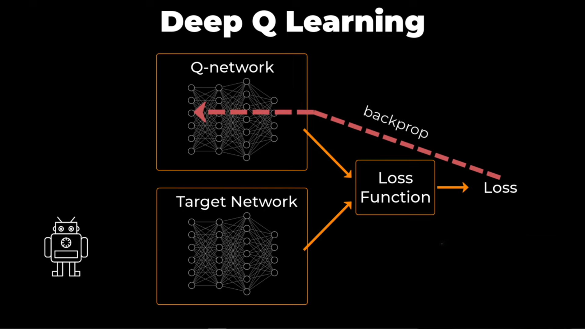
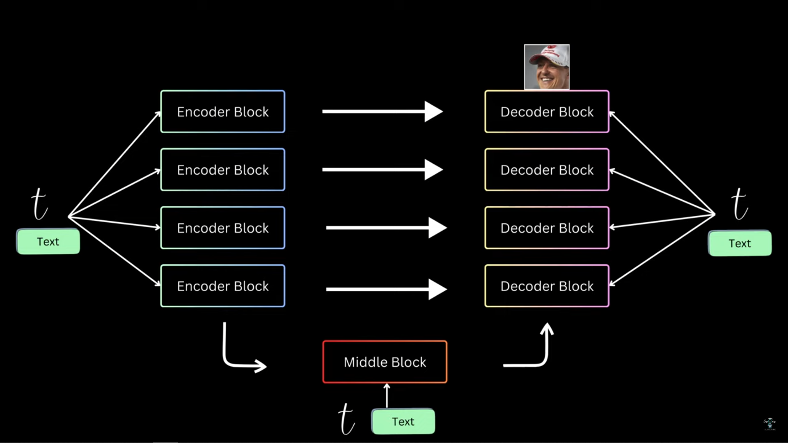
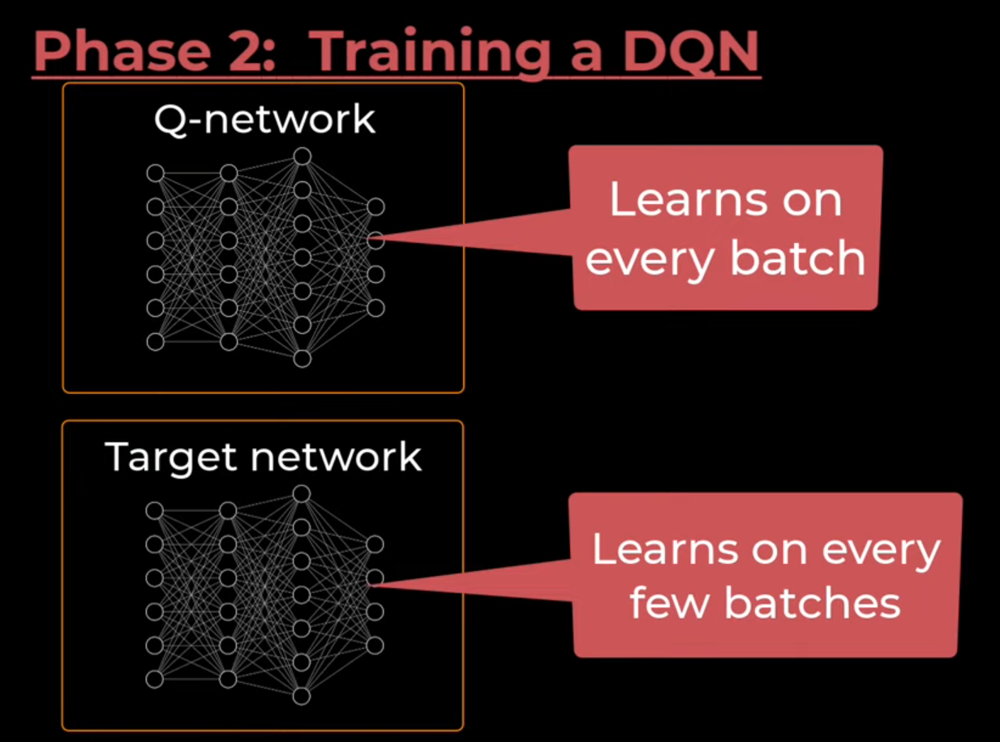

### Sources:
- [Deep Q-Networks Explained!](https://www.youtube.com/watch?v=x83WmvbRa2I)
## Deep Q-Learning (DQN)

Deep Q-Learning replaces the traditional, explicit **Q-table** with a **Deep Neural Network** (DNN) to handle environments with vast or continuous state spaces, where a table would be impossible to store.

### The Q-Network: Function Approximator

The core idea of DQN is to use a neural network, often called the **Q-Network** ($Q_\theta$), as a **function approximator** for the **optimal** Q-function, $Q^*(s, a)$.

* **Input:** The state ($s$) of the environment.
* **Output:** The Q-values for **all possible actions** ($a$) in that state.
* **Parameters ($\theta$):** The weights and biases of the neural network.

Instead of looking up a value in a table, the agent feeds the current state into the network, and the network outputs an estimated Q-value **for every action**. The best action is still chosen using the **greedy policy** on the network's output: $a = \underset{a}{\operatorname{argmax}} Q_\theta(s, a)$.

> **Summary:** The **Q-table is replaced** by a **Deep Neural Network ($Q_\theta$)** that takes the **state** as input and outputs the estimated **Q-values** for all possible actions, allowing the agent to generalize across vast state spaces.

### Experience Replay Buffer

In classic Q-learning, updates happen one step after the other, using the current experience $(\mathbf{s}, \mathbf{a}, \mathbf{r}, \mathbf{s'})$ -> (state, action, reward, next state). Training a neural network with this sequential, correlated data is highly inefficient and unstable because:
1.  **Correlated Data:** Successive states in an episode are *heavily related*, which biases the gradient descent algorithm.
2.  **Catastrophic Forgetting:** Updates for the current state can drastically change the network's understanding of past states.

The **Experience Replay Buffer** solves this by acting as a *database* storing past experiences in the form of tuples $(\mathbf{s}, \mathbf{a}, \mathbf{r}, \mathbf{s'})$.

* **Phase 1: Data Collection:** The **behavior policy** ($\pi_B$, typically $\epsilon$-greedy) interacts with the environment, and the resulting transitions are stored in the buffer.

* **Phase 2: Training:** The network is trained by sampling **mini-batches** of transitions *randomly* from the buffer, which **breaks the temporal correlation** of the data and improves stability and data efficiency.

> **Summary:** The **Experience Replay Buffer** stores past transition tuples $(\mathbf{s}, \mathbf{a}, \mathbf{r}, \mathbf{s'})$. This allows the network to be trained on **randomly sampled mini-batches**, which **decorrelates the data** and prevents unstable training.

### DQN Loss Function and the Bellman Error

In Deep Learning, instead of an "update rule" applied directly to $Q(s, a)$, we define a **Loss Function** that we minimize via **Gradient Descent**. DQN frames the TD Error as a **Mean Squared Error (MSE) Loss Function**.

The objective is to minimize the squared difference between the **TD Target** and the **Q-Network's Current Estimate**:

$$\mathcal{L}(\theta) = \mathbb{E} \left[ (\mathbf{TD\, Target} - Q_\theta(s, a))^2 \right]$$

The components of this loss are:

1.  **Current Estimate (Behavior Network):** $Q_\theta(s, a)$
    * This is the output of the network being **trained** for the action $a$ taken in state $s$.

2.  **TD Target (The "True" Value):** $R_{t+1} + \gamma \max_{a'} Q_{\theta_{\text{target}}}(s', a')$
    * This is based on the received reward $R_{t+1}$ and the Q-value of the next state $s'$.
    * This term is treated as a **constant** during the gradient calculation (it's the desired output).

The gradient of this loss function is used to update the network parameters $\theta$ (the weights), moving them closer to the optimal values, $\theta^*$.

### The Target Network ($\theta_{\text{target}}$)

The greatest source of instability in early attempts to combine Q-learning with neural networks was that the **TD Target** itself depended on the very network being updated:
$$\text{TD Target} = R_{t+1} + \gamma \max_{a'} Q_{\theta}(s', a')$$

This is like trying to chase a **moving target**: as $\theta$ changes, the target $Q_{\theta}(s', a')$ also changes, leading to oscillations and divergence.

To stabilize learning, DQN introduces a **Target Network** ($Q_{\theta_{\text{target}}}$) that is a **delayed copy** of the main **Behavior Network** ($Q_\theta$).

* **Behavior Network ($Q_\theta$):** Used to select actions and is updated at *every training step*.
* **Target Network ($Q_{\theta_{\text{target}}}$):** Used **only** to calculate the $\mathbf{TD\, Target}$.
    * Its parameters ($\theta_{\text{target}}$) are **fixed** for many training steps.
    * They are only updated by **periodically copying** the current weights from the Behavior Network ($\theta_{\text{target}} \leftarrow \theta$).

This setup ensures that the TD Target is stable for a period, allowing the Behavior Network to reliably converge towards it.

> **Summary:** A separate **Target Network** ($Q_{\theta_{\text{target}}}$) is used to calculate the TD Target, while the main **Behavior Network** ($Q_\theta$) is trained. The target network is updated **periodically** (not every step) by copying the behavior network's weights, which **stabilizes the training process**.

---

## Numerical Example: Calculating the Loss

Let's use a transition sampled from the **Experience Replay Buffer** to see how the loss is calculated.

**Transition:** $(\mathbf{s}, \mathbf{a}, \mathbf{r}, \mathbf{s'}) = (\text{State A}, \text{Action UP}, 5, \text{State B})$
* **Reward ($R$):** 5
* **Discount Factor ($\gamma$):** 0.9

### Step 1: Calculate the Current Estimate

The **Behavior Network** ($Q_\theta$) processes the state $s$.
* Input $s$ (State A) into $Q_\theta$.
* Output Q-values: $Q_\theta(\text{A}, \text{UP})=10.0$, $Q_\theta(\text{A}, \text{DOWN})=8.0$.
* **Current Estimate:** $Q_\theta(s, a) = Q_\theta(\text{A}, \text{UP}) = \mathbf{10.0}$

### Step 2: Calculate the TD Target

The **Target Network** ($Q_{\theta_{\text{target}}}$) processes the next state $s'$.
* Input $s'$ (State B) into $Q_{\theta_{\text{target}}}$.
* Output Q-values: $Q_{\theta_{\text{target}}}(\text{B}, \text{LEFT})=12.0$, $Q_{\theta_{\text{target}}}(\text{B}, \text{RIGHT})=15.0$.
* **Max Q-value of next state:** $\max_{a'} Q_{\theta_{\text{target}}}(s', a') = \max(12.0, 15.0) = \mathbf{15.0}$

Now, calculate the **TD Target**:
$$\text{TD Target} = R + \gamma \times (\max_{a'} Q_{\theta_{\text{target}}}(s', a'))$$
$$\text{TD Target} = 5 + 0.9 \times 15.0$$
$$\text{TD Target} = 5 + 13.5 = \mathbf{18.5}$$

### Step 3: Calculate the Loss and Update the Network

The TD Target ($\mathbf{18.5}$) is the "true" value we want the current estimate ($\mathbf{10.0}$) to move towards.

* **TD Error (Difference):** $\text{Target} - \text{Estimate} = 18.5 - 10.0 = 8.5$
* **MSE Loss:** $\mathcal{L}(\theta) = (\text{TD Target} - Q_\theta(s, a))^2$
    $$\mathcal{L}(\theta) = (18.5 - 10.0)^2 = 8.5^2 = \mathbf{72.25}$$

The calculated loss of $\mathbf{72.25}$ is then used in the **gradient descent** algorithm (e.g., Adam or SGD) to adjust the weights $\theta$ of the **Behavior Network** ($Q_\theta$) to reduce the error. The parameters of the **Target Network** ($Q_{\theta_{\text{target}}}$) remain fixed until the next periodic update.