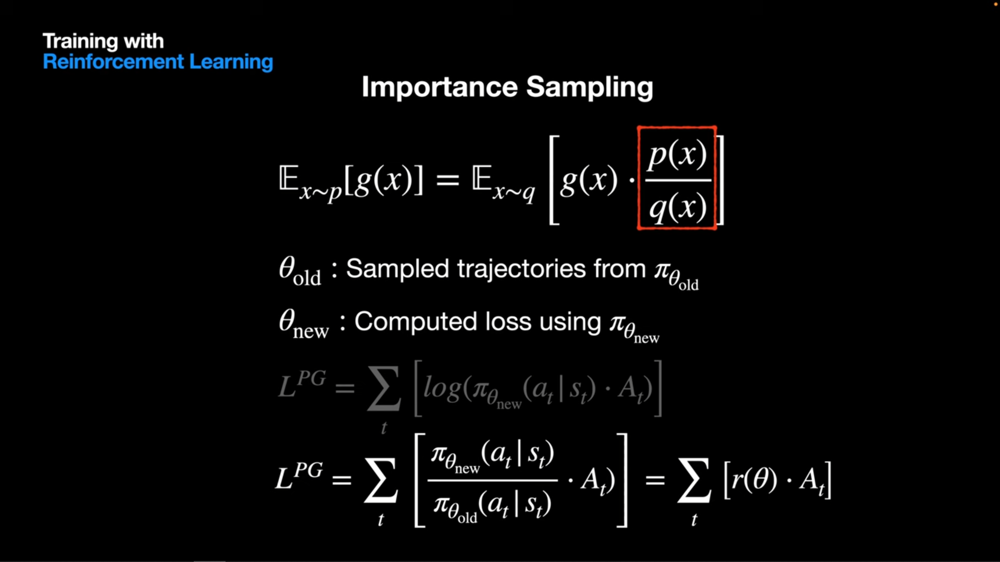
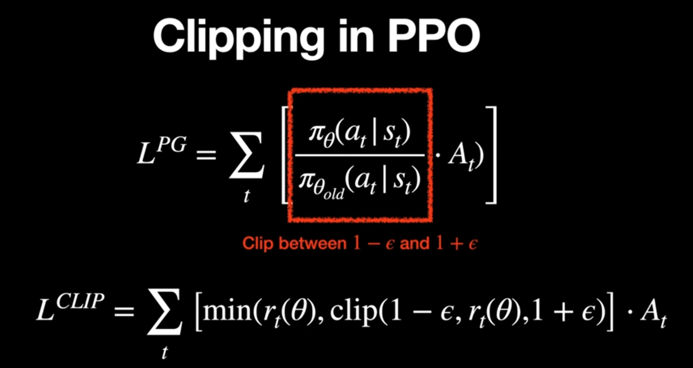
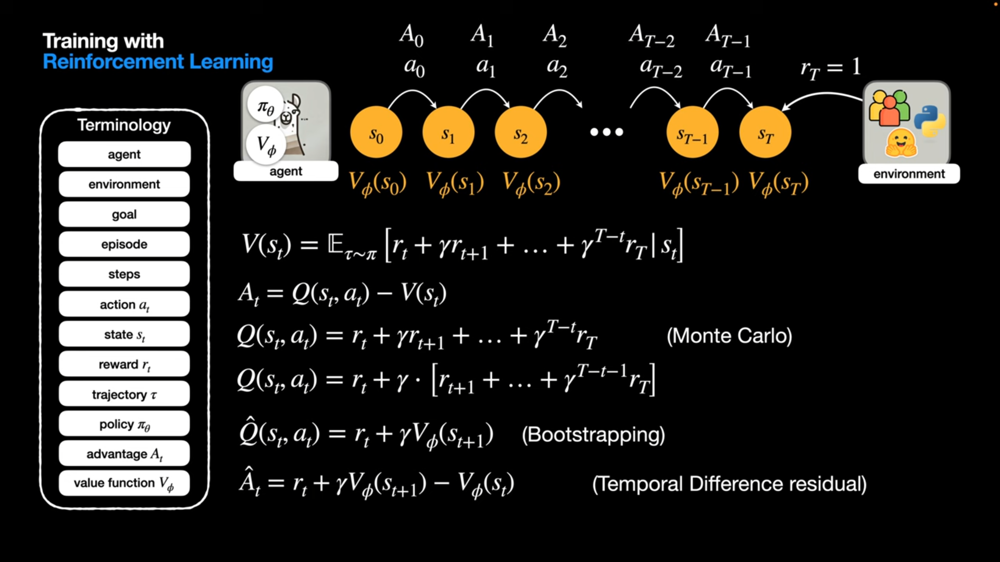
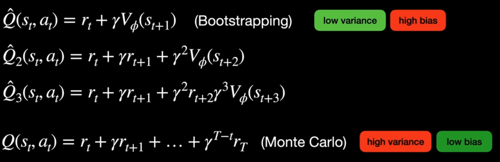
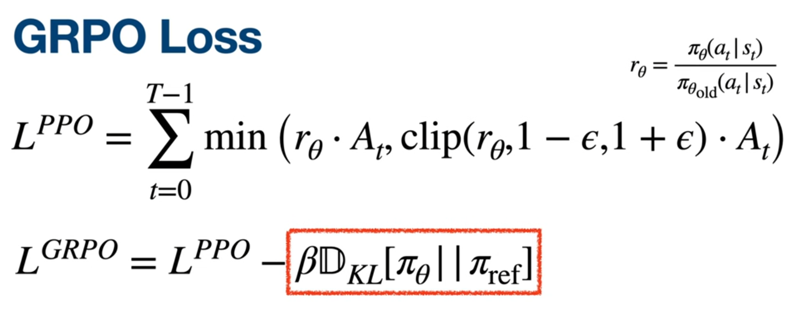
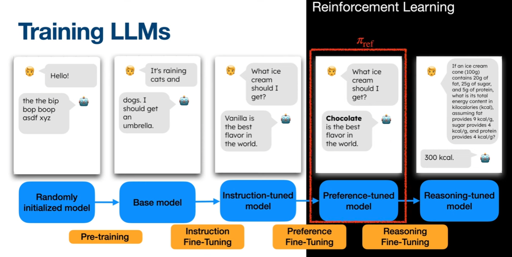
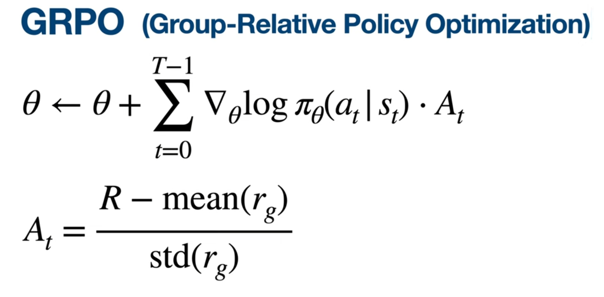
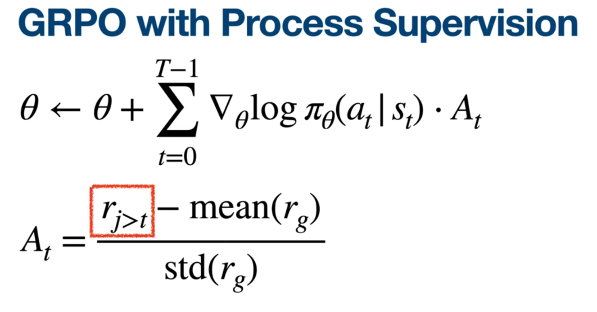
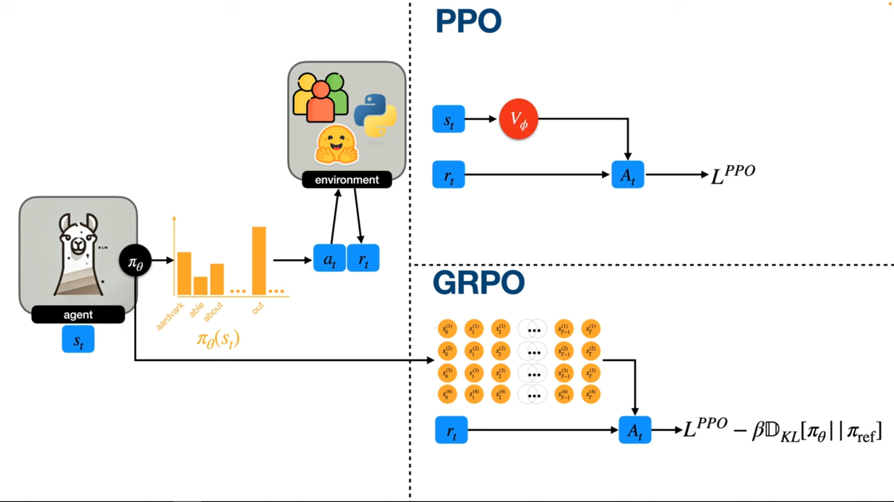

### Sources:
- [Proximal Policy Optimization | ChatGPT uses this](https://www.youtube.com/watch?v=MVXdncpCbYE)
- [Proximal Policy Optimization (PPO) for LLMs Explained Intuitively](https://www.youtube.com/watch?v=8jtAzxUwDj0&t=81s)
- [DeepSeek's GRPO (Group Relative Policy Optimization) | Reinforcement Learning for LLMs](https://www.youtube.com/watch?v=xT4jxQUl0X8)
- [Proximal Policy Optimization & Group Relative Policy Optimization | Paper Explained](https://www.youtube.com/watch?v=5ChE_UPNN78) -watch this to revise!
# Proximal  (PPO) & Group relative (GRPO) Policy Optimization

- RLHF -PPO -DPO
- RLVR (verifiable rewards) -PPO / GRPO (reasoning)
- When calculating advantage: GRPO -uses the last reward only (not the return) and one baseline for all states
- Intermediate rewards were probably wrong anyways so this approach is way faster and doesn't lose a lot of accuracy
- The group relative in GRPO is because we take the average reward (baseline) from a group to get the advantage
- GRPO with process supervision: another reward model that measuers the intermediate rewards
- GRPO uses PPO loss minus 2 reference policies (the reference here is different from PPO where pi ref is before we started finetuning)

## 1. Proximal Policy Optimization (PPO)

**Concept:** PPO is an **Advantage Actor-Critic (A2C)** method. Its primary goal is **stability**. In standard Policy Gradient methods, if you update the neural network too aggressively based on a specific batch of data, the policy might change so much that it enters a "*collapse mode*" (outputting garbage), and it *can never recover* because the data it generates next will also be garbage. PPO prevents this by forcing updates to stay within a "**Trust Region**."

### A. The Policy Ratio (Importance Sampling)

PPO is an **on-policy** algorithm, but to be efficient, it wants to use the data collected by the *previous* version of the policy for a few gradient steps. To do this mathematically, we use a ratio:

$$r_t(\theta) = \frac{\pi_\theta(a_t|s_t)}{\pi_{\text{old}}(a_t|s_t)}$$

**Parameters:**
* **$r_t(\theta)$**: The probability ratio at time step $t$.
* **$\theta$**: The current weights of the neural network (the one we are updating).
* **$\pi_\theta(a_t|s_t)$**: The probability the **new** policy (the one we are currently updating) assigns to action $a_t$ at state $s_t$.
* **$\pi_{\text{old}}(a_t|s_t)$**: The probability the **old** policy assigned to that action when the data was collected.
  
We **must use this old probability** because it is a *fixed* value. If we used the new policy instead, its log-probabilities would **change** during training, which would **mess up backpropagation**.

Using the old policy keeps the denominator constant, ensuring stable gradients and preventing the optimizer from cheating by making both numerator and denominator move together.

**Intuition:**
* If $r_t > 1$: The new policy thinks this action is *better* than the old policy did.
* If $r_t < 1$: The new policy thinks this action is *less* likely.

### B. The Clipped Surrogate Objective

This is the heart of PPO. We want to maximize the reward, but we don't want $r_t$ to **move too far away** from 1 (which would mean the new policy is **drastically** different from the old one).

$$L^{\text{CLIP}}(\theta) = \hat{\mathbb{E}}_t \left[ \min \left( r_t(\theta) \hat{A}_t, \ \text{clip}(r_t(\theta), 1-\epsilon, 1+\epsilon) \hat{A}_t \right) \right]$$

**Parameters:**
* **$\hat{\mathbb{E}}_t$**: The average (expectation) over the batch of data.
* **$\hat{A}_t$**: The **Advantage Estimate**. A positive number means the action was better than average; negative means it was worse.
* **$\epsilon$ (Epsilon)**: The **Hyperparameter** for the clipping range (usually set to $0.1$ or $0.2$). It defines the "safe zone."
* **$\text{clip}(\dots)$**: A function that forces the ratio to stay between $1-\epsilon$ and $1-\epsilon$.
* $\min(...)$: We take the **min** to make sure we always choose the **more conservative** (safer) update. If the unclipped term tries to push the policy too far, the clipped term becomes *smaller*, so the min forces the update to stay within the safe range. This prevents the policy from making *unstable* or *overly aggressive* jumps during training.

**How it works (The Logic):**
1.  **If Advantage is Positive ($A > 0$):** We want to **increase** the probability of this action. The ratio $r_t$ will **grow**. The formula *caps the growth* at $1+\epsilon$. This stops us from becoming *overconfident* based on a single sample.
2.  **If Advantage is Negative ($A < 0$):** We want to **decrease** the probability. The ratio $r_t$ will **shrink**. The formula *caps the penalty* at $1-\epsilon$. This prevents us from *destroying* the policy just because of one bad training example.

### C. Generalized Advantage Estimation (GAE)
How do we calculate $\hat{A}_t$ (how "good" an action was)? PPO uses GAE to balance the trade-off between **Variance** (noisy data) and **Bias** (inaccurate predictions).

$$\hat{A}_t = \sum_{l=0}^{\infty} (\gamma \lambda)^l \delta_{t+l}$$

**Parameters:**
* **$\delta$ (Delta)**: The TD (Temporal Difference) error. The immediate surprise: $\text{Reward} + \text{Predicted Value}_{\text{next}} - \text{Predicted Value}_{\text{current}}$.
* **$\gamma$ (Gamma)**: The **Discount Factor** (usually 0.99). It determines how much we care about future rewards vs. immediate rewards.
* **$\lambda$ (Lambda)**: The **GAE Smoothing Parameter** (usually 0.95).
    * If $\lambda = 1$: It acts like Monte Carlo (high variance, we wait for the true final result).
    * If $\lambda = 0$: It acts like TD Learning (high bias, we trust the critic's next-step guess entirely).

### D. Monte Carlo vs Bootstrapping in PPO

The Generalized Advantage Estimation (GAE) used in PPO is specifically designed to manage the trade-off between **Bias** and **Variance** that arises from two fundamental ways of calculating the return or value in RL: Monte Carlo and Bootstrapping.

#### 1. Monte Carlo (High Variance, Low Bias)
* **What it is:** The *return* is **calculated** by waiting until the *end* of an entire episode and summing up all the actual, undiscounted rewards received.
    $$G_t = R_{t+1} + \gamma R_{t+2} + \gamma^2 R_{t+3} + \dots$$
* **Bias:** It is **low** (unbiased) because it uses the true, realized rewards.
* **Variance:** It is **high** (noisy) because the return for an action taken early in the episode is affected by every single random action taken afterward. One lucky or unlucky event at the end completely changes the signal for the starting actions.

#### 2. Bootstrapping (High Bias, Low Variance)
* **What it is:** The *return* is **estimated** after just one or a few steps by using the Critic's Value Function ($V(s)$) to predict the future rewards from the next state onward.
    $$G_t \approx R_{t+1} + \gamma V(s_{t+1})$$
* **Bias:** It is **high** (biased) because the value is based on the *estimate* of the Critic. If the **Critic's prediction** is *wrong*, the entire **calculation** is *wrong*.
* **Variance:** It is **low** (stable) because it only depends on the immediate reward $R_{t+1}$ and the Critic's local, learned prediction $V(s_{t+1})$, which changes slowly.

#### 3. GAE: The Trade-Off Solution

GAE uses the parameter $\lambda$ (lambda) to continuously adjust between these two extremes, providing a smoother, more reliable estimate of the Advantage ($\hat{A}_t$): 
* **Setting $\lambda$ close to 1** leans towards the **Monte Carlo** side, reducing bias but increasing variance.
* **Setting $\lambda$ close to 0** leans towards the **Bootstrapping** side, reducing variance but increasing bias (since you are relying more on the potentially inaccurate Critic).

PPO typically sets $\lambda \approx 0.95$ to get the best of both worlds: a long-term, low-bias estimate that is smoothed enough to keep the learning stable.
### Summary: PPO
* **Role:** The stable, general-purpose RL algorithm.
* **Key Mechanism:** Uses a **Ratio** to compare new vs. old policies and **Clipping** to prevent large updates.
* **Requirement:** Requires training **two networks**: an Actor (Policy) and a Critic (Value Function).
* **Advantage:** Uses GAE, which combines immediate rewards with the Critic's predictions for a smooth learning signal.

---
## 2. Group Relative Policy Optimization (GRPO)

**Concept:** GRPO is an optimization of PPO specifically designed for **Reinforcement Learning from Verifiable Rewards (RLVR)**. It was developed to tackle the *high computational cost* and *unstable training issues* of standard PPO when applied to large generative models (LLMs) for complex tasks like multi-step reasoning (math, code generation).

### A. The Motivation: Cost, Noise, and the Critic

The decision to simplify PPO was driven by two main problems in LLM training:
1.  **Computational Cost:** Training the **Critic (Value Network)** in PPO requires duplicating the massive LLM architecture, nearly **doubling VRAM consumption** and training time. GRPO eliminates this.
2.  **Reward Noise:** For tasks like solving a complex math problem, the only truly reliable reward is the **final outcome** (1 for correct, 0 for incorrect). Trying to assign *intermediate rewards* for every token generated leads to a **noisy signal** that often misleads the model. GRPO, therefore, simplifies the reward structure.

### B. Group Sampling & The Objective Function

GRPO generates a **group of outputs** for the same prompt so it can compute a *local baseline* from that small set. This baseline is then used inside a PPO-style loss, but with an **important addition**: a KL penalty term that keeps the policy close to a fixed reference model.

The GRPO loss:

$$L^{\text{GRPO}}(\theta) = \mathbb{E} \left[ \frac{1}{G} \sum_{i=1}^G \left( \min \left( r_i(\theta) A_i, \text{clip}(r_i(\theta), 1-\epsilon, 1+\epsilon) A_i \right) - \beta D_{KL}(\pi_\theta ,|, \pi_{\text{ref}}) \right) \right]$$

Which is often written compactly as:

$$L^{\text{GRPO}}(\theta) = L^{\text{PPO}}(\theta) - \beta D_{KL}(\pi_\theta ,|, \pi_{\text{ref}})$$

**Parameters:**

* **$G$** : Number of sampled outputs in the group (e.g., 4, 8, 16).
* **$r_i(\theta)$** : PPO probability ratio for the $i$-th output.
* **$A_i$** : **Group-relative** advantage computed using the **group's own average reward**.
* **$\beta$** : Controls how strongly we penalize deviation from the reference model.
* **$D_{KL}(\pi_\theta ,|, \pi_{\text{ref}})$** : KL **divergence** between the *current policy* and the *reference policy*.

**Why the KL Term? (Two Different Reference Points)**
GRPO relies on two different “reference” policies, each serving a specific purpose:

1. **$\pi_{\text{old}}$  Local reference for PPO stability**
   Used inside the ratio ( $r_i(\theta)$ ).
   Ensures updates are *stable* and prevents the new policy from **jumping too far** from the policy that collected the data.

2. **$\pi_{\text{ref}}$  Global reference for language-model grounding** (*before* we started reasoning finetuning)
   Used in the KL penalty.
   Keeps the policy from *drifting* too far away from the **original preference-tuned model**, which prevents:
	- reward hacking.
	- unnatural or degenerate outputs.
	- forgetting how to behave like a normal language model.
	- Compensates the oversimplification of the GRPO architecture.

Together, these two references keep GRPO both **stable** (like PPO) and **well-grounded** in the behavior of the pretrained model.

### C. Group Relative Advantage (The "Critic-Less" Approach)

GRPO **discards** the complex **GAE** used in PPO because *intermediate rewards* are **unreliable**. It simplifies the advantage calculation in two crucial ways:

#### 1. Final Reward Focus (Ignoring Intermediate Steps)
When calculating the return ($G_t$), GRPO only considers the single final reward $R_T$ (e.g., 1 or 0 for correctness) and discounts it back to the current state $t$.

* **PPO:** Uses a sum of rewards and predicted values (GAE).
* **GRPO:** **Uses the last reward only** (not the full return sum) because the intermediate rewards assigned to individual tokens are often noisy or even wrong, especially in complex reasoning chains. This simplification is **faster and does not lose much accuracy** for tasks with clear final outcomes.

#### 2. Group Normalization Baseline

The **Group Relative** concept comes from using the **group's performance as the baseline** instead of a *learned Value function*:

$$A_i = \frac{r_i - \text{mean}(\{r_1, \dots, r_G\})}{\text{std}(\{r_1, \dots, r_G\})}$$

* **$\text{mean}(\dots)$**: This **Group Average Reward** serves as the **single baseline for all states** in that group. By subtracting the group average, we calculate the advantage based on relative performance within the current batch.
* **The Intuition:** This normalization automatically adjusts the signal based on prompt difficulty. An output with a score of 0.5 might receive a positive advantage if the group average was 0.2, but a negative advantage if the group average was 0.9.

### D. Supervision Variations
GRPO works well with different types of reward signals, each serving a different training setup:

#### **1. RLVR (Verifiable Rewards)**

This is the main setting for GRPO.
The reward comes from an **objective, verifiable metric**, that you can see if it is right or wrong just from the *final answer*, for example:

* whether code compiles,
* whether a math answer is correct,
* whether a tool returns the expected result.

Because these rewards are clear and reliable, GRPO can use the **final reward only**, without needing intermediate supervision. This keeps training simple and stable.

#### **2. GRPO with Process Supervision**

For tasks that require *reasoning* (like math, logic, or multi-step planning), GRPO can incorporate a **second Reward Model** that scores the **intermediate steps**, not just the final answer.

In this case:

* The final reward is combined with the intermediate step rewards.
* The total episode reward is ( $R_T = R_{\text{final}} + \sum R_{\text{process}}$ ).

Even with these extra rewards, GRPO still computes the **Group Relative Advantage** the same way, each sample is compared to the **group average**, which helps smooth out the noise from step-by-step scoring.

---

### Summary: GRPO
* **Core Role:** Specialized, memory-efficient algorithm for LLMs and verifiable reasoning tasks (RLVR).
* **Mechanism:** Samples a **Group ($G$)** of outputs to calculate a statistical baseline instead of training a separate **Critic** network.
* **Advantage:** Uses **Group Normalization** (Z-score) on the **final reward only**, eliminating the noise and complexity of GAE and intermediate token-level rewards.
* **Safety:** Includes a **KL Divergence penalty** against the original SFT model ($\pi_{\text{ref}}$) to prevent catastrophic forgetting and reward hacking.
---

## 3. Comparative Deep Dive

| Feature                  | PPO (Proximal Policy Optimization)                                                                                              | GRPO (Group Relative Policy Optimization)                                                                                           |
| :----------------------- | :------------------------------------------------------------------------------------------------------------------------------ | :---------------------------------------------------------------------------------------------------------------------------------- |
| **Network Architecture** | **Actor-Critic (2 Models):** You must load the Policy model (LLM) AND a Value model (LLM) into GPU memory.                      | **Policy Only (1 Model):** You only need the Policy model. The "Value" is calculated on the fly via statistics (group wise).        |
| **Loss Function**        | **Clipped Surrogate + Value Loss:** Tries to satisfy the reward while ensuring the Critic accurately predicts future rewards.   | **Clipped Surrogate + KL Penalty:** Tries to satisfy the reward while ensuring the model doesn't drift from the Reference model.    |
| **Advantage Source**     | **GAE (Generalized Advantage Est.):** Sophisticated mix of current reward and future predictions. Handles delayed rewards well. | **Group Normalization:** Simple statistical comparison. "Did I do better than the other attempts in this batch?"                    |
| **Baseline**             | **Learned ($V(s)$):** The network *learns* the baseline. This can be biased if the network is untrained.                        | **Observed ($\bar{R}$):** The baseline is the *actual* average of the current batch. Unbiased but requires sampling multiple times. |
| **Primary Use Case**     | Robotics, Video Games, General RL, Chatbots where only 1 response is generated.                                                 | **Reasoning Models (DeepSeek)**, Math, Coding, where "Best of N" sampling is possible.                                              |

### Summary: Comparison
* **Complexity:** PPO is mathematically more complex regarding the Value function; GRPO is conceptually simpler but requires handling groups of data.
* **Memory:** GRPO is the clear winner for Large Language Models, often saving 30-50% VRAM.
* **Stability:** PPO is generally more stable for single-step tasks. GRPO relies on the "Law of Large Numbers" within the group to provide stability.

---