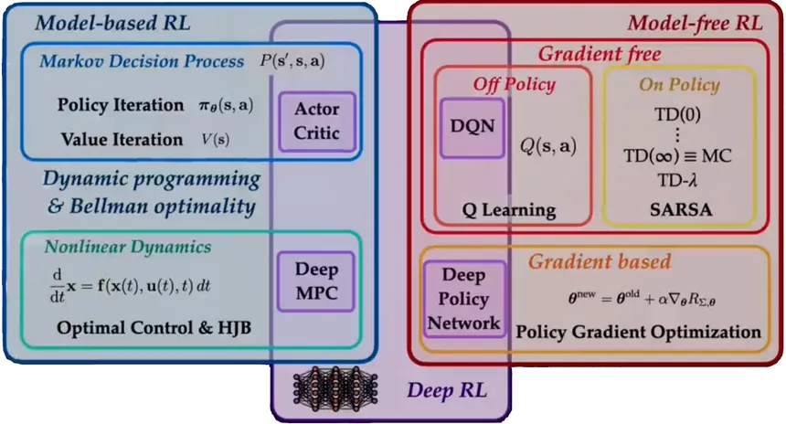

# Reinforcement Learning Algorithms

RL is about an agent interacting with an environment to maximize **cumulative reward**.

### Key Terms

* **State (s):** What the world looks like right now.
* **Action (a):** What the agent decides to do.
* **Reward (r):** Feedback (good or bad) after an action.
* **Policy (π):** A rule for choosing actions. (function that maps a *state* to *action*)
* **Value Function (V or Q):** Predicts future rewards.

\

---

# 1. Model-Free RL (The “Habit Learner”)

The agent **does not learn how the world works**. It only learns which actions are good based on *trial and error*.

---

## A. Value-Based Methods

### Example algorithms: **Q-learning**, **DQN**, **C51**, **QR-DQN**

### What they do

* Learn **Q(s, a)** = “expected future **reward** if I take *action* 'a' in *state* 's'”.

### Example

**Environment:** FrozenLake (agent must reach goal without falling into holes)

* If the agent stands at a state with two possible actions:

  * **Left** → safe but slow
  * **Right** → risky but fast

Q-values might look like:

| State | Action | Q-value |
| ----- | ------ | ------- |
| S5    | Left   | 0.3     |
| S5    | Right  | 0.8     |

The agent picks the action with the highest Q-value: **Right**.

### Why it's useful

* Works well for discrete action spaces.
* Easy to implement.
* Scales with deep learning → **DQN**.

---

## B. Policy Optimization

### Example algorithms: **PPO**, **A2C**, **TRPO**

### What they do

* Learn **the policy directly**: π(a|s).
* Instead of picking the best action from Q-values, the network **outputs probabilities for each action**.

### Example

**CartPole:** The agent must keep a pole balanced.

* Observation = angle and position of the pole
* Output = probability of pushing left or right

Policy might produce:

* π(left | s) = 0.2
* π(right | s) = 0.8

So the agent chooses **right** most of the time.

### Why it's useful

* Works for large and continuous action spaces.
* Usually more stable training than value-based methods.

---

## C. Actor–Critic (Hybrid)

### Example algorithms: **A2C**, **DDPG**, **TD3**, **SAC**

### What they do

* **Actor:** chooses the action (policy).
* **Critic:** estimates whether the action is good (value).
* They train **each other**.

### Example

**Pendulum environment** (continuous torque applied to a pendulum)

* Actor outputs a continuous action: torque = -1.2
* Critic estimates Q(s, torque)
* If torque produces higher reward (less swing), critic says “good”, actor shifts to similar actions.

### Why it's useful

* Best for **continuous control** tasks.
* Modern algorithms like **TD3** and **SAC** are SOTA in robotics.

---

# 2. Model-Based RL (The “Planner” Learner)

Here the agent **learns a model of the environment**:

* Predict next state:
  $$ s_{t+1} = f_\theta(s_t, a_t) $$
* Predict reward:
  $$ r_t = g_\theta(s_t, a_t) $$

Then it uses that model to plan decisions.

### Example

**Self-driving simulation:**
Instead of driving blindly, the agent learns:

* “If I accelerate here, I’ll get close to the car in front.”
* “If I turn left now, I’ll leave the lane.”

### Types

1. **Learn the model** (e.g., World Models, Dreamer)
   * The agent *builds its own* internal simulator.

1. **Given the model** (e.g., AlphaZero)
   * Chess rules are known → agent uses Monte Carlo Tree Search + neural networks.

### Benefits

* Much more sample efficient.
* Can “imagine” future moves without interacting with the real environment.

---

# Code Implementation Checklist

### 1. **Q-learning (tabular)**

* Best method to build core understanding of RL.
* Learn Q-table updates:
  $$ Q(s, a) \leftarrow Q(s, a) + \alpha [r + \gamma \max_{a'} Q(s', a') - Q(s, a)] $$
* Example: FrozenLake, Taxi-v3.

---

### 2. **DQN (with Replay + Target Network)**

* Neural network version of Q-learning.
* Must implement:
	* Experience replay buffer
	- Target network
	  - Ε-greedy exploration
* Example: CartPole, Atari Pong.

---

### 3. **REINFORCE**

* Pure policy gradient.
* Monte Carlo approach:
  $$ \nabla_\theta J(\theta) = \mathbb{E}[G_t \nabla_\theta \log \pi_\theta(a_t|s_t)] $$
* Simple but unstable → teaches the fundamentals of policy gradients.

---

### 4. **A2C (Advantage Actor–Critic)**

* Actor chooses action.
* Critic estimates value and stabilizes training.
* Example: LunarLander-v2.

---

### 5. **PPO (full implementation)**

* The modern workhorse of RL.
* Adds clipping to stabilize policy updates.
* Example: MuJoCo, CarRacing.

---

### 6. **DDPG / TD3 / SAC** (continuous control)

* For robotics, continuous actions, real control tasks.
* Order of difficulty:

  1. **DDPG** (base algorithm)
  2. **TD3** (fixes DDPG overestimation)
  3. **SAC** (state-of-the-art, maximum entropy RL)

---

# Summary Table With Examples

| Algorithm    | Type                        | Good For                       | Example Environment   |
| ------------ | --------------------------- | ------------------------------ | --------------------- |
| Q-learning   | Value-based                 | Discrete actions               | FrozenLake, Taxi      |
| DQN          | Value-based + Deep Learning | Atari games                    | CartPole, Pong        |
| REINFORCE    | Policy-gradient             | Simple tasks, understanding PG | CartPole              |
| A2C          | Actor-Critic                | More stable PG                 | LunarLander           |
| PPO          | Policy Optimization         | Modern RL, stable              | MuJoCo                |
| DDPG/TD3/SAC | Actor-Critic (continuous)   | Robotics, control              | Pendulum, HalfCheetah |

---

If you want, I can also create:

* a **visual diagram** of all algorithms and their relationships
* a **step-by-step learning roadmap**
* **mini coding templates** for each algorithm in PyTorch
