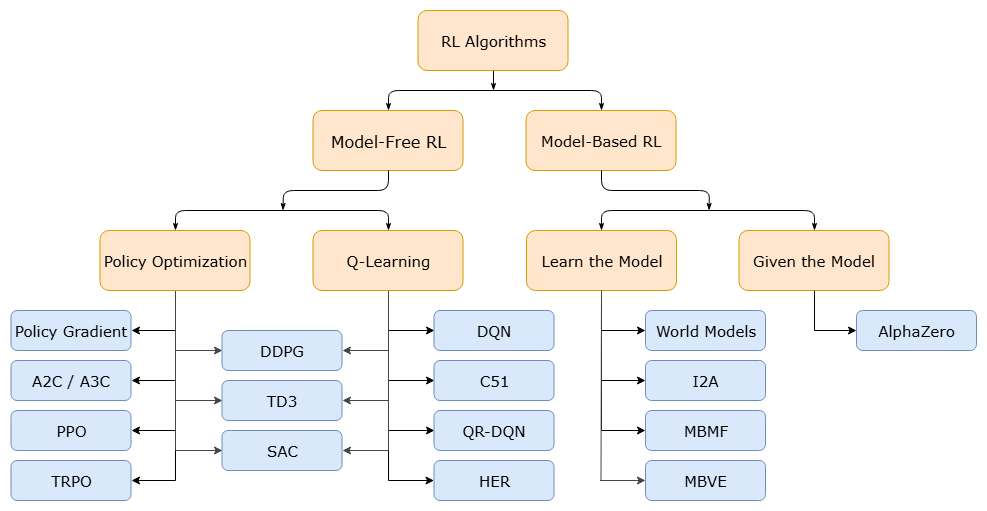
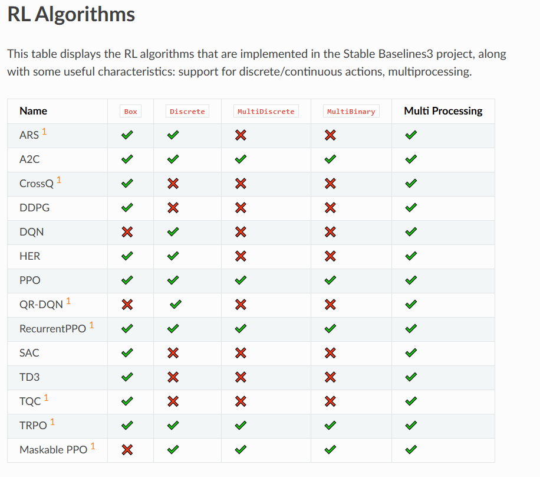

## RL Algorithms Overview

This diagram  outlines the main ways RL agents learn. All algorithms seek to maximize the cumulative **reward**.

### Model-Free RL (The "Habit" Learner)
* **What it is:** The agent learns directly from its experience with the environment (trial and error) **without** explicitly building a model of how the world works. It doesn't try to predict the next state or reward; it just learns which action is best from the current state.
* **Categories:**
    * **Policy Optimization:** The agent learns a **policy function** (the brain) that maps states directly to actions. It adjusts this function to increase the probability of taking actions that lead to high rewards.
        * *Examples:* **PPO** (Proximal Policy Optimization), **A2C** (Advantage Actor-Critic), **TRPO** (Trust Region Policy Optimization).
    * **Q-Learning/Value-Based:** The agent learns a **value function** ($Q$) that estimates the maximum future reward it can get by taking a specific action in a specific state. The action taken is simply the one that maximizes this estimated $Q$-value.
        * *Examples:* **DQN** (Deep Q-Network), **C51**, **QR-DQN**.
    * **Actor-Critic (Hybrid):** Combines Policy Optimization (the **Actor** chooses the action) with Value-Based methods (the **Critic** evaluates the action). DDPG, TD3, and SAC fall into this category, specifically designed for continuous action spaces.
        * *Examples:* **DDPG** (Deep Deterministic Policy Gradient), **SAC** (Soft Actor-Critic).

### Model-Based RL (The "Planner" Learner)
* **What it is:** The agent first learns an **environmental model** (a simulation) that predicts the next state and reward given the current state and action. It then uses this internal model to plan, look ahead, and select the best actions.
* **Categories:**
    * **Learn the Model (World Models, I2A):** The algorithm learns the model during training alongside the policy.
    * **Given the Model (AlphaZero):** The model (like the rules of chess for AlphaZero) is provided upfront.
* **Benefit:** Often much more sample efficient (requires less real-world interaction) because the agent can "simulate" experience internally.

> For more details visit [spinningup](https://github.com/openai/spinningup/blob/master/docs/spinningup/rl_intro2.rst)
***

##  Spaces (Action Space, Observation Space)

In RL, the **Space** defines the format and range of data used for interactions. Every Gym environment has an `observation_space` (what the agent sees) and an `action_space` (what the agent can do).

| Space Type | Description | Example Environment |
| :--- | :--- | :--- |
| **Box** | Represents a **continuous** N-dimensional box. Values are floating-point numbers within a defined range. | **Observation Space:** Position, velocity, and angle of the CartPole (e.g., $x \in [-4.8, 4.8]$). |
| **Discrete** | Represents a **fixed range of non-negative integers**. The agent chooses one integer index. | **Action Space:** CartPole (0: push left, 1: push right). |
| **MultiDiscrete** | Represents a list of multiple independent **Discrete** choices, each with its own size. | A simple game where you choose a weapon (3 options) AND a shield (2 options). |
| **MultiBinary** | Represents a list of fixed-size binary values (0 or 1). Often used for environments where multiple actions can be active simultaneously. | Turning on/off four separate light switches at once. |
| **Tuple / Dict** | Used to combine multiple other spaces into a single observation or action. For instance, the observation might be a dictionary containing a `'visual'` Box (for pixels) and a `'data'` Box (for joint angles). | Complex robotic control tasks. |

The **Stable-Baselines3 (SB3) table**  shows which algorithms can handle which action spaces. For example:
* **DDPG, TD3, SAC** (Actor-Critic methods) are primarily designed for continuous actions (represented by the **Box** action space).
* **DQN, C51, HER** (Value-Based methods) are typically limited to **Discrete** actions.
* **PPO, A2C** are versatile and support both **Box** (continuous) and **Discrete** action spaces.

***

##  Evaluation Metrics

These metrics are essential for tracking the progress and performance of your RL agent during training and evaluation.

* **`ep_len_mean` (Mean Episode Length):**
    * **What it is:** The average number of time steps or actions the agent takes before an episode ends (either by reaching a goal, failing, or hitting a time limit/truncation).
    * **Interpretation:** For goal-oriented tasks (like reaching a target), a **shorter** length might be better (more efficient). For survival tasks (like balancing the CartPole), a **longer** length is usually better.

* **`ep_rew_mean` (Mean Episode Reward):**
    * **What it is:** The average cumulative reward the agent receives over the course of a single episode. This is the **primary measure of success** in RL.
    * **Interpretation:** A **higher** value indicates a better policy. This value should consistently increase as the agent learns.

---

## Architecture changes in **Stable-Baselines3 (SB3)**

For example, `net_arch=[dict(pi=[128, 128, 128, 128], vf=[128, 128, 128, 128])]` means you are creating a network with **four hidden layers**, each containing **128 neurons**, for both the **policy network** ($\pi$) and the **value function network** ($vf$).

---

### Detailed Breakdown

#### 1. `net_arch` (Network Architecture)

This is the parameter used by many SB3 algorithms (especially Actor-Critic ones like PPO and A2C) to configure the structure of the neural network.

#### 2. `dict(...)`

This specifies a custom network structure. By default, SB3 uses a shared network where the initial layers process the observation, and the final layers split off for the policy and value function.

#### 3. `pi=[128, 128, 128, 128]` (Policy Network)

* **`pi`**: Short for **Policy** ($\pi$). This network is the agent's "brain" responsible for deciding **which action to take** given a state.
* **`[128, 128, 128, 128]`**: This is a list defining the structure of the **hidden layers** for the policy network.
    * It specifies **four hidden layers**.
    * Each of those four layers will have **128 neurons** (or units).
    * *The output layer (which produces the action probabilities/values) is handled automatically by SB3 based on the environment's action space (e.g., 2 outputs for CartPole's Discrete action space).*

#### 4. `vf=[128, 128, 128, 128]` (Value Function Network)

* **`vf`**: Short for **Value Function** ($V$). This network is the agent's "evaluator" responsible for predicting the **expected future reward** (or value) of a given state.
* **`[128, 128, 128, 128]`**: This specifies the structure of the hidden layers for the value function network, mirroring the policy network with **four layers of 128 neurons** each.
    * *The output layer of the value network is always a single unit, representing the predicted value of the input state.*

---

### General Interpretation

When you see a definition like this, it means the algorithm will create two separate, parallel networks (or a shared base network that splits):

1.  A **Policy Network ($\pi$)** that learns $P(a|s)$ (the probability of action $a$ given state $s$).
2.  A **Value Network ($V$)** that learns $V(s)$ (the value of state $s$).

The list of numbers (e.g., `[128, 128, 128, 128]`) represents the **depth** (number of layers) and **width** (number of neurons per layer) of the network. Increasing these numbers makes the model more powerful but requires more data and computational time to train.