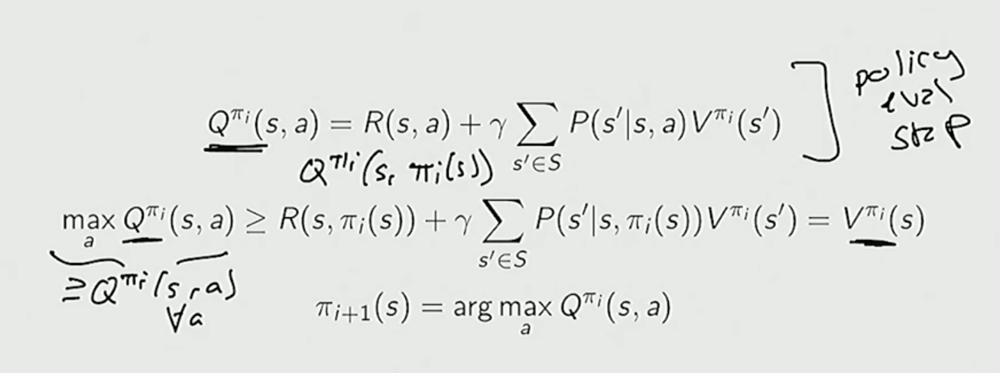
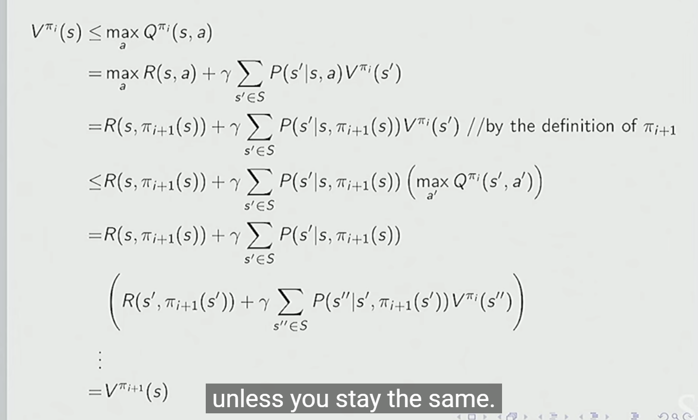

# Lecture 1

* ChatGPT training pipeline (high-level):

  * Behavior cloning (imitation learning): supervised learning on human demonstrations to copy *good* policies
	* Assumes demonstrations are near-optimal
  * Reward modeling (model-based RL component): learn a reward function from human preferences
  * Reinforcement learning (RLHF): optimize the policy against the learned reward using RL

* Reinforcement Learning (RL) involves:
  * Optimization: learning a policy that maximizes expected return
  * Delayed consequences: actions affect rewards far in the future
  * Exploration: the agent must try unknown actions to discover better rewards
  * Generalization: the policy must work on unseen states, not just memorized ones

* Imitation Learning (IL):
  * Reduces RL to supervised learning
  * Assumes access to demonstrations of **good policies**
  * Limitation: performance is bounded by demonstrator quality

* Key limitation of IL:
  * “If you want to go beyond human performance, you can’t rely on human performance”
    * IL cannot exceed the demonstrator
    * RL can improve beyond demonstrations via exploration

* History definition:
  * History $h_t = (a_0, o_0, r_0, \dots, a_{t-1}, o_{t-1}, r_{t-1})$
  * Represents everything observed so far

* Agent behavior:
  * Agent chooses action $a_t$ based on history $h_t$
  * General formulation before assuming Markov structure

* Markov assumption:
  * The **future** is independent of the **past** given the **present**
  * If the current state is sufficiently informative, past history is unnecessary

* Markov state condition:
  * A state is Markov **if and only if**:
    * $p(s_{t+1} \mid s_t, a_t) = p(s_{t+1} \mid h_t, a_t)$
  * Meaning: the state summarizes all relevant past information

* Models in RL:
  * Transition (dynamics) model:
    * Predicts next state given current state and action
    * $p(s_{t+1} \mid s_t, a_t)$
  * Reward model:
    * Predicts immediate reward
    * $r(s_t, a_t)$

* Policies:
  * Deterministic policy:
    * Always selects the same action for a given state
    * $a = \pi(s)$
  * Stochastic policy:
    * Outputs a probability distribution over actions
    * $\pi(a \mid s)$
    * Enables exploration and robustness

* Evaluation vs control:
  * Policy evaluation:
    * Compute the value of a **fixed** policy
  * Control:
    * Find the **optimal** policy

* Markov Process (MP):
  * Sequence of random states with the Markov property
  * No actions, no rewards
  * Defined only by transition probabilities

* Markov Reward Process (MRP):
  * Markov process + rewards
  * Includes discount factor $\gamma$
  * No actions (policy is implicit or fixed)

* Discount factor $\gamma$:
  * $\gamma = 0$:
    * Only immediate rewards matter
  * $\gamma = 1$:
    * Future rewards are as important as immediate rewards
  * Controls trade-off between short-term and long-term rewards

* Value function in an MRP:
  * Expected return starting from a state
  * $V(s) = \mathbb{E}\left[\sum_{t=0}^{\infty} \gamma^t r_{t} \mid s_0 = s \right]$
  * Can be written recursively using Bellman equation:
    * $V(s) = r(s) + \gamma \mathbb{E}_{s'}[V(s')]$
# Lecture 2

* Computing value functions directly:
  * Requires inverse of $(I - \gamma P)$
  * This is computationally unrealistic for large state spaces

* Dynamic Programming (DP):
  * Avoids matrix inversion
  * Computes values iteratively
  * Uses Bellman equations to update values until convergence

* Markov Decision Process (MDP):
  * MRP + actions
  * Defined by:
    * States $S$
    * Actions $A$
    * Transition probabilities $P(s' \mid s, a)$
    * Reward function $r(s, a)$
    * Discount factor $\gamma$

* Relationship between MDPs and MRPs:
  * MDP + fixed policy $\pi$ induces an MRP
  * Transitions and rewards become policy-dependent

* Bellman equation for a fixed policy (Bellman backup):
  * $V^\pi(s) = \mathbb{E}*{a \sim \pi}\left[r(s,a) + \gamma \mathbb{E}*{s'}[V^\pi(s')]\right]$
  * Used for policy evaluation

* Number of deterministic policies:
  * $|A|^{|S|}$
  * Exponential growth makes brute-force search infeasible

* Properties of the optimal policy:
  * Deterministic:
    * Randomness is unnecessary when maximizing expected return
  * Stationary:
    * Does not depend on time step
  * Unique:
    * The optimal **value function** is unique
    * Multiple policies may achieve it, but at least one deterministic optimal policy exists

* Policy improvement using the Q-function:
  * $Q^\pi(s,a) = r(s,a) + \gamma \mathbb{E}_{s'}[V^\pi(s')]$
  * New policy chooses:
    * $\pi'(s) = \arg\max_a Q^\pi(s,a)$

* Diagram (policy improvement illustration):
  * Shows how greedy action selection improves the policy
  * Value increases or stays the same after improvement
  * 

* Policy improvement guarantee:
  * If $\pi_{i+1} = \pi_i$, improvement stops
  * Otherwise, policy strictly improves
  * This yields **monotonic improvement**
  * 

* Diagram (policy iteration loop):
  * Alternates between:
    * Policy evaluation
    * Policy improvement
  * Converges to optimal policy

* Bellman optimality backup operator:
  * Applied to a value function $V$
  * $\mathcal{T}V(s) = \max_a \left[r(s,a) + \gamma \mathbb{E}_{s'}[V(s')]\right]$
  * Produces a new value function
  * Improves value if possible

* Contraction property of Bellman operator:
  * For any two value functions $V_1, V_2$:
    * $|\mathcal{T}V_1 - \mathcal{T}V_2| \le \gamma |V_1 - V_2|$
  * Ensures convergence to a unique fixed point
  
* Policy improvement vs value improvement:
  * Policy improvement:
    * Improves policy using the Q-function
  * Value improvement:
    * Improves value function directly using Bellman optimality operator
  * Both ultimately converge to the optimal value and policy
