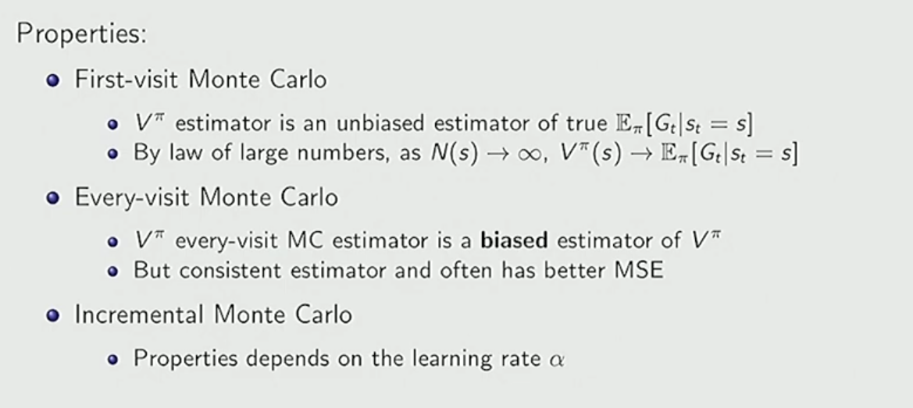
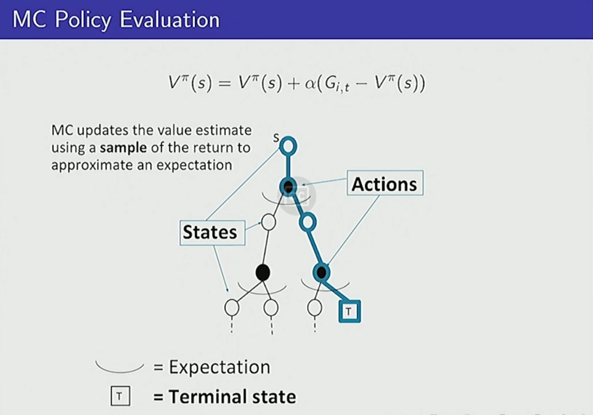
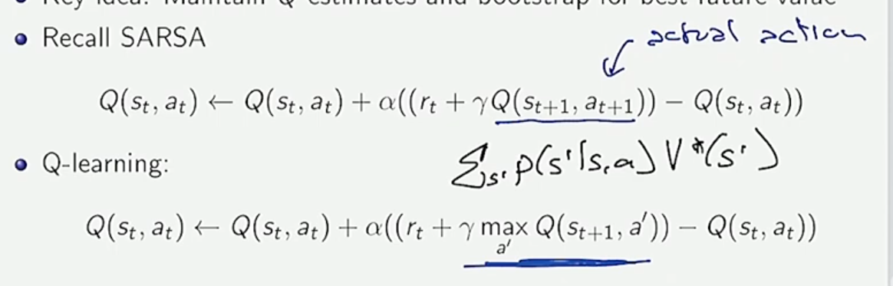

# Lecture 3
* Value iteration and policy iteration:
	* Both are guaranteed to converge to the **optimal value function** and a policy achieving that value
	* This guarantee holds **only if** the discount factor satisfies $\gamma < 1$
	* Reason: the Bellman operators are contractions when $\gamma < 1$

* Policy iteration complexity:
	* Maximum number of deterministic policies: $|A|^{|S|}$
	* Policy iteration may require evaluating many policies, but:
		* Each policy improvement step strictly improves (or keeps) the value
		* It terminates once the policy stops changing

* Value iteration complexity:
	* Number of iterations is **not** bounded by $|A|^{|S|}$
	* Value iteration improves values directly, not policies
	* It may take more iterations than the number of possible policies, but each iteration is cheaper

* Return:
	* $G_t$ (return) is the discounted sum of rewards from time step $$t$$ onward:
	
	$$G_t = r_t + \gamma r_{t+1} + \gamma^2 r_{t+2} + \dots$$
	* Measures long-term reward starting from time $t$

* State-value function:
	* $V^\pi(s)$ is the **expected return** starting from state $s$ and following policy $\pi$:
	
	$$V^\pi(s) = \mathbb{E}_\pi[G_t \mid s_t = s]$$
	* Answers: “How good is this state under policy $\pi$?”

* State–action value function:
	* $Q^\pi(s,a)$ is the expected return starting from state $s$,
	taking action $a$ once, then following policy $\pi$:
	
	$$Q^\pi(s,a) = \mathbb{E}_\pi[G_t \mid s_t = s, a_t = a]$$
	* Used directly for policy improvement

* Bootstrapping:
	* Using an **estimate** of the value function to update another estimate
	* Instead of waiting for the full return $G_t$, we use current value estimates
	* Key idea behind Temporal Difference methods

* Monte Carlo (MC) policy evaluation:
	* Estimate value function by **averaging observed returns**
	$$V^\pi(s) \approx \frac{1}{N(s)} \sum_{i=1}^{N(s)} G_t^{(i)}$$
	* Does **not** require the Markov property
	* Requires **episodic tasks** (must reach a terminal state)

* First-visit Monte Carlo:
	* Update value only on the **first visit** to a state in an episode
	* Produces an **unbiased estimator** of $V^\pi(s)$
	* Easier to analyze theoretically

* Every-visit Monte Carlo:
	* Update value on **every visit** to a state in an episode
	* Estimator is **biased**, but often lower variance in practice

* Incremental Monte Carlo update:
	* Avoids storing all returns
	* Update rule:
	
	$$V(s) \leftarrow V(s) + \alpha \left(G_t - V(s)\right)$$
	* $\alpha$ is the learning rate
* 

* Monte Carlo policy evaluation diagram:
	* Shows full episodes being generated
	* Returns are computed after episode termination
	* Value updates happen after observing the complete return
	- 
* Policy estimation quality criteria:
	* Consistency:
		* Converges to the true value with infinite data
	* Computational complexity:
		* Time required per update
	* Memory requirements:
		* Storage needed for returns or samples
	* Statistical efficiency:
		* How much data is needed for good estimates
	* Empirical accuracy:
		* Practical performance with finite data

* Monte Carlo variance:
	* MC is a **high-variance estimator**
	* Entire future trajectory affects $G_t$
	* Leads to slow convergence, especially with long horizons

* Temporal Difference learning (TD(0)):
	* Replaces the return $G_t$ with a **bootstrapped estimate**
	* TD target:
	
	$$r_t + \gamma V(s_{t+1})$$
	* Update rule:

    $$V(s_t) \leftarrow V(s_t) + \alpha \left[r_t + \gamma V(s_{t+1}) - V(s_t)\right]$$

* Key properties of TD learning:
	* No need to wait for episode termination
	* Can update **immediately** after observing a transition
	* Works in **continuing (non-episodic)** tasks
	* Combines:
		* Sampling (using real transitions)
		* Bootstrapping (using value estimates)

* TD learning diagram:
	* Shows one-step lookahead
	* Update depends only on current reward and next state value
	- 
* Certainty equivalence / MLE MDP:
	* Estimate transition probabilities and rewards using maximum likelihood
	* Solve the estimated MDP as if it were the true one
	* Very **data-efficient**
	* Sensitive to model estimation errors

* Batch Monte Carlo and TD:
	* Batch MC:
		* Uses complete episodes stored in a dataset
	* Batch TD:
		* Uses stored transitions and bootstrapped targets
		* Batch TD often converges faster with less data

* Monte Carlo vs TD (conceptual comparison):
	* Mc:
		* Unbiased
		* High variance
		* Requires episodes
	* Td:
		* Biased (due to bootstrapping)
		* Lower variance
		* Online and incremental

# Lecture 4
- Exploration vs exploitation:
	* Exploitation:
		* Choose best-known action
	* Exploration:
		* Try uncertain actions to gain information
	* Trade-off is fundamental in RL

* Epsilon-greedy policy:
	* With probability $\varepsilon$: choose a random action
	* With probability $1 - \varepsilon$: choose greedy action
	* Simple and widely used exploration strategy

* Policy improvement after each episode:
	* Evaluate policy (approximately)
	* Improve policy using updated value or Q estimates
	* Leads to gradual policy refinement

* GLIE (Greedy in the Limit of Infinite Exploration):
	* Conditions:
		* Every state–action pair is explored infinitely often
		* Policy becomes greedy as time goes to infinity
	* Ensures convergence to optimal policy
- Policy evaluation vs policy improvement:
	* Policy evaluation:
		* Estimate $V^\pi$ or $Q^\pi$ for a fixed policy
	* Policy improvement:
		* Update policy to be greedy w.r.t. the estimated values

* On-policy vs off-policy learning:
	* On-policy (SARSA):
		* Learns the value of the policy it **actually follows**
		* Update:
	
	$$Q(s_t,a_t) \leftarrow Q(s_t,a_t) + \alpha [r_t + \gamma Q(s_{t+1},a_{t+1}) - Q(s_t,a_t)]$$
	* Off-policy (Q-learning):
		* Learns the optimal policy while following another policy
		* Update:
	
	$$Q(s_t,a_t) \leftarrow Q(s_t,a_t) + \alpha [r_t + \gamma \max_a Q(s_{t+1},a) - Q(s_t,a_t)]$$
	
	* On-policy vs off-policy diagram:
		* 
		* Highlights difference between sampled action and greedy action in updates

* Function approximation:
	* Used when state or action spaces are too large
	* Approximate value functions using parameters $\theta$:
	$$V(s) \approx V(s;\theta)$$
$$Q(s,a) \approx Q(s,a;\theta)$$
* Enables generalization across states

* Motivation for function approximation:
	* Tabular methods do not scale
	* Needed for continuous or high-dimensional spaces

* Deadly triad:
	* Bootstrapping
	* Function approximation
	* Off-policy learning
	* When combined, they can cause **divergence and instability**

* Deep Q-Networks (DQN):
	* Uses neural networks to approximate $Q(s,a)$
	* Two key stabilizing techniques:

* Experience replay:
	* Store transitions in a replay buffer
	* Sample randomly during training
	* Breaks correlations between consecutive samples

* Fixed Q-targets:
	* Use a separate target network $Q_{\text{target}}$
	* Target updated periodically
	* Reduces non-stationarity of TD targets
 
