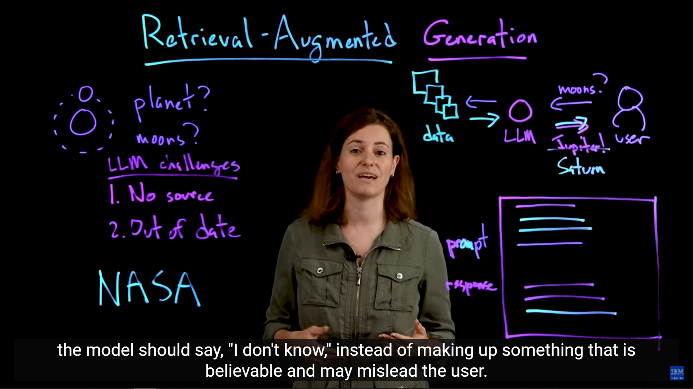
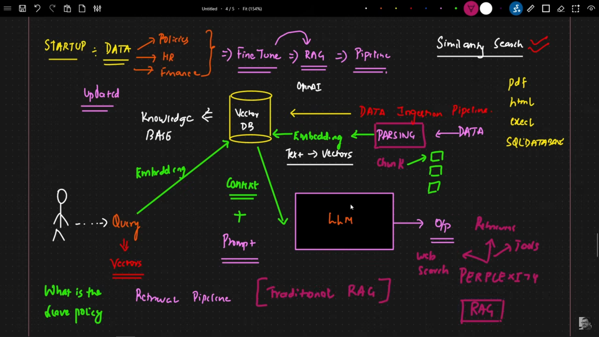
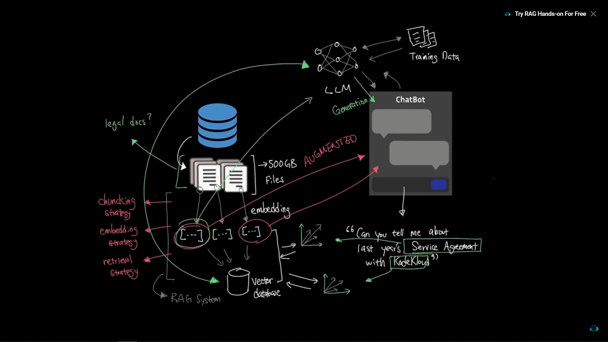

### Material
- [What is Retrieval-Augmented Generation (RAG)?](https://www.youtube.com/watch?v=T-D1OfcDW1M&list=WL&index=8)
- [RAG Explained For Beginners](https://www.youtube.com/watch?v=_HQ2H_0Ayy0)
- [Introduction To Understanding RAG (Retrieval-Augmented Generation)](https://www.youtube.com/watch?v=fZM3oX4xEyg)

## Retrieval-Augmented Generation (RAG) Study Notes

Retrieval-Augmented Generation (RAG) is an architectural pattern that integrates Large Language Models (LLMs) with external, authoritative knowledge bases to enhance the quality, factual grounding, and currency of generated responses. It is a cost-effective alternative to continuous retraining.

---

## 1. Core Concept and Motivation

### Definition
RAG effectively gives the LLM an **external memory** or "lookup" capability at inference time. It optimizes the LLM's output by providing relevant context from an external knowledge source, thereby grounding the generation process.

The functional mechanism is often summarized as:
$$\text{Response} = \text{Generator}(\text{Query} + \text{Retrieved Context})$$

### Key Benefits (The "Why")
* **Overcoming Knowledge Cutoff:** LLMs are limited by their *training data*. RAG connects the model to **up-to-date** or proprietary data sources, eliminating the need for expensive full **retraining** when knowledge changes.
* **Hallucination Mitigation:** By anchoring the LLM's response in verifiable **retrieved facts**, RAG significantly reduces the model's tendency to generate convincing but **false information**.
* **Factual Grounding & Trust:** The system can provide **source attribution** (citations) for the generated text, increasing transparency and user confidence.
* **Cost Efficiency:** It is generally **cheaper** and faster to maintain an index of external data than to continuously fine-tune or pre-train an entire massive LLM.

---

## 2. RAG System Architecture and Pipeline

The RAG pipeline is divided into two phases: **Indexing** (Build Time) and **Querying** (Run Time).

### Phase 1: Indexing (Knowledge Base Preparation)
1.  **Data Sourcing & Pre-processing:** Gather proprietary documents (e.g., PDFs, internal docs). The data is cleaned, normalized, and prepared for conversion.
2.  **Chunking:** Source documents are divided into smaller, semantically coherent passages, or **chunks**. This is critical because LLMs have a finite **context window** size, and optimal chunking ensures highly relevant information is retrieved without unnecessary noise.
3.  **Embedding Generation:** An **Embedding Model** transforms each text chunk into a high-dimensional numerical **vector representation** (embedding). Embeddings capture the *semantic* meaning of the text.
4.  **Vector Database Storage:** The generated embeddings are stored in a specialized **Vector Database** (e.g., Pinecone, Faiss, Qdrant). This database is optimized for **Approximate Nearest Neighbor (ANN)** search, enabling rapid similarity lookups.

### Phase 2: Querying (Retrieval-Augmented Generation)
1.  **Query Embedding:** The user's input query is passed through the **same Embedding Model** used in the indexing phase to generate a query vector.
2.  **Retrieval (Similarity Search):** The query vector is used to perform a similarity search in the Vector Database (e.g., calculating **Cosine Similarity**). The system retrieves the **top-k** most relevant text chunks.
3.  **Prompt Augmentation:** The retrieved text chunks are *combined* with the original user query to create a single, **augmented prompt**. This combined input is then fed into the LLM's context window. System instructions often direct the LLM to strictly answer *only* based on the provided context.
4.  **Augmented Generation:** The LLM (the **Generator**) uses its internal knowledge, combined with the authoritative external context, to generate the final, grounded response.

---

## 3. Advanced Retrieval Techniques
To address issues like retrieval latency or poor retrieval quality (garbage in, garbage out), advanced RAG implementations use techniques beyond simple vector search:

* **Re-ranking:** After retrieving the top-k chunks, a separate model (**Cross-Encoder**) is used to score and re-order the results based on even finer-grained semantic relevance, ensuring the *best* context is at the top of the LLM's input.
* **Hybrid Search:** Combines **dense retrieval** (vector search based on semantic meaning) with **sparse retrieval** (keyword matching, e.g., BM25) for robust search performance.
* **Agentic RAG:** The LLM itself acts as an autonomous **agent**, dynamically deciding whether to retrieve information, which source to query, and even formulating sub-queries (multi-hop retrieval) for complex reasoning tasks.

---

## 4. RAG vs. Fine-Tuning: A Comparison

Both RAG and fine-tuning aim to improve LLM output, but they address fundamentally different problems and use different mechanisms.

| Aspect                | Retrieval-Augmented Generation (RAG)                                                      | Fine-Tuning (FT)                                                                                              |
| :-------------------- | :---------------------------------------------------------------------------------------- | :------------------------------------------------------------------------------------------------------------ |
| **Mechanism**         | **Augmentation** (Modifies the input/context at runtime).                                 | **Modification** (Adjusts the model's weights/parameters).                                                    |
| **LLM Weights**       | **Not modified**, the base LLM remains unchanged.                                         | **Modified** using a small, specialized dataset.                                                              |
| **Focus/Goal**        | Factual currency, specific domain knowledge, real-time data, and reducing hallucinations. | Changing **style, tone, output format** (e.g., JSON), or mastering **specialized terminology and reasoning**. |
| **Data Requirements** | Unlabeled, raw documents (must be pre-processed and embedded).                            | High-quality, labeled, domain-specific training examples.                                                     |
| **Cost**              | Generally **lower** cost and faster to deploy/update.                                     | **High** computational cost (GPU time) and data collection/labeling cost [4.3].                               |

### Hybrid Approach
The most effective solution for enterprise applications is often a **Hybrid Approach**:
* **Fine-Tuning** is used to train the LLM to understand the domain's *language* and adopt a desired *persona* or *format*.
* **RAG** is used to inject the most **current and factual data** into that skilled model during inference, giving the system both specialized reasoning and up-to-date knowledge.

---
## Retrieval-Augmented Generation (RAG) Pipeline Details

### 1. Breakdown of the R-A-G Acronym in the Pipeline

The acronym **R-A-G** clearly defines the three essential sequential stages that occur at **runtime** (when a user submits a query):

| Letter | Stage            | Function in the Pipeline                                                                                                                                                                           |
| :----- | :--------------- | :------------------------------------------------------------------------------------------------------------------------------------------------------------------------------------------------- |
| **R**  | **Retrieval**    | The user's query is converted into a *vector*, and a search is performed against the external **Vector Database**. The top-k most semantically relevant text **chunks** (knowledge) are retrieved. |
| **A**  | **Augmentation** | The retrieved knowledge is *combined* with the original user query and typically a set of system instructions (prompt template) to form a single, **augmented prompt**.                            |
| **G**  | **Generation**   | The augmented prompt (query + relevant context) is fed into the Large Language Model (LLM), which uses this combined input to generate the final, grounded response.                               |

---

### 2. Why the Input (Prompt) is Changed (Augmented)

The input prompt must be **augmented** with the **retrieved context** to achieve the primary goals of RAG: **factual grounding** and accessing **up-to-date knowledge**.

The change is necessary because the LLM is inherently a **closed-book** system, meaning its knowledge is static and limited to its original training data.

The new, stored information **is indeed sent to the LLM via the input prompt.** This process of adding the information to the prompt is what the "Augmentation" step in RAG is all about.

That is a great question that gets to the core mechanism of how **Retrieval-Augmented Generation (RAG)** works.

The new, stored information **is indeed sent to the LLM via the input prompt.** This process of adding the information to the prompt is what the "Augmentation" step in RAG is all about.
#### Why Augmentation Uses the Prompt

1.  **Context Window Injection:** LLMs, especially decoder-only Transformer models, are designed to process all relevant information *within their **context window**.* The context window is the single, concatenated sequence of tokens that the model receives as input. There is no separate "memory slot" or API call (other than the initial token sequence) that the model naturally uses to pull in facts from the outside. To utilize the **retrieved** knowledge, **RAG must inject the text directly into this primary input sequence.**
2.  **Stateless Inference:** The core LLM operation during inference is **stateless**. For every query, it must be provided with all the necessary context to generate a response. The RAG pipeline performs the **retrieval** as a separate step *before* the LLM call, but the **augmentation** step then physically combines the retrieved documents with the user's query into one unified string, the final prompt.
3.  **The Role of Retrieval (The Separate Step):**  The **retrieval** is a separate, distinct step, it is a database query.
    * **Step 1: Retrieval (External):** An external component (the Vector Database) finds the relevant text chunks. This step happens *outside* the LLM.
    * **Step 2: Augmentation (Integration):** The RAG system takes the results from Step 1 and integrates them with the original user prompt.
    * **Step 3: Generation (Internal):** The combined, augmented prompt is sent to the LLM.

In short, the separate step is the **retrieval of the data** from the vector database. The retrieved data is then packaged and delivered to the LLM through its only available input mechanism: the **prompt**.

***
